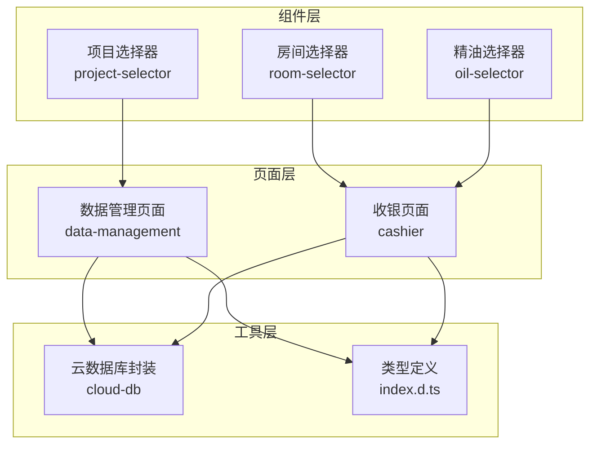
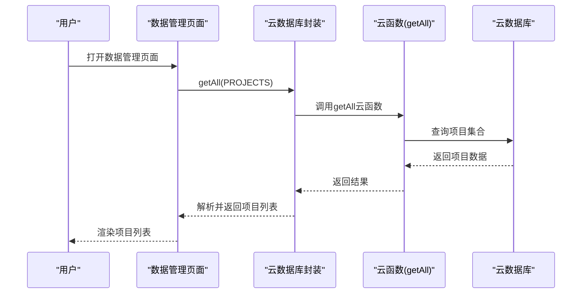
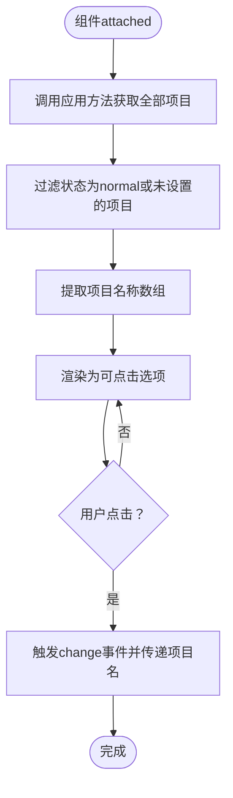
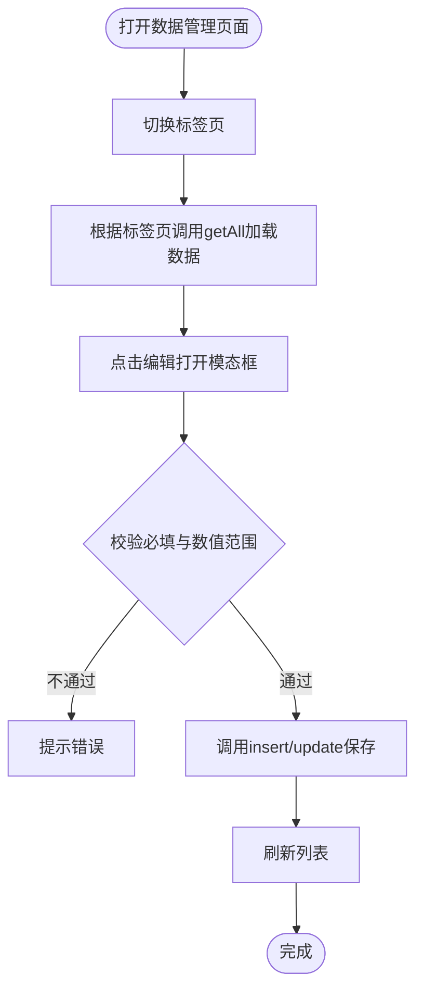
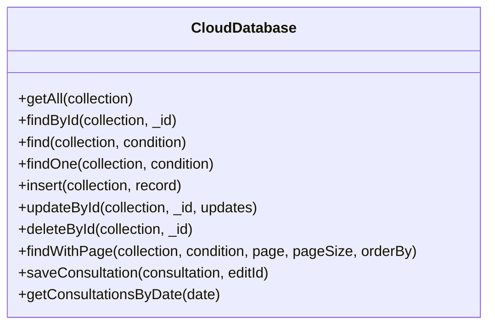
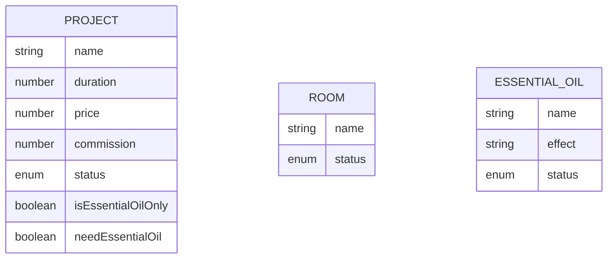
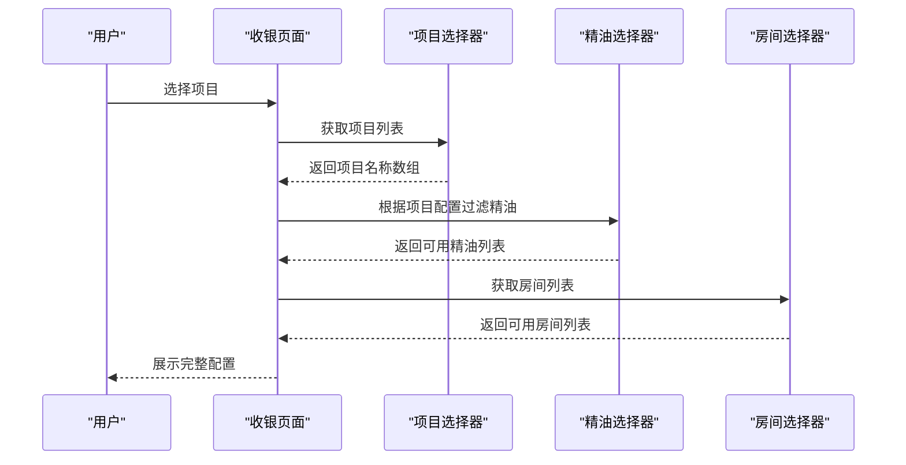
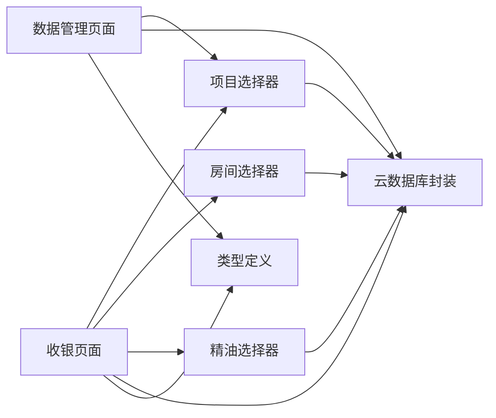

# SPA项目配置

<cite>
**本文档引用的文件**
- [project-selector.ts](file://miniprogram/components/project-selector/project-selector.ts)
- [project-selector.wxml](file://miniprogram/components/project-selector/project-selector.wxml)
- [project-selector.less](file://miniprogram/components/project-selector/project-selector.less)
- [data-management.ts](file://miniprogram/pages/data-management/data-management.ts)
- [data-management.wxml](file://miniprogram/pages/data-management/data-management.wxml)
- [cloud-db.ts](file://miniprogram/utils/cloud-db.ts)
- [index.d.ts](file://typings/index.d.ts)
- [cashier.json](file://miniprogram/pages/cashier/cashier.json)
- [cashier.ts](file://miniprogram/pages/cashier/cashier.ts)
- [room-selector.ts](file://miniprogram/components/room-selector/room-selector.ts)
- [room-selector.wxml](file://miniprogram/components/room-selector/room-selector.wxml)
- [oil-selector.ts](file://miniprogram/components/oil-selector/oil-selector.ts)
- [oil-selector.less](file://miniprogram/components/oil-selector/oil-selector.less)
</cite>

## 目录
1. [简介](#简介)
2. [项目结构](#项目结构)
3. [核心组件](#核心组件)
4. [架构总览](#架构总览)
5. [详细组件分析](#详细组件分析)
6. [依赖关系分析](#依赖关系分析)
7. [性能考虑](#性能考虑)
8. [故障排除指南](#故障排除指南)
9. [结论](#结论)
10. [附录](#附录)

## 简介
本文件面向SPA项目中的“项目配置”功能，围绕项目选择器组件、项目数据管理、项目与精油/房间的关联关系、状态管理与排序策略进行系统化说明。内容涵盖：
- 项目选择器组件的实现原理（数据获取、显示逻辑、用户交互）
- 项目配置管理（名称、描述、时长、价格、提成、状态等）
- 项目分类与状态管理、排序策略
- 项目与精油、房间的关联关系配置
- 最佳实践、批量编辑思路与数据验证机制
- 配置示例、使用场景与故障排除

## 项目结构
SPA项目采用分层+按功能模块组织的结构：
- 组件层：项目选择器、房间选择器、精油选择器等可复用UI组件
- 页面层：数据管理页面、收银页面等业务页面
- 工具层：云数据库封装、类型定义、工具函数
- 类型定义：统一的数据模型与接口约束

图表来源
- [project-selector.ts](file://miniprogram/components/project-selector/project-selector.ts#L1-L38)
- [room-selector.ts](file://miniprogram/components/room-selector/room-selector.ts#L3-L43)
- [oil-selector.ts](file://miniprogram/components/oil-selector/oil-selector.ts#L2-L36)
- [data-management.ts](file://miniprogram/pages/data-management/data-management.ts#L1-L298)
- [cashier.ts](file://miniprogram/pages/cashier/cashier.ts#L1-L200)
- [cloud-db.ts](file://miniprogram/utils/cloud-db.ts#L1-L321)
- [index.d.ts](file://typings/index.d.ts#L185-L206)

章节来源
- [project-selector.ts](file://miniprogram/components/project-selector/project-selector.ts#L1-L38)
- [data-management.ts](file://miniprogram/pages/data-management/data-management.ts#L1-L298)
- [cloud-db.ts](file://miniprogram/utils/cloud-db.ts#L1-L321)
- [index.d.ts](file://typings/index.d.ts#L185-L206)

## 核心组件
- 项目选择器组件：负责从全局应用数据中筛选正常状态的项目，渲染为可点击选项，并通过自定义事件向上抛出选中结果
- 数据管理页面：提供项目/房间/精油的增删改查、状态切换、表单校验与保存
- 云数据库封装：提供统一的查询、插入、更新、删除与分页能力
- 类型定义：明确项目、房间、精油等实体字段与状态枚举

章节来源
- [project-selector.ts](file://miniprogram/components/project-selector/project-selector.ts#L1-L38)
- [data-management.ts](file://miniprogram/pages/data-management/data-management.ts#L1-L298)
- [cloud-db.ts](file://miniprogram/utils/cloud-db.ts#L69-L203)
- [index.d.ts](file://typings/index.d.ts#L185-L206)

## 架构总览
项目配置功能由“页面-组件-服务-数据源”四层构成：
- 页面负责业务编排与状态管理
- 组件负责用户交互与数据展示
- 服务封装对云数据库的操作
- 数据源为云端集合（项目、房间、精油）

图表来源
- [data-management.ts](file://miniprogram/pages/data-management/data-management.ts#L30-L52)
- [cloud-db.ts](file://miniprogram/utils/cloud-db.ts#L69-L88)

章节来源
- [data-management.ts](file://miniprogram/pages/data-management/data-management.ts#L30-L52)
- [cloud-db.ts](file://miniprogram/utils/cloud-db.ts#L69-L88)

## 详细组件分析

### 项目选择器组件
项目选择器组件负责在页面中展示可用项目供用户选择，其核心流程如下：
- 生命周期attached时触发加载
- 从全局应用对象获取全部项目
- 过滤状态为normal或未设置的项目
- 将项目名称映射为字符串数组并渲染
- 用户点击后通过change事件传递选中项目名

图表来源
- [project-selector.ts](file://miniprogram/components/project-selector/project-selector.ts#L14-L29)
- [project-selector.wxml](file://miniprogram/components/project-selector/project-selector.wxml#L1-L12)

章节来源
- [project-selector.ts](file://miniprogram/components/project-selector/project-selector.ts#L1-L38)
- [project-selector.wxml](file://miniprogram/components/project-selector/project-selector.wxml#L1-L12)
- [project-selector.less](file://miniprogram/components/project-selector/project-selector.less#L1-L38)

### 数据管理页面（项目配置）
数据管理页面提供完整的项目配置能力：
- 切换标签页加载不同集合（项目/房间/精油）
- 表单字段覆盖项目名称、时长、价格、提成、状态、是否专用精油、是否需要精油等
- 保存前进行必填项与数值范围校验
- 支持启用/禁用状态切换与删除操作
- 通过云数据库封装执行增删改查

图表来源
- [data-management.ts](file://miniprogram/pages/data-management/data-management.ts#L25-L52)
- [data-management.ts](file://miniprogram/pages/data-management/data-management.ts#L140-L212)
- [data-management.wxml](file://miniprogram/pages/data-management/data-management.wxml#L114-L178)

章节来源
- [data-management.ts](file://miniprogram/pages/data-management/data-management.ts#L1-L298)
- [data-management.wxml](file://miniprogram/pages/data-management/data-management.wxml#L1-L179)

### 云数据库封装
云数据库封装提供统一的CRUD与分页能力：
- getAll：通过云函数批量读取集合
- insert/updateById/deleteById：标准的增删改查
- find/findWithPage：条件查询与分页
- saveConsultation/getConsultationsByDate：咨询单相关便捷方法

图表来源
- [cloud-db.ts](file://miniprogram/utils/cloud-db.ts#L12-L321)

章节来源
- [cloud-db.ts](file://miniprogram/utils/cloud-db.ts#L1-L321)

### 类型定义与数据模型
类型定义明确了项目、房间、精油等实体的字段与状态：
- 项目：名称、时长、价格、提成、状态、是否专用精油、是否需要精油
- 房间：名称、状态
- 精油：名称、功效、状态
- 状态枚举：normal/disabled

图表来源
- [index.d.ts](file://typings/index.d.ts#L185-L206)

章节来源
- [index.d.ts](file://typings/index.d.ts#L185-L206)

### 项目与精油、房间的关联关系
- 项目与精油：通过“是否专用精油”和“是否需要精油”两个布尔字段控制关联策略；在收银页面中，项目选择器与精油选择器共同决定可用精油集
- 项目与房间：在收银页面中，房间选择器提供可用房间列表，房间状态为normal时才可被选择

图表来源
- [cashier.json](file://miniprogram/pages/cashier/cashier.json#L3-L10)
- [project-selector.ts](file://miniprogram/components/project-selector/project-selector.ts#L14-L29)
- [oil-selector.ts](file://miniprogram/components/oil-selector/oil-selector.ts#L14-L28)
- [room-selector.ts](file://miniprogram/components/room-selector/room-selector.ts#L19-L35)

章节来源
- [cashier.json](file://miniprogram/pages/cashier/cashier.json#L1-L11)
- [project-selector.ts](file://miniprogram/components/project-selector/project-selector.ts#L1-L38)
- [oil-selector.ts](file://miniprogram/components/oil-selector/oil-selector.ts#L1-L36)
- [room-selector.ts](file://miniprogram/components/room-selector/room-selector.ts#L1-L43)

## 依赖关系分析
- 页面依赖组件：数据管理页面依赖项目选择器组件进行项目展示；收银页面依赖项目、房间、精油选择器
- 组件依赖应用全局数据：项目/房间/精油选择器均通过应用对象获取全局数据
- 页面依赖云数据库封装：数据管理页面与收银页面均通过云数据库封装访问云端集合
- 类型定义贯穿全栈：类型定义为页面、组件、服务提供一致的数据契约

图表来源
- [cashier.json](file://miniprogram/pages/cashier/cashier.json#L3-L10)
- [data-management.ts](file://miniprogram/pages/data-management/data-management.ts#L1-L298)
- [cloud-db.ts](file://miniprogram/utils/cloud-db.ts#L1-L321)
- [index.d.ts](file://typings/index.d.ts#L185-L206)

章节来源
- [cashier.json](file://miniprogram/pages/cashier/cashier.json#L1-L11)
- [data-management.ts](file://miniprogram/pages/data-management/data-management.ts#L1-L298)
- [cloud-db.ts](file://miniprogram/utils/cloud-db.ts#L1-L321)
- [index.d.ts](file://typings/index.d.ts#L185-L206)

## 性能考虑
- 数据加载优化：使用云函数getAll一次性拉取集合，避免多次网络请求
- 组件懒加载：选择器组件在attached生命周期加载，减少首屏压力
- 列表渲染优化：使用wx:for配合wx:key提升渲染性能
- 状态切换：启用/禁用状态切换仅更新单条记录，避免全量刷新
- 分页查询：提供findWithPage支持大数据量场景下的分页加载

章节来源
- [cloud-db.ts](file://miniprogram/utils/cloud-db.ts#L69-L88)
- [cloud-db.ts](file://miniprogram/utils/cloud-db.ts#L209-L255)
- [project-selector.ts](file://miniprogram/components/project-selector/project-selector.ts#L32-L36)

## 故障排除指南
- 无法加载项目/房间/精油数据
  - 检查云函数getAll是否正常返回
  - 确认集合名称与Collections常量一致
  - 查看页面加载状态与错误提示
- 保存失败
  - 检查必填字段与数值范围校验
  - 确认云数据库updateById/insert返回状态
- 状态切换无效
  - 确认当前记录存在且_id有效
  - 检查状态枚举(normal/disabled)是否正确
- 选择器无数据
  - 确认应用全局数据已加载
  - 检查状态过滤逻辑（仅normal或未设置）

章节来源
- [data-management.ts](file://miniprogram/pages/data-management/data-management.ts#L45-L51)
- [data-management.ts](file://miniprogram/pages/data-management/data-management.ts#L144-L157)
- [cloud-db.ts](file://miniprogram/utils/cloud-db.ts#L170-L188)
- [project-selector.ts](file://miniprogram/components/project-selector/project-selector.ts#L14-L24)

## 结论
SPA项目配置功能以“页面-组件-服务-数据源”的清晰分层实现，项目选择器组件与数据管理页面协同工作，结合云数据库封装与强类型定义，提供了稳定、可扩展的项目配置能力。通过状态管理、数据校验与可视化交互，满足了日常运营对项目配置的需求。

## 附录

### 配置最佳实践
- 项目命名规范：简洁、唯一、可识别
- 时长与价格：遵循业务规则，保持一致性
- 提成设置：确保数值为正整数，便于财务统计
- 精油关联：根据项目特性合理设置专用精油与是否需要精油
- 状态管理：启用/禁用应有明确的业务语义与审批流程

### 批量编辑建议
- 在现有单条编辑基础上，增加批量勾选与批量状态切换
- 批量保存时进行二次确认与错误汇总提示
- 对大列表采用分页批量处理，避免一次性提交过多数据

### 数据验证机制
- 必填字段校验：名称、手工提成、精油功效等
- 数值范围校验：时长、价格、提成需符合业务预期
- 状态切换校验：仅对有效记录进行状态变更

### 使用场景示例
- 新项目上线：在数据管理页面添加项目，设置时长、价格、提成与关联精油
- 促销活动：临时调整项目价格或提成，完成后恢复原状
- 库存管理：通过“是否需要精油”控制项目可用性
- 房间调度：房间状态变化影响项目排钟与预约