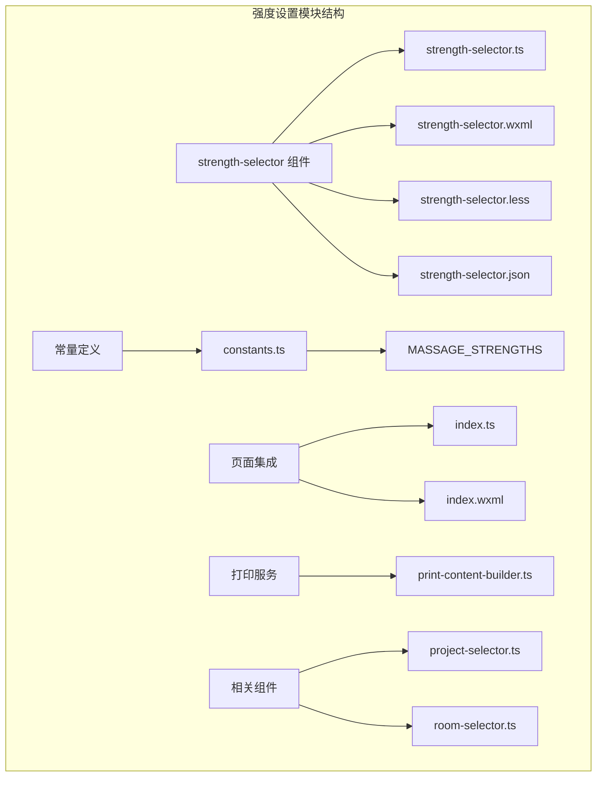
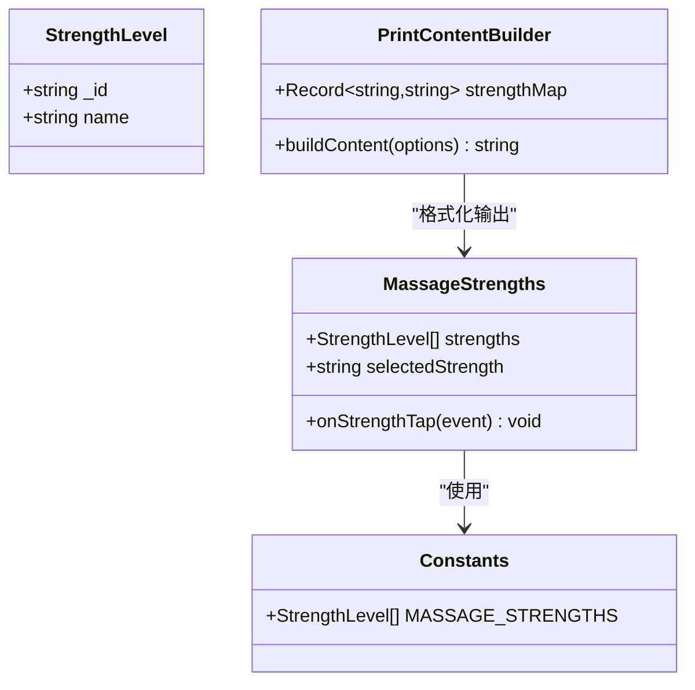
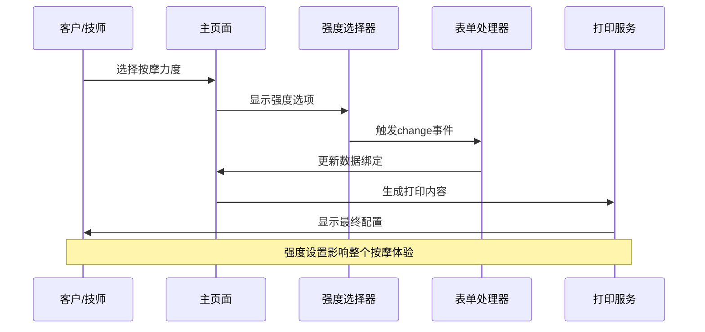
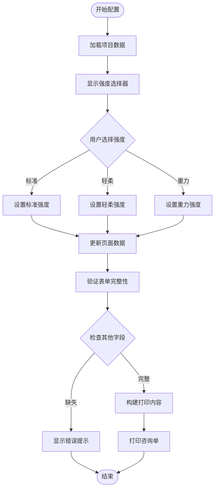
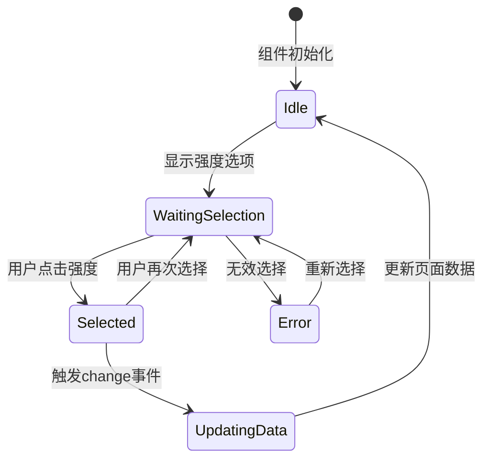
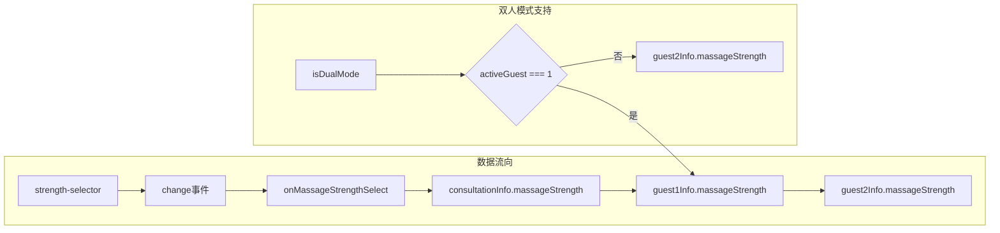
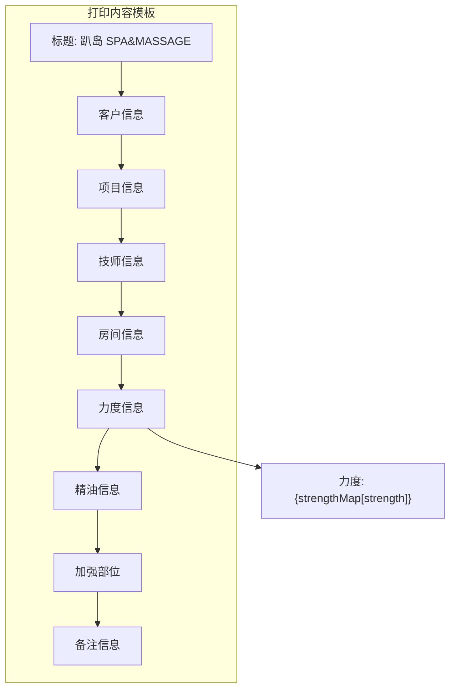
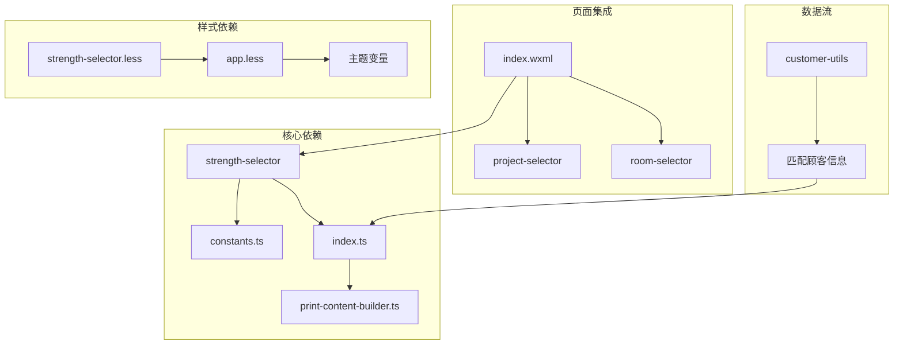

# 力度强度设置

<cite>
**本文档引用的文件**
- [strength-selector.ts](file://miniprogram/components/strength-selector/strength-selector.ts)
- [strength-selector.wxml](file://miniprogram/components/strength-selector/strength-selector.wxml)
- [strength-selector.less](file://miniprogram/components/strength-selector/strength-selector.less)
- [constants.ts](file://miniprogram/utils/constants.ts)
- [index.ts](file://miniprogram/pages/index/index.ts)
- [index.wxml](file://miniprogram/pages/index/index.wxml)
- [print-content-builder.ts](file://miniprogram/services/print-content-builder.ts)
- [project-selector.ts](file://miniprogram/components/project-selector/project-selector.ts)
- [room-selector.ts](file://miniprogram/components/room-selector/room-selector.ts)
- [customer-utils.ts](file://miniprogram/pages/index/utils/customer-utils.ts)
</cite>

## 目录
1. [简介](#简介)
2. [项目结构](#项目结构)
3. [核心组件](#核心组件)
4. [架构概览](#架构概览)
5. [详细组件分析](#详细组件分析)
6. [依赖关系分析](#依赖关系分析)
7. [性能考虑](#性能考虑)
8. [故障排除指南](#故障排除指南)
9. [结论](#结论)
10. [附录](#附录)

## 简介

力度强度设置模块是SPA按摩服务管理系统中的关键功能组件，负责管理按摩力度的选择和配置。该模块提供了标准化、轻柔和重力三种强度级别，通过直观的用户界面帮助客户和技师选择合适的按摩力度，确保按摩效果达到最佳状态。

本模块采用组件化设计，与项目选择、房间选择、精油选择等功能模块协同工作，形成完整的按摩服务配置流程。系统支持单人模式和双人模式，能够满足不同场景下的使用需求。

## 项目结构

力度强度设置模块位于小程序项目的组件目录中，采用标准的组件结构组织：

**图表来源**
- [strength-selector.ts](file://miniprogram/components/strength-selector/strength-selector.ts#L1-L19)
- [constants.ts](file://miniprogram/utils/constants.ts#L1-L5)
- [index.ts](file://miniprogram/pages/index/index.ts#L75-L147)

**章节来源**
- [strength-selector.ts](file://miniprogram/components/strength-selector/strength-selector.ts#L1-L19)
- [strength-selector.wxml](file://miniprogram/components/strength-selector/strength-selector.wxml#L1-L13)
- [strength-selector.less](file://miniprogram/components/strength-selector/strength-selector.less#L1-L58)

## 核心组件

### 强度级别定义

系统定义了三种标准的按摩强度级别：

| 强度级别 | 英文标识 | 中文名称 | 适用场景 | 特征描述 |
|---------|----------|----------|----------|----------|
| 标准强度 | standard | 标准 STANDARD | 普通按摩、日常护理 | 适中的压力，适合大多数客户 |
| 轻柔强度 | soft | 轻柔 SOFT | 敏感肌肤、初次体验 | 较小的压力，温和舒适 |
| 重力强度 | gravity | 重力 STRONG | 深层肌肉放松、专业治疗 | 较大的压力，深度放松 |

### 数据结构设计

**图表来源**
- [constants.ts](file://miniprogram/utils/constants.ts#L1-L5)
- [strength-selector.ts](file://miniprogram/components/strength-selector/strength-selector.ts#L1-L19)
- [print-content-builder.ts](file://miniprogram/services/print-content-builder.ts#L11-L15)

**章节来源**
- [constants.ts](file://miniprogram/utils/constants.ts#L1-L5)
- [strength-selector.ts](file://miniprogram/components/strength-selector/strength-selector.ts#L10-L12)

## 架构概览

力度强度设置模块在整个SPA管理系统中扮演着重要的角色，与其他组件形成完整的业务流程：

**图表来源**
- [index.ts](file://miniprogram/pages/index/index.ts#L130-L139)
- [strength-selector.ts](file://miniprogram/components/strength-selector/strength-selector.ts#L14-L16)

### 配置流程

**图表来源**
- [index.ts](file://miniprogram/pages/index/index.ts#L262-L324)
- [print-content-builder.ts](file://miniprogram/services/print-content-builder.ts#L31-L80)

**章节来源**
- [index.ts](file://miniprogram/pages/index/index.ts#L130-L139)
- [index.wxml](file://miniprogram/pages/index/index.wxml#L63-L67)

## 详细组件分析

### 强度选择器组件

强度选择器是一个独立的WXML组件，负责提供用户交互界面和事件处理：

#### 组件属性和数据

| 属性名 | 类型 | 默认值 | 描述 |
|--------|------|--------|------|
| selectedStrength | String | '' | 当前选中的强度标识 |
| strengths | Array | MASSAGE_STRENGTHS | 可选的强度列表 |

#### 交互逻辑

**图表来源**
- [strength-selector.ts](file://miniprogram/components/strength-selector/strength-selector.ts#L13-L18)

#### 视觉反馈机制

组件通过CSS类实现视觉状态变化：

- **默认状态**: 浅色边框，普通字体颜色
- **选中状态**: 橙色边框和背景，勾选图标显示
- **悬停状态**: 平滑的颜色过渡动画

**章节来源**
- [strength-selector.ts](file://miniprogram/components/strength-selector/strength-selector.ts#L1-L19)
- [strength-selector.wxml](file://miniprogram/components/strength-selector/strength-selector.wxml#L1-L13)
- [strength-selector.less](file://miniprogram/components/strength-selector/strength-selector.less#L35-L51)

### 页面集成机制

主页面通过数据绑定和事件处理实现强度设置的集成：

#### 数据绑定策略

**图表来源**
- [index.ts](file://miniprogram/pages/index/index.ts#L130-L139)
- [index.wxml](file://miniprogram/pages/index/index.wxml#L66)

#### 事件处理流程

当用户选择强度时，系统执行以下步骤：

1. 接收change事件
2. 解析强度标识
3. 检查双人模式状态
4. 更新对应的数据对象
5. 触发页面数据更新

**章节来源**
- [index.ts](file://miniprogram/pages/index/index.ts#L130-L139)
- [index.wxml](file://miniprogram/pages/index/index.wxml#L63-L67)

### 打印内容生成

强度设置直接影响打印内容的格式化输出：

#### 强度映射表

| 英文标识 | 中文显示 | 打印格式 |
|----------|----------|----------|
| standard | 标准 | 标准 |
| soft | 轻柔 | 轻柔 |
| gravity | 重力 | 重力 |

#### 打印模板结构

**图表来源**
- [print-content-builder.ts](file://miniprogram/services/print-content-builder.ts#L31-L80)

**章节来源**
- [print-content-builder.ts](file://miniprogram/services/print-content-builder.ts#L11-L15)
- [print-content-builder.ts](file://miniprogram/services/print-content-builder.ts#L44)

## 依赖关系分析

力度强度设置模块与其他系统组件存在紧密的依赖关系：

**图表来源**
- [strength-selector.ts](file://miniprogram/components/strength-selector/strength-selector.ts#L1)
- [index.ts](file://miniprogram/pages/index/index.ts#L1-L14)
- [print-content-builder.ts](file://miniprogram/services/print-content-builder.ts#L1)

### 外部依赖

| 依赖项 | 用途 | 版本要求 |
|--------|------|----------|
| WeChat Miniprogram | 小程序框架 | 最新稳定版 |
| constants.ts | 常量定义 | 内置模块 |
| print-content-builder.ts | 打印服务 | 内置服务 |
| app.less | 样式基础 | 内置样式 |

**章节来源**
- [strength-selector.ts](file://miniprogram/components/strength-selector/strength-selector.ts#L1)
- [index.ts](file://miniprogram/pages/index/index.ts#L1-L14)

## 性能考虑

### 渲染优化

1. **虚拟列表**: 使用wx:for渲染强度选项，避免DOM节点过多
2. **事件委托**: 通过bindtap处理点击事件，减少事件监听器数量
3. **数据缓存**: 常量数据在组件初始化时加载，避免重复计算

### 内存管理

- 组件卸载时自动清理事件监听
- 数据绑定采用双向绑定，减少手动DOM操作
- 图标使用SVG内联，避免额外的图片请求

### 网络优化

- 常量数据本地存储，无需网络请求
- 打印内容生成在客户端完成，减少服务器负载

## 故障排除指南

### 常见问题及解决方案

#### 强度选项不显示

**症状**: 强度选择器空白或显示异常

**可能原因**:
1. constants.ts文件加载失败
2. MASSAGE_STRENGTHS数组为空
3. 组件初始化顺序问题

**解决步骤**:
1. 检查constants.ts文件是否存在
2. 验证MASSAGE_STRENGTHS数组格式正确
3. 确认组件生命周期钩子正常执行

#### 事件处理失败

**症状**: 选择强度后页面数据不更新

**可能原因**:
1. change事件未正确触发
2. onMassageStrengthSelect方法未绑定
3. 双人模式数据更新逻辑错误

**解决步骤**:
1. 检查组件事件绑定语法
2. 验证页面方法绑定正确性
3. 测试双人模式下的数据更新

#### 打印内容异常

**症状**: 打印的力度信息显示错误

**可能原因**:
1. strengthMap映射表配置错误
2. 强度标识与映射不匹配
3. 数据传递过程中的类型转换

**解决步骤**:
1. 验证strengthMap键值对正确性
2. 检查强度标识的一致性
3. 确认数据类型转换正确

**章节来源**
- [strength-selector.ts](file://miniprogram/components/strength-selector/strength-selector.ts#L14-L16)
- [index.ts](file://miniprogram/pages/index/index.ts#L130-L139)

## 结论

力度强度设置模块通过简洁而强大的设计，为SPA按摩服务提供了灵活且直观的强度配置功能。模块采用组件化架构，与系统的其他功能模块无缝集成，形成了完整的按摩服务配置流程。

该模块的主要优势包括：
- **用户友好**: 直观的视觉反馈和简单易用的操作界面
- **功能完整**: 支持多种强度级别和双人模式
- **扩展性强**: 基于常量定义，易于添加新的强度级别
- **性能优秀**: 优化的渲染和事件处理机制

通过合理的配置和使用，该模块能够有效提升客户体验，确保按摩效果达到预期目标。

## 附录

### 强度配置示例

#### 标准强度配置
- 适用项目: 普通按摩、日常护理
- 客户类型: 普通客户、初次体验者
- 房间条件: 标准按摩房
- 精油搭配: 可选，建议使用薰衣草

#### 轻柔强度配置
- 适用项目: 敏感肌肤护理、产后恢复
- 客户类型: 老年客户、孕妇
- 房间条件: 温馨私人房
- 精油搭配: 可选，建议使用洋甘菊

#### 重力强度配置
- 适用项目: 深层肌肉放松、运动康复
- 客户类型: 专业运动员、长期久坐者
- 房间条件: 专业治疗室
- 精油搭配: 可选，建议使用薄荷

### 使用场景和效果评估

#### 场景一：初次体验
- **强度选择**: 轻柔强度
- **评估指标**: 客户舒适度、放松程度
- **后续调整**: 根据客户反馈可升级至标准强度

#### 场景二：专业治疗
- **强度选择**: 重力强度
- **评估指标**: 肌肉放松度、疼痛缓解程度
- **注意事项**: 治疗师需具备相应技能

#### 场景三：日常保养
- **强度选择**: 标准强度
- **评估指标**: 整体放松效果、满意度
- **频率建议**: 建议定期进行

### 技师操作规范

1. **术前沟通**: 询问客户身体状况和偏好
2. **循序渐进**: 从轻柔强度开始，逐步增加
3. **观察反应**: 密切关注客户的舒适度
4. **及时调整**: 根据客户反馈调整力度
5. **安全第一**: 避免过度用力造成伤害