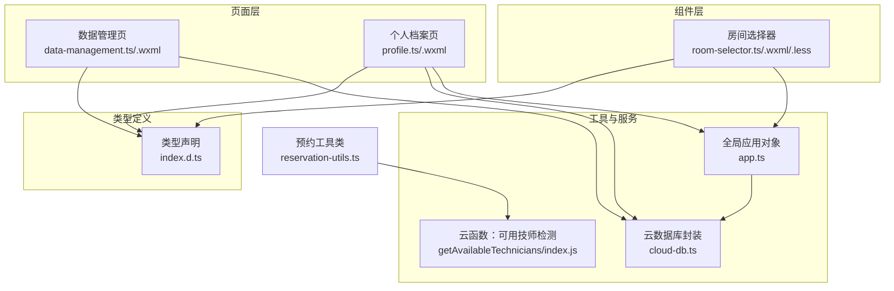
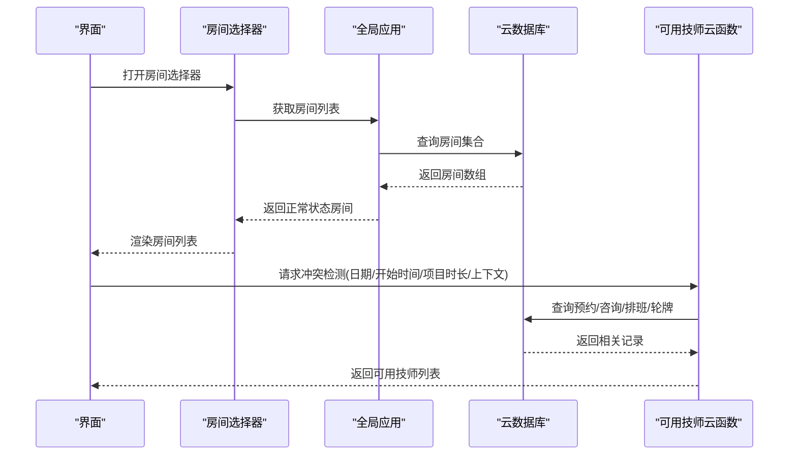
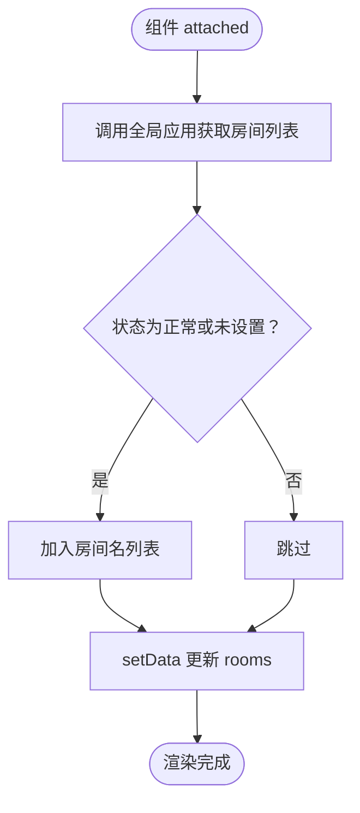
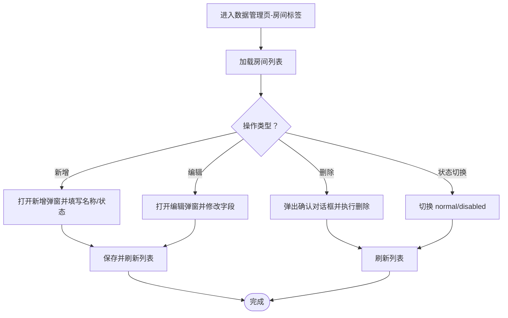
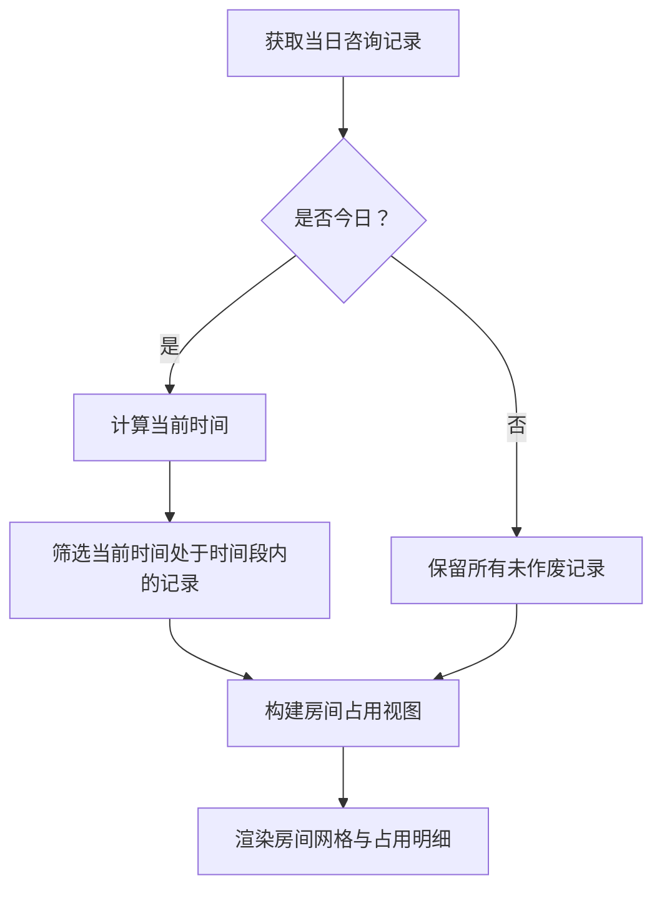
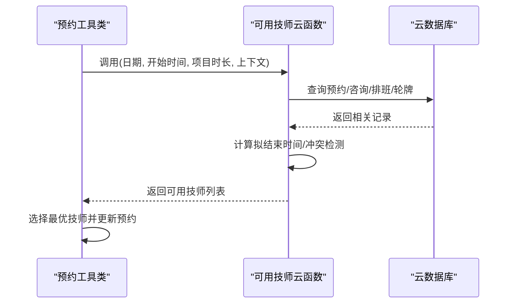
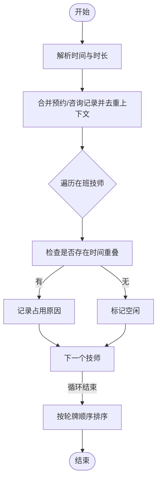
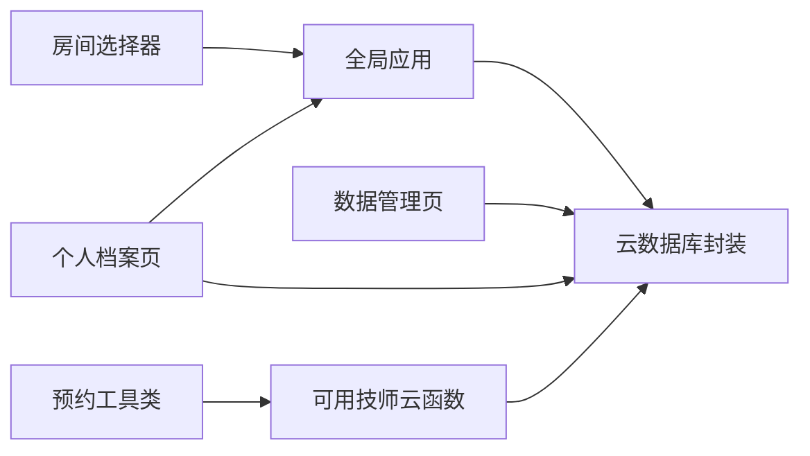

# 房间分配

<cite>
**本文引用的文件**
- [room-selector.ts](file://miniprogram/components/room-selector/room-selector.ts)
- [room-selector.wxml](file://miniprogram/components/room-selector/room-selector.wxml)
- [room-selector.less](file://miniprogram/components/room-selector/room-selector.less)
- [data-management.ts](file://miniprogram/pages/data-management/data-management.ts)
- [data-management.wxml](file://miniprogram/pages/data-management/data-management.wxml)
- [profile.ts](file://miniprogram/pages/profile/profile.ts)
- [profile.wxml](file://miniprogram/pages/profile/profile.wxml)
- [reservation-utils.ts](file://miniprogram/pages/index/utils/reservation-utils.ts)
- [getAvailableTechnicians/index.js](file://cloudfunctions/getAvailableTechnicians/index.js)
- [app.ts](file://miniprogram/app.ts)
- [cloud-db.ts](file://miniprogram/utils/cloud-db.ts)
- [index.d.ts](file://typings/index.d.ts)
</cite>

## 目录
1. [简介](#简介)
2. [项目结构](#项目结构)
3. [核心组件](#核心组件)
4. [架构总览](#架构总览)
5. [详细组件分析](#详细组件分析)
6. [依赖关系分析](#依赖关系分析)
7. [性能考量](#性能考量)
8. [故障排查指南](#故障排查指南)
9. [结论](#结论)
10. [附录](#附录)

## 简介
本文件面向“房间分配”模块，围绕房间选择器组件、房间基础配置、房间使用状态与占用管理、房间与技师/项目的时间冲突检测与智能分配、以及房间管理的配置与批量设置进行系统化说明。文档同时提供可视化图示、流程图与最佳实践建议，帮助非技术读者也能快速理解与高效使用。

## 项目结构
房间分配涉及以下关键文件与职责划分：
- 组件层：房间选择器组件负责渲染可用房间列表、响应用户点击并触发变更事件
- 页面层：数据管理页面用于维护房间基础信息（名称、状态），个人档案页展示房间当日占用状态
- 工具与服务：全局应用对象提供房间数据获取；云数据库提供集合读写；云函数提供冲突检测与可用技师查询
- 类型定义：统一的房间接口定义确保前后端一致的数据契约

图表来源
- [room-selector.ts](file://miniprogram/components/room-selector/room-selector.ts#L1-L44)
- [data-management.ts](file://miniprogram/pages/data-management/data-management.ts#L1-L298)
- [profile.ts](file://miniprogram/pages/profile/profile.ts#L1-L287)
- [app.ts](file://miniprogram/app.ts#L40-L87)
- [cloud-db.ts](file://miniprogram/utils/cloud-db.ts#L271-L320)
- [getAvailableTechnicians/index.js](file://cloudfunctions/getAvailableTechnicians/index.js#L1-L285)
- [index.d.ts](file://typings/index.d.ts#L194-L197)

章节来源
- [room-selector.ts](file://miniprogram/components/room-selector/room-selector.ts#L1-L44)
- [data-management.ts](file://miniprogram/pages/data-management/data-management.ts#L1-L298)
- [profile.ts](file://miniprogram/pages/profile/profile.ts#L1-L287)
- [app.ts](file://miniprogram/app.ts#L40-L87)
- [cloud-db.ts](file://miniprogram/utils/cloud-db.ts#L271-L320)
- [getAvailableTechnicians/index.js](file://cloudfunctions/getAvailableTechnicians/index.js#L1-L285)
- [index.d.ts](file://typings/index.d.ts#L194-L197)

## 核心组件
- 房间选择器组件：在挂载时从全局应用对象拉取房间列表，过滤出正常状态的房间，渲染为可点击选项，并通过自定义事件向外传递选中房间名
- 数据管理页面：提供房间列表、新增/编辑/删除、状态切换（启用/禁用）能力，支持批量操作入口
- 个人档案页面：按日展示房间占用状态，标注当前正在使用的客户、技师与结束时间
- 预约工具类与云函数：基于项目时长与当前时间计算“拟结束时间”，结合预约与咨询记录进行冲突检测，返回可用技师列表，支撑房间与技师的智能匹配

章节来源
- [room-selector.ts](file://miniprogram/components/room-selector/room-selector.ts#L1-L44)
- [data-management.ts](file://miniprogram/pages/data-management/data-management.ts#L1-L298)
- [profile.ts](file://miniprogram/pages/profile/profile.ts#L1-L287)
- [reservation-utils.ts](file://miniprogram/pages/index/utils/reservation-utils.ts#L1-L173)
- [getAvailableTechnicians/index.js](file://cloudfunctions/getAvailableTechnicians/index.js#L1-L285)

## 架构总览
房间分配的端到端流程如下：
- 数据来源：全局应用对象聚合房间数据；云数据库提供房间、预约、咨询、排班、轮牌等集合
- 展示层：房间选择器仅展示正常状态房间；个人档案页按日汇总房间占用
- 冲突检测：预约工具类调用云函数，传入日期、起始时间、项目时长与当前上下文，云函数综合预约与咨询记录判断技师冲突
- 智能分配：根据轮牌顺序与冲突检测结果，优先分配空闲且符合性别的技师

图表来源
- [room-selector.ts](file://miniprogram/components/room-selector/room-selector.ts#L18-L41)
- [app.ts](file://miniprogram/app.ts#L75-L80)
- [cloud-db.ts](file://miniprogram/utils/cloud-db.ts#L303-L320)
- [getAvailableTechnicians/index.js](file://cloudfunctions/getAvailableTechnicians/index.js#L9-L124)

## 详细组件分析

### 房间选择器组件
- 职责与行为
  - 初始化加载：组件 attached 生命周期内异步拉取房间列表
  - 过滤策略：仅展示状态为“正常”或未设置状态的房间
  - 交互事件：点击房间项触发 change 事件，向父组件传递所选房间名
  - 禁用态：当 disabled 属性为真时，阻止点击并呈现禁用样式
- 数据流
  - 输入属性：selectedRoom（当前选中）、disabled（是否禁用）
  - 输出事件：change（携带 room 字段）
  - 内部状态：rooms（字符串数组，房间名列表）

图表来源
- [room-selector.ts](file://miniprogram/components/room-selector/room-selector.ts#L18-L41)

章节来源
- [room-selector.ts](file://miniprogram/components/room-selector/room-selector.ts#L1-L44)
- [room-selector.wxml](file://miniprogram/components/room-selector/room-selector.wxml#L1-L12)
- [room-selector.less](file://miniprogram/components/room-selector/room-selector.less#L1-L44)

### 房间基础配置与管理
- 基础属性
  - 名称：房间唯一标识，用于展示与选择
  - 状态：normal（启用）、disabled（禁用），影响房间选择器可见性与数据管理页的启用/禁用按钮
- 配置入口
  - 数据管理页“房间列表”标签页提供新增、编辑、删除、状态切换
  - 支持批量设置：通过状态切换按钮对多条记录进行启用/禁用
- 使用场景
  - 新店开业：批量添加房间并设为启用
  - 临时停用：将某房间置为禁用，避免被选中
  - 维护期：将房间置为禁用，待修复后恢复

图表来源
- [data-management.ts](file://miniprogram/pages/data-management/data-management.ts#L30-L209)
- [data-management.wxml](file://miniprogram/pages/data-management/data-management.wxml#L45-L70)

章节来源
- [data-management.ts](file://miniprogram/pages/data-management/data-management.ts#L1-L298)
- [data-management.wxml](file://miniprogram/pages/data-management/data-management.wxml#L45-L70)

### 房间使用状态管理与占用展示
- 占用判定规则
  - 当日：仅保留当前时间之后的记录；若当前时间位于某记录时间段内，则标记为占用
  - 非当日：展示全部未作废记录
- 展示内容
  - 房间名称
  - 若占用：展示客户姓名、技师、结束时间等明细
- 适用页面
  - 个人档案页按日查看房间占用
  - 收银台/大厅看板风格的房间网格布局（样式由独立 less 提供）

图表来源
- [profile.ts](file://miniprogram/pages/profile/profile.ts#L107-L164)
- [profile.wxml](file://miniprogram/pages/profile/profile.wxml#L138-L156)

章节来源
- [profile.ts](file://miniprogram/pages/profile/profile.ts#L1-L287)
- [profile.wxml](file://miniprogram/pages/profile/profile.wxml#L138-L156)

### 时间冲突检测与智能分配
- 冲突检测输入
  - 日期、当前时间、项目时长（分钟）、当前上下文（当前预约/咨询 ID 列表）
- 检测范围
  - 预约集合（active 状态）
  - 咨询记录集合（当日且未作废）
  - 排班与轮牌（确定在班人员与顺序）
- 输出
  - 可用技师列表（含性别、位置序号、占用原因等）
- 分配策略
  - 优先满足性别要求（若预约有性别需求或技师性别）
  - 在满足条件的技师中，优先选择轮牌顺序靠前且当前空闲或即将空闲者
  - 结合项目时长与拟结束时间，避免与现有任务重叠

图表来源
- [reservation-utils.ts](file://miniprogram/pages/index/utils/reservation-utils.ts#L26-L145)
- [getAvailableTechnicians/index.js](file://cloudfunctions/getAvailableTechnicians/index.js#L9-L124)

章节来源
- [reservation-utils.ts](file://miniprogram/pages/index/utils/reservation-utils.ts#L1-L173)
- [getAvailableTechnicians/index.js](file://cloudfunctions/getAvailableTechnicians/index.js#L1-L285)

### 房间与技师/项目的冲突检测算法
- 关键步骤
  - 将项目时长换算为分钟，得到拟结束时间
  - 合并预约与咨询记录，排除当前上下文中的记录
  - 对每个在班技师检查是否存在时间区间重叠
  - 记录占用原因（如具体时间段与来源）
  - 按轮牌顺序排序输出
- 复杂度与优化
  - 时间复杂度近似 O(N×M)，N 为在班技师数，M 为当日预约/咨询记录数
  - 可通过索引优化（按日期、技师名、时间段建立索引）降低查询成本
  - 对于高频场景，可在前端缓存轮牌与排班数据，减少重复请求

图表来源
- [getAvailableTechnicians/index.js](file://cloudfunctions/getAvailableTechnicians/index.js#L70-L117)

章节来源
- [getAvailableTechnicians/index.js](file://cloudfunctions/getAvailableTechnicians/index.js#L1-L285)

## 依赖关系分析
- 组件与应用层
  - 房间选择器依赖全局应用对象提供的房间数据接口
- 应用层与数据库层
  - 全局应用对象通过云数据库封装统一访问各集合
- 页面与工具层
  - 个人档案页依赖全局应用与云数据库；数据管理页直接依赖云数据库
- 云函数与数据库层
  - 云函数集中查询多个集合，进行跨表关联与冲突检测

图表来源
- [room-selector.ts](file://miniprogram/components/room-selector/room-selector.ts#L18-L41)
- [app.ts](file://miniprogram/app.ts#L40-L87)
- [cloud-db.ts](file://miniprogram/utils/cloud-db.ts#L303-L320)
- [data-management.ts](file://miniprogram/pages/data-management/data-management.ts#L30-L52)
- [profile.ts](file://miniprogram/pages/profile/profile.ts#L107-L164)
- [reservation-utils.ts](file://miniprogram/pages/index/utils/reservation-utils.ts#L26-L145)
- [getAvailableTechnicians/index.js](file://cloudfunctions/getAvailableTechnicians/index.js#L9-L124)

章节来源
- [app.ts](file://miniprogram/app.ts#L40-L87)
- [cloud-db.ts](file://miniprogram/utils/cloud-db.ts#L303-L320)

## 性能考量
- 数据加载
  - 全局应用对象采用并发加载项目、房间、精油、员工集合，减少等待时间
- 渲染优化
  - 房间选择器仅渲染正常状态房间，减少 DOM 数量
  - 个人档案页按日筛选，避免全量渲染
- 云函数优化
  - 合理使用 where 条件与索引，避免全表扫描
  - 对在班技师与轮牌顺序进行预处理，减少排序成本
- 建议
  - 对常用集合增加复合索引（如日期+状态、技师名+时间段）
  - 在前端缓存轮牌与排班数据，降低重复查询
  - 对房间列表与技师列表进行分页或懒加载（如房间数量较多）

章节来源
- [app.ts](file://miniprogram/app.ts#L40-L87)
- [getAvailableTechnicians/index.js](file://cloudfunctions/getAvailableTechnicians/index.js#L131-L285)

## 故障排查指南
- 房间选择器不显示任何房间
  - 检查房间集合中是否存在状态为 normal 的房间
  - 确认全局应用对象房间数据接口返回正常
- 个人档案页房间占用显示异常
  - 检查当日咨询记录是否正确，是否存在作废记录
  - 确认当前时间计算逻辑与日期格式
- 冲突检测无结果或错误
  - 检查云函数入参（日期、开始时间、项目时长）是否完整
  - 查看云数据库对应集合数据是否齐全（预约、咨询、排班、轮牌）
- 状态切换无效
  - 确认数据管理页状态切换逻辑与云数据库更新接口

章节来源
- [room-selector.ts](file://miniprogram/components/room-selector/room-selector.ts#L18-L41)
- [profile.ts](file://miniprogram/pages/profile/profile.ts#L107-L164)
- [data-management.ts](file://miniprogram/pages/data-management/data-management.ts#L254-L280)
- [reservation-utils.ts](file://miniprogram/pages/index/utils/reservation-utils.ts#L26-L145)
- [getAvailableTechnicians/index.js](file://cloudfunctions/getAvailableTechnicians/index.js#L16-L21)

## 结论
房间分配模块以“房间选择器 + 房间管理 + 占用展示 + 冲突检测 + 智能分配”为核心闭环，通过全局应用与云数据库统一数据源，配合云函数实现高效的冲突检测与分配决策。建议在实际部署中完善索引、缓存与批量配置能力，持续优化用户体验与运营效率。

## 附录

### 房间基础配置清单
- 必填字段
  - 名称：房间唯一标识
- 常用字段
  - 状态：normal/disabled
- 说明
  - 状态为 normal 或未设置时，房间选择器才会显示该房间
  - 禁用状态仅影响选择器可见性，不影响占用展示

章节来源
- [data-management.ts](file://miniprogram/pages/data-management/data-management.ts#L178-L182)
- [room-selector.ts](file://miniprogram/components/room-selector/room-selector.ts#L22-L25)

### 房间配置示例（描述性）
- 示例1：新增房间
  - 在数据管理页“房间列表”标签页点击“添加房间”，填写名称与状态为 normal，保存后即可在房间选择器中看到
- 示例2：批量启用/禁用
  - 在房间列表中逐条点击“启用/禁用”按钮，实现批量状态切换
- 示例3：维护期房间
  - 将房间状态置为 disabled，避免被选择；修复后恢复 normal

章节来源
- [data-management.wxml](file://miniprogram/pages/data-management/data-management.wxml#L45-L70)
- [data-management.ts](file://miniprogram/pages/data-management/data-management.ts#L254-L280)

### 使用场景与维护提醒
- 场景1：新店开业
  - 批量添加房间并设为 normal，确保房间选择器正常显示
- 场景2：技师排班调整
  - 通过轮牌与排班数据联动，云函数自动识别在班技师并参与冲突检测
- 场景3：房间维修
  - 将房间置为 disabled，避免被分配；完成后恢复 normal
- 维护提醒
  - 定期核对房间状态与占用情况，确保数据一致性
  - 对云函数查询路径进行监控，及时发现异常

章节来源
- [profile.ts](file://miniprogram/pages/profile/profile.ts#L107-L164)
- [getAvailableTechnicians/index.js](file://cloudfunctions/getAvailableTechnicians/index.js#L131-L285)