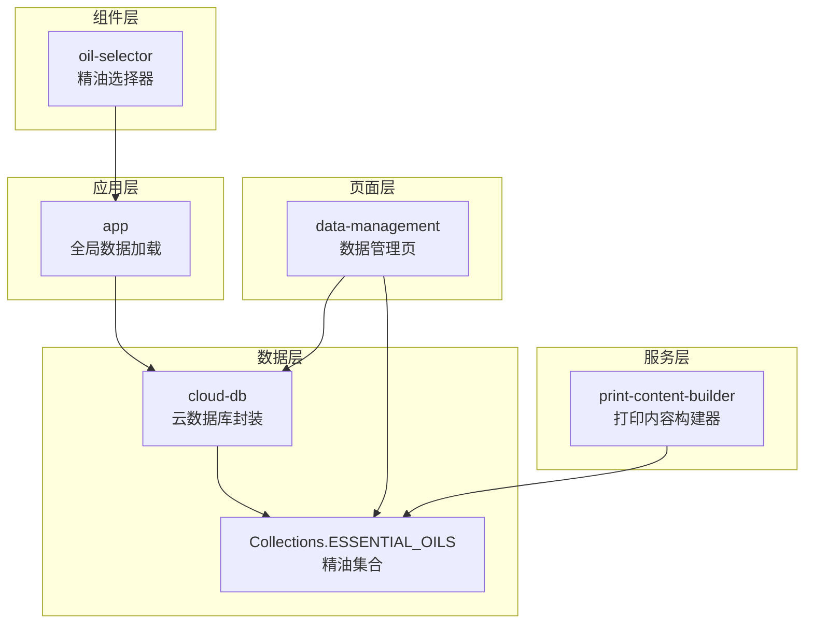
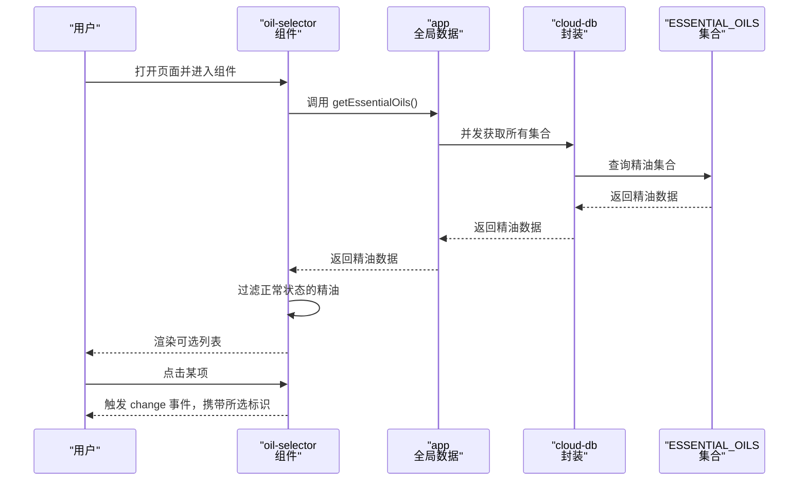
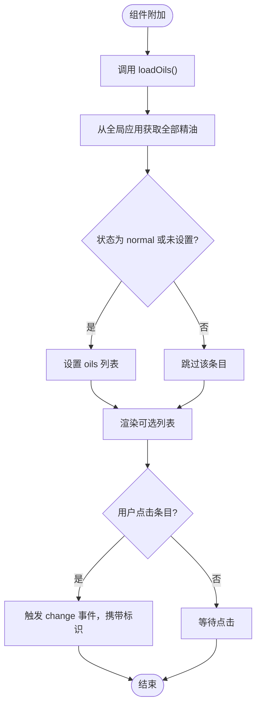
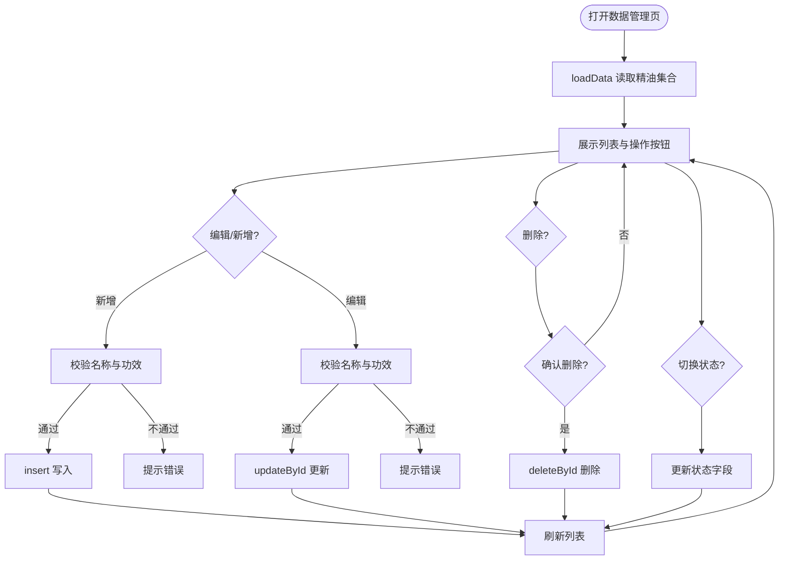
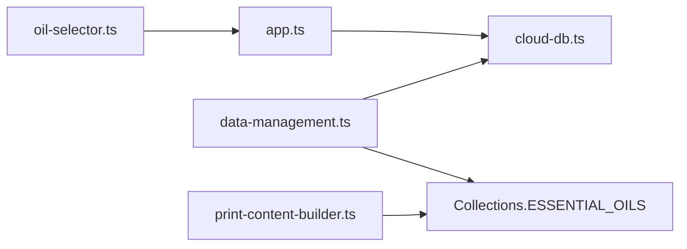

# 精油管理

<cite>
**本文引用的文件**
- [oil-selector.ts](file://miniprogram/components/oil-selector/oil-selector.ts)
- [oil-selector.json](file://miniprogram/components/oil-selector/oil-selector.json)
- [oil-selector.wxml](file://miniprogram/components/oil-selector/oil-selector.wxml)
- [oil-selector.less](file://miniprogram/components/oil-selector/oil-selector.less)
- [data-management.ts](file://miniprogram/pages/data-management/data-management.ts)
- [data-management.wxml](file://miniprogram/pages/data-management/data-management.wxml)
- [app.ts](file://miniprogram/app.ts)
- [cloud-db.ts](file://miniprogram/utils/cloud-db.ts)
- [print-content-builder.ts](file://miniprogram/services/print-content-builder.ts)
</cite>

## 目录
1. [简介](#简介)
2. [项目结构](#项目结构)
3. [核心组件](#核心组件)
4. [架构总览](#架构总览)
5. [详细组件分析](#详细组件分析)
6. [依赖关系分析](#依赖关系分析)
7. [性能考量](#性能考量)
8. [故障排查指南](#故障排查指南)
9. [结论](#结论)
10. [附录](#附录)

## 简介
本文件面向“精油管理”模块，系统化阐述精油选择器组件的工作原理、精油基础配置、与按摩项目的关联配置、打印输出中的精油展示逻辑，以及数据来源与持久化方案。同时提供操作指南、批量导入导出与备份恢复机制的实践建议，并给出配置示例、使用建议与库存预警设置思路。

## 项目结构
精油管理涉及以下关键文件与职责划分：
- 组件层：精油选择器组件负责从全局数据中筛选并展示可用精油，支持点击选择并向上游触发变更事件。
- 页面层：数据管理页面提供精油的增删改查、状态切换、表单校验与保存。
- 应用层：应用入口负责全局数据的加载与缓存，确保组件与页面可直接访问。
- 数据层：云数据库封装提供集合读取、插入、更新、删除与按日期查询等能力。
- 服务层：打印内容构建器在生成咨询单时根据配置决定是否展示精油信息。

图表来源
- [oil-selector.ts](file://miniprogram/components/oil-selector/oil-selector.ts#L14-L23)
- [data-management.ts](file://miniprogram/pages/data-management/data-management.ts#L41-L44)
- [app.ts](file://miniprogram/app.ts#L40-L66)
- [cloud-db.ts](file://miniprogram/utils/cloud-db.ts#L69-L88)
- [print-content-builder.ts](file://miniprogram/services/print-content-builder.ts#L29-L50)

章节来源
- [oil-selector.ts](file://miniprogram/components/oil-selector/oil-selector.ts#L1-L37)
- [data-management.ts](file://miniprogram/pages/data-management/data-management.ts#L1-L298)
- [app.ts](file://miniprogram/app.ts#L1-L191)
- [cloud-db.ts](file://miniprogram/utils/cloud-db.ts#L1-L321)
- [print-content-builder.ts](file://miniprogram/services/print-content-builder.ts#L1-L102)

## 核心组件
- 精油选择器组件
  - 属性：接收当前选中精油标识。
  - 数据：内部维护可选精油列表。
  - 行为：组件附加时自动拉取全局精油数据，过滤正常状态的精油，渲染为可点击列表；用户点击后向上游触发 change 事件传递所选标识。
- 数据管理页面
  - 支持切换“项目管理/房间管理/精油管理”三个标签页。
  - 精油列表展示名称与功效；支持启用/禁用、编辑、删除。
  - 新增/编辑表单支持名称、状态、是否专用精油、是否需要精油（项目维度）、精油功效（精油维度）等字段。
- 全局数据加载
  - 应用启动时并发加载项目、房间、精油、员工等集合，缓存在全局数据中，供组件与页面共享。
- 云数据库封装
  - 提供 getAll、insert、updateById、deleteById、按日期查询等功能；集合常量包含 ESSENTIAL_OILS。
- 打印内容构建
  - 在构建咨询单时，根据 isEssentialOilOnly 与 needEssentialOil 决定是否展示精油；若需要则通过已传入的精油数组查找对应名称进行展示。

章节来源
- [oil-selector.ts](file://miniprogram/components/oil-selector/oil-selector.ts#L2-L36)
- [oil-selector.wxml](file://miniprogram/components/oil-selector/oil-selector.wxml#L1-L14)
- [oil-selector.less](file://miniprogram/components/oil-selector/oil-selector.less#L1-L70)
- [data-management.ts](file://miniprogram/pages/data-management/data-management.ts#L30-L52)
- [data-management.wxml](file://miniprogram/pages/data-management/data-management.wxml#L72-L99)
- [app.ts](file://miniprogram/app.ts#L40-L87)
- [cloud-db.ts](file://miniprogram/utils/cloud-db.ts#L69-L88)
- [print-content-builder.ts](file://miniprogram/services/print-content-builder.ts#L31-L50)

## 架构总览
精油管理采用“组件-页面-应用-数据-服务”的分层架构：
- 组件负责用户交互与事件上报；
- 页面负责业务编排与数据持久化；
- 应用负责全局数据加载与缓存；
- 数据层负责云端集合的读写；
- 服务层负责打印内容的格式化与展示策略。

图表来源
- [oil-selector.ts](file://miniprogram/components/oil-selector/oil-selector.ts#L14-L28)
- [app.ts](file://miniprogram/app.ts#L82-L87)
- [cloud-db.ts](file://miniprogram/utils/cloud-db.ts#L69-L88)

## 详细组件分析

### 精油选择器组件（oil-selector）
- 工作原理
  - 生命周期 attached 时调用 loadOils。
  - loadOils 从全局应用获取全部精油数据，过滤状态为 normal 或未设置的记录，赋值给组件内部 oils。
  - 用户点击条目时，触发 change 事件并传递当前项的标识。
- 显示样式
  - 使用复选框样式的自定义布局，选中态有边框与背景色变化及勾选图标。
  - 名称为主文本，功效为次级描述文本。
- 选择逻辑
  - 仅展示正常状态或未设置状态的精油，避免禁用项被误选。
  - 通过事件向父组件传递所选标识，由父组件决定如何处理选中结果。

图表来源
- [oil-selector.ts](file://miniprogram/components/oil-selector/oil-selector.ts#L14-L28)
- [oil-selector.wxml](file://miniprogram/components/oil-selector/oil-selector.wxml#L1-L14)
- [oil-selector.less](file://miniprogram/components/oil-selector/oil-selector.less#L35-L47)

章节来源
- [oil-selector.ts](file://miniprogram/components/oil-selector/oil-selector.ts#L2-L36)
- [oil-selector.wxml](file://miniprogram/components/oil-selector/oil-selector.wxml#L1-L14)
- [oil-selector.less](file://miniprogram/components/oil-selector/oil-selector.less#L1-L70)

### 数据管理页面（精油管理）
- 数据源
  - 通过云数据库封装的 getAll 读取 ESSENTIAL_OILS 集合。
- 表单字段
  - 名称、状态（启用/禁用）、精油功效（必填校验）。
- 保存逻辑
  - 新增/编辑统一走 handleSave，对必填字段进行校验，再调用 insert 或 updateById。
- 状态切换
  - handleToggleStatus 根据当前状态在启用/禁用之间切换。
- 删除流程
  - 弹窗确认后调用 deleteById 删除。

图表来源
- [data-management.ts](file://miniprogram/pages/data-management/data-management.ts#L30-L52)
- [data-management.ts](file://miniprogram/pages/data-management/data-management.ts#L140-L212)
- [data-management.ts](file://miniprogram/pages/data-management/data-management.ts#L254-L280)
- [data-management.ts](file://miniprogram/pages/data-management/data-management.ts#L214-L252)

章节来源
- [data-management.ts](file://miniprogram/pages/data-management/data-management.ts#L1-L298)
- [data-management.wxml](file://miniprogram/pages/data-management/data-management.wxml#L72-L99)

### 全局数据加载（app）
- 启动时并发加载项目、房间、精油、员工集合，缓存到 globalData 中。
- 提供 getEssentialOils 等方法供组件与页面使用，避免重复请求。

章节来源
- [app.ts](file://miniprogram/app.ts#L40-L87)

### 云数据库封装（cloud-db）
- 提供 getAll、insert、updateById、deleteById、按日期查询等通用能力。
- 集合常量包含 ESSENTIAL_OILS，便于页面与组件统一引用。

章节来源
- [cloud-db.ts](file://miniprogram/utils/cloud-db.ts#L69-L88)
- [cloud-db.ts](file://miniprogram/utils/cloud-db.ts#L303-L320)

### 打印内容构建（print-content-builder）
- 构建咨询单时，根据 isEssentialOilOnly 与 needEssentialOil 决定是否展示精油。
- 若需要展示，则通过传入的精油数组按标识查找名称并输出。

章节来源
- [print-content-builder.ts](file://miniprogram/services/print-content-builder.ts#L31-L50)

## 依赖关系分析
- 组件依赖应用层提供的全局精油数据，应用层依赖云数据库封装。
- 页面依赖云数据库封装进行 CRUD 操作，并依赖应用层的全局数据以减少重复请求。
- 打印服务依赖页面传入的精油数组与集合常量。

图表来源
- [oil-selector.ts](file://miniprogram/components/oil-selector/oil-selector.ts#L16-L17)
- [data-management.ts](file://miniprogram/pages/data-management/data-management.ts#L41-L44)
- [app.ts](file://miniprogram/app.ts#L48-L51)
- [cloud-db.ts](file://miniprogram/utils/cloud-db.ts#L303-L320)
- [print-content-builder.ts](file://miniprogram/services/print-content-builder.ts#L29-L49)

章节来源
- [oil-selector.ts](file://miniprogram/components/oil-selector/oil-selector.ts#L1-L37)
- [data-management.ts](file://miniprogram/pages/data-management/data-management.ts#L1-L298)
- [app.ts](file://miniprogram/app.ts#L1-L191)
- [cloud-db.ts](file://miniprogram/utils/cloud-db.ts#L1-L321)
- [print-content-builder.ts](file://miniprogram/services/print-content-builder.ts#L1-L102)

## 性能考量
- 并发加载：应用层使用 Promise.all 并发获取多个集合，减少首屏等待时间。
- 组件本地过滤：组件侧对状态进行本地过滤，避免重复网络请求。
- 列表渲染：使用 wx:for 渲染，结合 wx:key 提升渲染效率。
- 云函数封装：getAll 通过云函数调用，减少前端直连数据库的复杂度与风险。

## 故障排查指南
- 精油列表为空
  - 检查应用层全局数据是否已加载完成；确认 ESSENTIAL_OILS 集合是否存在数据。
  - 参考路径：[app.ts](file://miniprogram/app.ts#L40-L66)、[cloud-db.ts](file://miniprogram/utils/cloud-db.ts#L69-L88)
- 无法选择精油
  - 确认组件已正确触发 change 事件；检查父组件是否正确接收并处理事件。
  - 参考路径：[oil-selector.ts](file://miniprogram/components/oil-selector/oil-selector.ts#L25-L28)
- 保存失败
  - 检查表单必填字段校验与云函数返回码；查看页面提示与控制台日志。
  - 参考路径：[data-management.ts](file://miniprogram/pages/data-management/data-management.ts#L140-L212)
- 状态切换无效
  - 确认 handleToggleStatus 的索引与集合 ID 是否正确；检查云函数 updateById 返回。
  - 参考路径：[data-management.ts](file://miniprogram/pages/data-management/data-management.ts#L254-L280)、[cloud-db.ts](file://miniprogram/utils/cloud-db.ts#L170-L188)

章节来源
- [app.ts](file://miniprogram/app.ts#L40-L87)
- [oil-selector.ts](file://miniprogram/components/oil-selector/oil-selector.ts#L25-L28)
- [data-management.ts](file://miniprogram/pages/data-management/data-management.ts#L140-L212)
- [cloud-db.ts](file://miniprogram/utils/cloud-db.ts#L170-L188)

## 结论
精油管理模块通过组件-页面-应用-数据-服务的清晰分层，实现了从数据加载、展示、选择到打印输出的完整闭环。组件负责交互与事件，页面负责业务编排与持久化，应用层提供全局缓存，数据层提供统一的云数据库封装，服务层负责打印策略。当前实现聚焦于基础配置与选择展示，后续可在现有基础上扩展库存管理、使用频率统计与成本核算功能。

## 附录

### 操作指南
- 添加/编辑精油
  - 在“数据管理”页切换至“精油管理”，点击“添加精油”，填写名称与功效，选择状态，保存。
  - 参考路径：[data-management.wxml](file://miniprogram/pages/data-management/data-management.wxml#L72-L99)、[data-management.ts](file://miniprogram/pages/data-management/data-management.ts#L140-L212)
- 启用/禁用精油
  - 在精油列表中点击“启用/禁用”按钮，即时切换状态。
  - 参考路径：[data-management.ts](file://miniprogram/pages/data-management/data-management.ts#L254-L280)
- 选择精油
  - 在需要选择的页面中使用 oil-selector 组件，点击条目触发 change 事件。
  - 参考路径：[oil-selector.ts](file://miniprogram/components/oil-selector/oil-selector.ts#L25-L28)

### 批量导入/导出与备份恢复
- 当前代码未提供专门的批量导入/导出与备份恢复功能。
- 建议方案
  - 导入：通过云数据库封装的 insert 批量写入，或在云函数中实现导入接口。
  - 导出：通过 getAll 读取集合，导出为 JSON 文件。
  - 备份/恢复：基于云数据库的集合备份与还原能力，结合云函数实现一键备份与恢复。
  - 参考路径：[cloud-db.ts](file://miniprogram/utils/cloud-db.ts#L136-L165)、[cloud-db.ts](file://miniprogram/utils/cloud-db.ts#L69-L88)

### 精油配置示例
- 基础配置字段
  - 名称：用于识别与展示。
  - 功效：简述作用，如“舒缓助眠”、“提神醒脑”等。
  - 状态：normal 或 disabled。
- 与项目关联配置
  - 项目维度支持“是否专用精油”“是否需要精油”，用于打印与业务策略。
  - 参考路径：[data-management.wxml](file://miniprogram/pages/data-management/data-management.wxml#L140-L153)、[print-content-builder.ts](file://miniprogram/services/print-content-builder.ts#L46-L50)

### 使用建议
- 优先维护“正常”状态的精油清单，避免禁用项干扰选择。
- 为常用精油设置明确的功效描述，提升选择效率。
- 在项目层面合理配置“是否需要精油”，确保打印内容与实际服务一致。

### 库存管理、使用频率统计与成本核算（扩展建议）
- 库存管理
  - 新增库存字段与出入库记录，结合页面进行入库/出库登记。
- 使用频率统计
  - 基于咨询单记录统计每种精油的使用次数与时间段分布。
- 成本核算
  - 记录入库成本与单价，结合使用频率计算月度/季度成本。
- 推荐搭配规则
  - 基于项目与精油组合规则，提供智能推荐与冲突提示。
- 参考路径
  - 当前集合常量包含 ESSENTIAL_OILS，可在此基础上扩展字段与逻辑。
  - [cloud-db.ts](file://miniprogram/utils/cloud-db.ts#L303-L320)