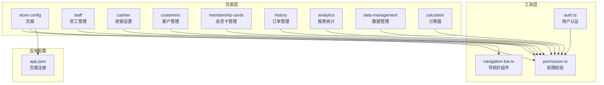
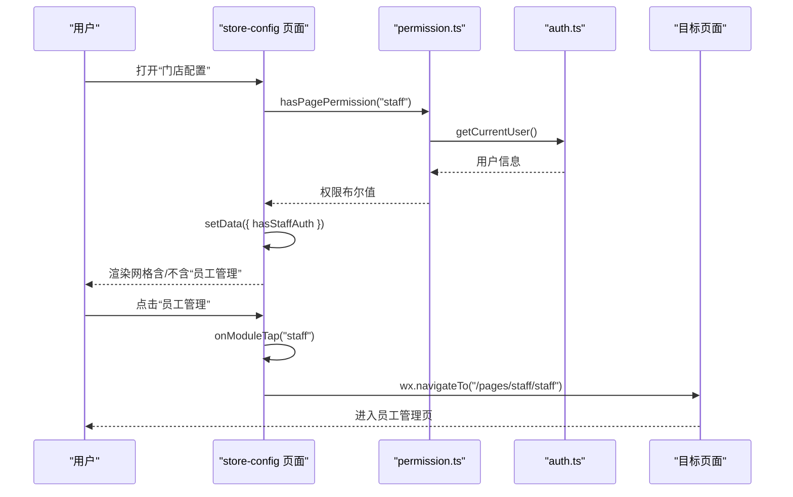
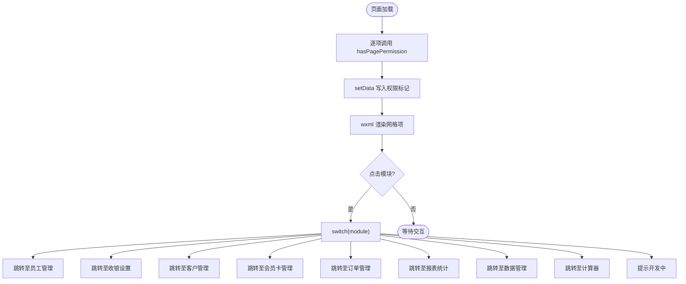
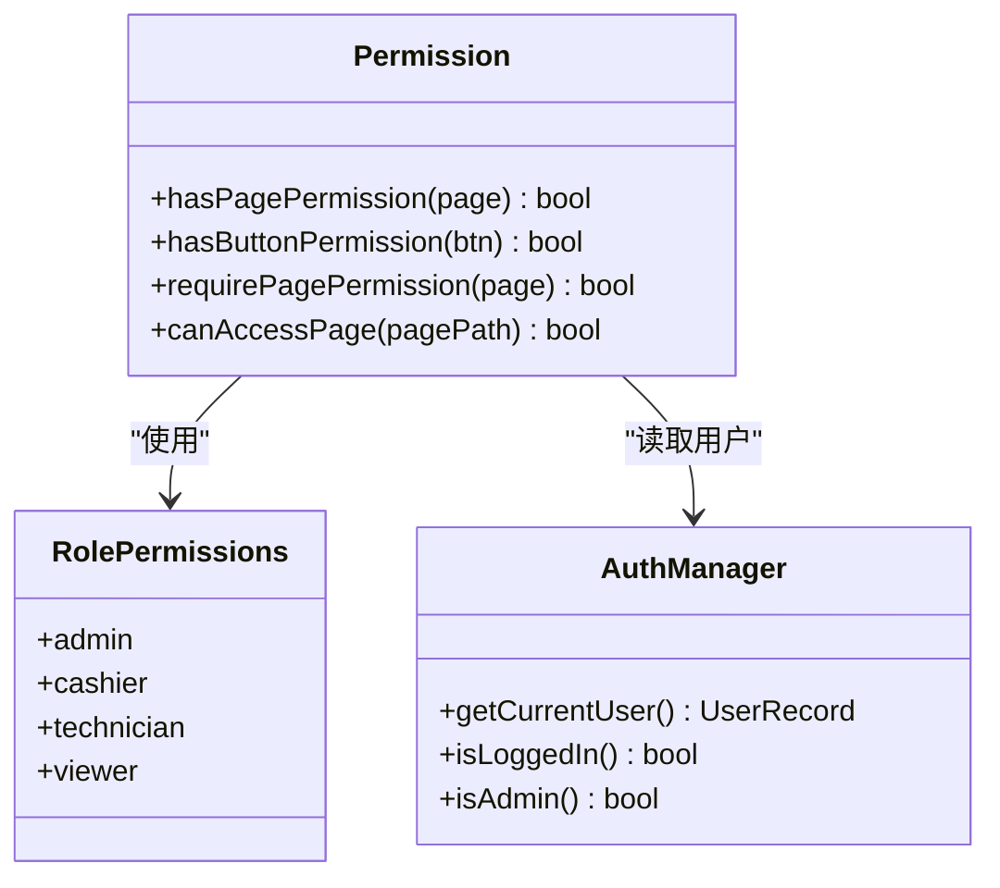
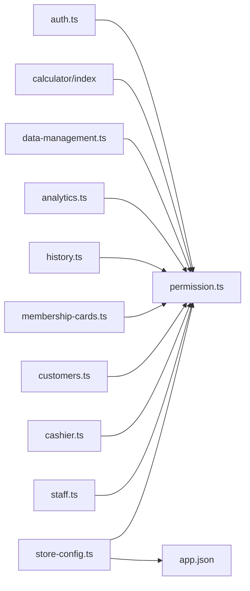

# 门店配置总览

<cite>
**本文引用的文件**
- [store-config.ts](file://miniprogram/pages/store-config/store-config.ts)
- [store-config.wxml](file://miniprogram/pages/store-config/store-config.wxml)
- [store-config.less](file://miniprogram/pages/store-config/store-config.less)
- [permission.ts](file://miniprogram/utils/permission.ts)
- [auth.ts](file://miniprogram/utils/auth.ts)
- [navigation-bar.ts](file://miniprogram/components/navigation-bar/navigation-bar.ts)
- [app.json](file://miniprogram/app.json)
- [staff.ts](file://miniprogram/pages/staff/staff.ts)
- [cashier.ts](file://miniprogram/pages/cashier/cashier.ts)
- [customers.ts](file://miniprogram/pages/customers/customers.ts)
- [membership-cards.ts](file://miniprogram/pages/membership-cards/membership-cards.ts)
- [history.ts](file://miniprogram/pages/history/history.ts)
- [analytics.ts](file://miniprogram/pages/analytics/analytics.ts)
- [data-management.ts](file://miniprogram/pages/data-management/data-management.ts)
</cite>

## 目录
1. [简介](#简介)
2. [项目结构](#项目结构)
3. [核心组件](#核心组件)
4. [架构总览](#架构总览)
5. [详细组件分析](#详细组件分析)
6. [依赖关系分析](#依赖关系分析)
7. [性能考虑](#性能考虑)
8. [故障排除指南](#故障排除指南)
9. [结论](#结论)
10. [附录](#附录)

## 简介
本文件面向“门店配置总览”页面（store-config），系统化梳理其整体架构、权限控制、模块导航与跳转逻辑，并对各配置模块（员工管理、收银设置、客户管理、会员卡管理、订单管理、报表统计、数据管理、计算器）的访问控制进行深入解析。文档同时提供导航设计与用户体验优化建议、权限分配最佳实践以及系统维护要点，帮助开发者与运营人员高效完成门店配置与日常管理工作。

## 项目结构
store-config 页面位于小程序前端目录 pages/store-config 下，采用标准的三件套组织：页面逻辑（ts）、模板（wxml）、样式（less）。权限控制与用户认证通过工具模块 permission.ts 与 auth.ts 提供统一能力；导航栏组件 navigation-bar.ts 支持自定义标题与返回行为；全局页面注册在 app.json 中声明。

图表来源
- [store-config.ts](file://miniprogram/pages/store-config/store-config.ts#L1-L64)
- [permission.ts](file://miniprogram/utils/permission.ts#L1-L194)
- [auth.ts](file://miniprogram/utils/auth.ts#L1-L245)
- [navigation-bar.ts](file://miniprogram/components/navigation-bar/navigation-bar.ts#L1-L114)
- [app.json](file://miniprogram/app.json#L1-L35)

章节来源
- [store-config.ts](file://miniprogram/pages/store-config/store-config.ts#L1-L64)
- [store-config.wxml](file://miniprogram/pages/store-config/store-config.wxml#L1-L64)
- [store-config.less](file://miniprogram/pages/store-config/store-config.less#L1-L110)
- [permission.ts](file://miniprogram/utils/permission.ts#L1-L194)
- [auth.ts](file://miniprogram/utils/auth.ts#L1-L245)
- [navigation-bar.ts](file://miniprogram/components/navigation-bar/navigation-bar.ts#L1-L114)
- [app.json](file://miniprogram/app.json#L1-L35)

## 核心组件
- store-config 页面：负责展示配置模块网格、根据用户权限动态显示模块入口，并在点击时执行跳转。
- 权限模块 permission.ts：集中定义页面权限映射、按钮权限映射、角色权限矩阵与权限校验函数。
- 认证模块 auth.ts：封装登录态、用户信息存储与读取、静默登录、登出等能力。
- 导航栏组件 navigation-bar.ts：支持自定义标题、返回、首页跳转与动画显示。
- 全局页面注册 app.json：声明所有页面路径，确保页面可被跳转。

章节来源
- [store-config.ts](file://miniprogram/pages/store-config/store-config.ts#L1-L64)
- [permission.ts](file://miniprogram/utils/permission.ts#L1-L194)
- [auth.ts](file://miniprogram/utils/auth.ts#L1-L245)
- [navigation-bar.ts](file://miniprogram/components/navigation-bar/navigation-bar.ts#L1-L114)
- [app.json](file://miniprogram/app.json#L1-L35)

## 架构总览
store-config 的权限控制遵循“角色 → 权限矩阵 → 页面/按钮权限”的链路。页面加载时调用 hasPagePermission 将权限结果写入 data，wxml 使用 wx:if 动态渲染模块项；点击模块后，store-config 根据模块键值执行对应的 navigateTo 跳转。

图表来源
- [store-config.ts](file://miniprogram/pages/store-config/store-config.ts#L16-L62)
- [permission.ts](file://miniprogram/utils/permission.ts#L149-L154)
- [auth.ts](file://miniprogram/utils/auth.ts#L51-L53)

章节来源
- [store-config.ts](file://miniprogram/pages/store-config/store-config.ts#L16-L62)
- [permission.ts](file://miniprogram/utils/permission.ts#L149-L154)
- [auth.ts](file://miniprogram/utils/auth.ts#L51-L53)

## 详细组件分析

### store-config 页面
- 数据绑定：hasStaffAuth、hasCashierAuth、hasCustomerAuth、hasMembershipAuth、hasOrdersAuth、hasReportsAuth、hasDataAuth、hasCalculatorAuth。
- 生命周期：onLoad 中逐项调用 hasPagePermission 并写入 data。
- 交互：onModuleTap 根据 data-module 键值执行跳转，未实现的模块默认提示“功能开发中”。

图表来源
- [store-config.ts](file://miniprogram/pages/store-config/store-config.ts#L16-L62)

章节来源
- [store-config.ts](file://miniprogram/pages/store-config/store-config.ts#L16-L62)
- [store-config.wxml](file://miniprogram/pages/store-config/store-config.wxml#L6-L61)
- [store-config.less](file://miniprogram/pages/store-config/store-config.less#L33-L85)

### 权限控制与角色管理
- 页面权限映射：PAGE_PERMISSION_MAP 将页面标识映射到角色权限键。
- 角色权限矩阵：RolePermissions 定义 admin、cashier、technician、viewer 四类角色对各页面与按钮的访问权限。
- 校验函数：
  - hasPagePermission(page)：基于当前用户角色判断页面访问。
  - hasButtonPermission(btn)：判断按钮级操作权限。
  - requirePagePermission(page)：无权限时提示并回退。
  - canAccessPage(pagePath)：根据路由路径反查页面权限。

图表来源
- [permission.ts](file://miniprogram/utils/permission.ts#L18-L147)
- [auth.ts](file://miniprogram/utils/auth.ts#L51-L69)

章节来源
- [permission.ts](file://miniprogram/utils/permission.ts#L18-L194)
- [auth.ts](file://miniprogram/utils/auth.ts#L51-L69)

### 模块入口与跳转逻辑
- 员工管理：hasStaffAuth 控制显示，点击跳转至 staff 页面。
- 收银设置：hasCashierAuth 控制显示，点击跳转至 cashier 页面。
- 客户管理：hasCustomerAuth 控制显示，点击跳转至 customers 页面。
- 会员卡管理：hasMembershipAuth 控制显示，点击跳转至 membership-cards 页面。
- 订单管理：hasOrdersAuth 控制显示，点击跳转至 history 页面。
- 报表统计：hasReportsAuth 控制显示，点击跳转至 analytics 页面。
- 数据管理：hasDataAuth 控制显示，点击跳转至 data-management 页面。
- 计算器：hasCalculatorAuth 控制显示，点击跳转至 calculator 页面。

章节来源
- [store-config.ts](file://miniprogram/pages/store-config/store-config.ts#L30-L62)
- [store-config.wxml](file://miniprogram/pages/store-config/store-config.wxml#L6-L61)

### 各配置模块的权限与可见性
- 员工管理：admin、cashier 可见；cashier 亦具备部分按钮权限。
- 收银设置：admin、cashier 可见；cashier 具备预约创建、推送旋转等按钮权限。
- 客户管理：admin、cashier 可见；支持会员卡开卡、历史查询等。
- 会员卡管理：admin 可见；cashier 默认不可见。
- 订单管理：admin、cashier 可见；支持作废、删除、提前结束等操作。
- 报表统计：admin 可见；cashier 默认不可见。
- 数据管理：admin 可见；cashier 默认不可见。
- 计算器：admin 可见；cashier 默认不可见。

章节来源
- [permission.ts](file://miniprogram/utils/permission.ts#L46-L147)
- [cashier.ts](file://miniprogram/pages/cashier/cashier.ts#L103-L126)
- [customers.ts](file://miniprogram/pages/customers/customers.ts#L1-L471)
- [membership-cards.ts](file://miniprogram/pages/membership-cards/membership-cards.ts#L1-L261)
- [history.ts](file://miniprogram/pages/history/history.ts#L75-L98)
- [analytics.ts](file://miniprogram/pages/analytics/analytics.ts#L1-L408)
- [data-management.ts](file://miniprogram/pages/data-management/data-management.ts#L1-L298)

### 导航设计与用户体验
- 网格布局：3列网格，模块项包含图标与标签，点击有按压反馈与缩放过渡。
- 动态可见性：仅展示当前用户具备权限的模块，避免无效入口。
- 统一导航：顶部自定义导航栏，支持返回与首页跳转。
- 响应式：页面采用 flex 布局与安全区适配，保证多机型一致体验。

章节来源
- [store-config.less](file://miniprogram/pages/store-config/store-config.less#L33-L110)
- [navigation-bar.ts](file://miniprogram/components/navigation-bar/navigation-bar.ts#L62-L112)

## 依赖关系分析
- store-config 依赖 permission.ts 进行权限判定，依赖 auth.ts 获取当前用户。
- 各业务页面（staff、cashier、customers、membership-cards、history、analytics、data-management、calculator）均通过 permission.ts 的页面权限校验或按钮权限校验保障访问安全。
- app.json 统一注册页面，确保跳转路径有效。

图表来源
- [store-config.ts](file://miniprogram/pages/store-config/store-config.ts#L1-L64)
- [permission.ts](file://miniprogram/utils/permission.ts#L1-L194)
- [auth.ts](file://miniprogram/utils/auth.ts#L1-L245)
- [app.json](file://miniprogram/app.json#L1-L35)

章节来源
- [store-config.ts](file://miniprogram/pages/store-config/store-config.ts#L1-L64)
- [permission.ts](file://miniprogram/utils/permission.ts#L1-L194)
- [auth.ts](file://miniprogram/utils/auth.ts#L1-L245)
- [app.json](file://miniprogram/app.json#L1-L35)

## 性能考虑
- 权限判定：hasPagePermission 仅在页面加载时执行一次，避免重复 IO。
- 按需渲染：wxml 使用 wx:if 动态隐藏无权限模块，减少节点数量。
- 跳转策略：使用 navigateTo，避免栈溢出；必要时结合 requirePagePermission 防止无效跳转。
- 样式优化：使用 less 变量与阴影、圆角等轻量样式，降低重绘成本。

## 故障排除指南
- 无法进入某模块
  - 检查角色权限矩阵中该模块开关是否开启。
  - 在 store-config 页面确认 hasXxxAuth 是否为 true。
- 登录态异常
  - 使用 auth.ts 的 silentLogin 与 checkLogin 确认登录状态。
  - 若未登录，将被 reLaunch 到登录页。
- 路由跳转失败
  - 核对 app.json 中页面注册路径与实际路径一致。
  - 使用 requirePagePermission 包裹页面入口，避免无权限跳转。
- 模块图标/标签显示异常
  - 检查 store-config.less 的 grid-item 与 icon-text 样式是否被覆盖。
  - 确认 navigation-bar 组件属性传入正确。

章节来源
- [permission.ts](file://miniprogram/utils/permission.ts#L163-L173)
- [auth.ts](file://miniprogram/utils/auth.ts#L224-L244)
- [app.json](file://miniprogram/app.json#L1-L35)
- [store-config.less](file://miniprogram/pages/store-config/store-config.less#L44-L85)

## 结论
store-config 页面以“角色 → 权限矩阵 → 页面/按钮权限”的统一模型实现模块化配置入口，结合动态渲染与导航组件，提供了清晰、安全且易扩展的配置总览体验。通过规范的权限分配与页面注册，可有效降低误操作风险并提升运营效率。

## 附录

### 权限分配最佳实践
- 为不同岗位明确最小权限集：admin 全量开放；cashier 仅开放必要模块与按钮。
- 定期审计角色权限矩阵，清理冗余开关。
- 对关键操作（如删除、作废）单独设置按钮权限，避免页面级越权。

### 系统维护建议
- 新增模块时同步完善 permission.ts 的页面映射与角色矩阵。
- 页面路径变更需同步更新 app.json 与跳转逻辑。
- 对外发布前进行全量权限回归测试，确保“可见即可用”。