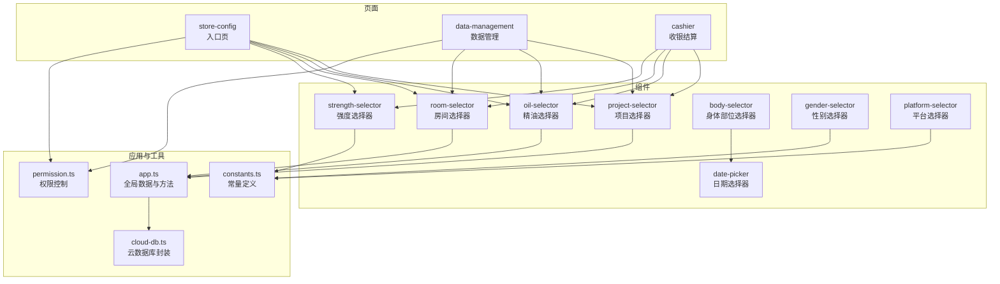
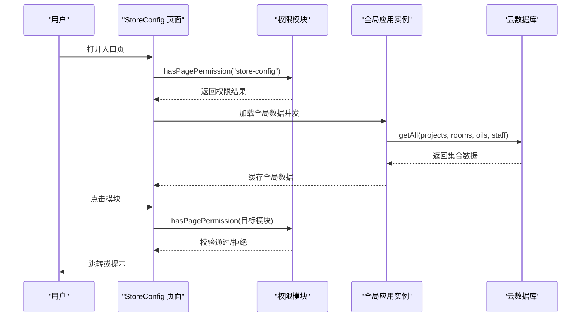
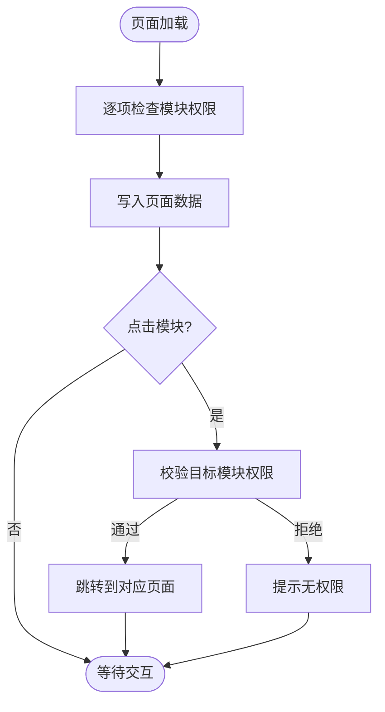
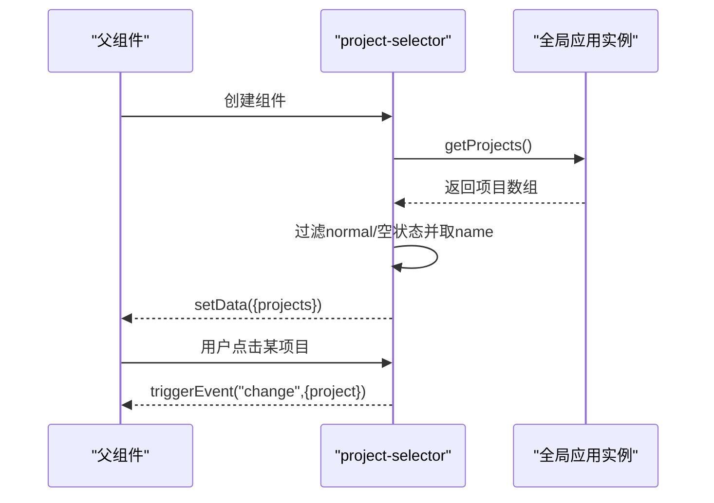
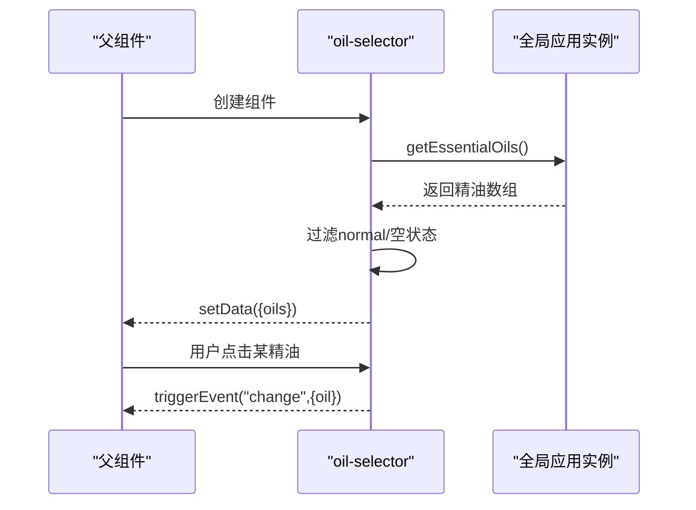
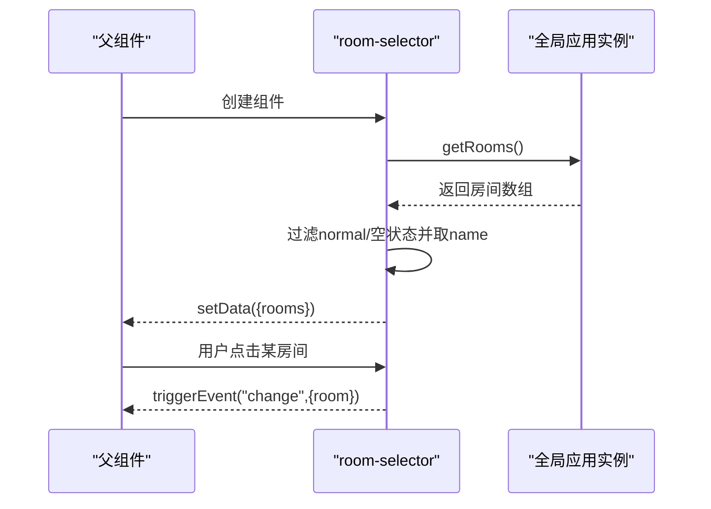
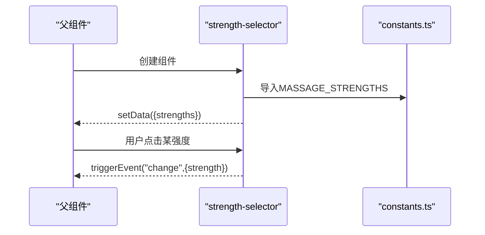
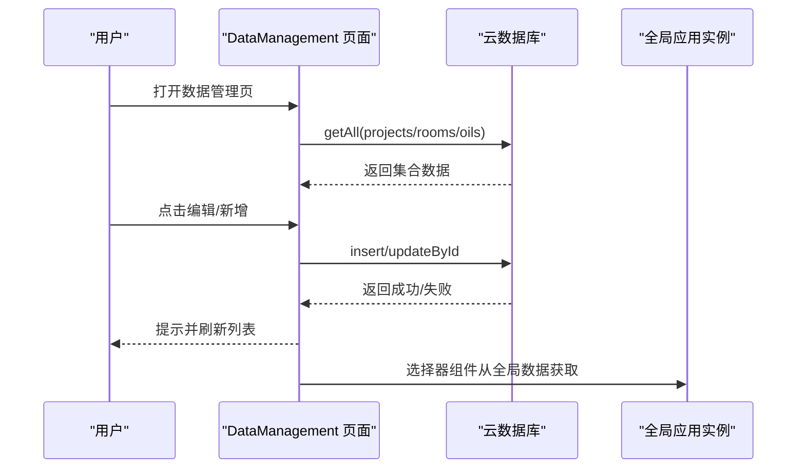
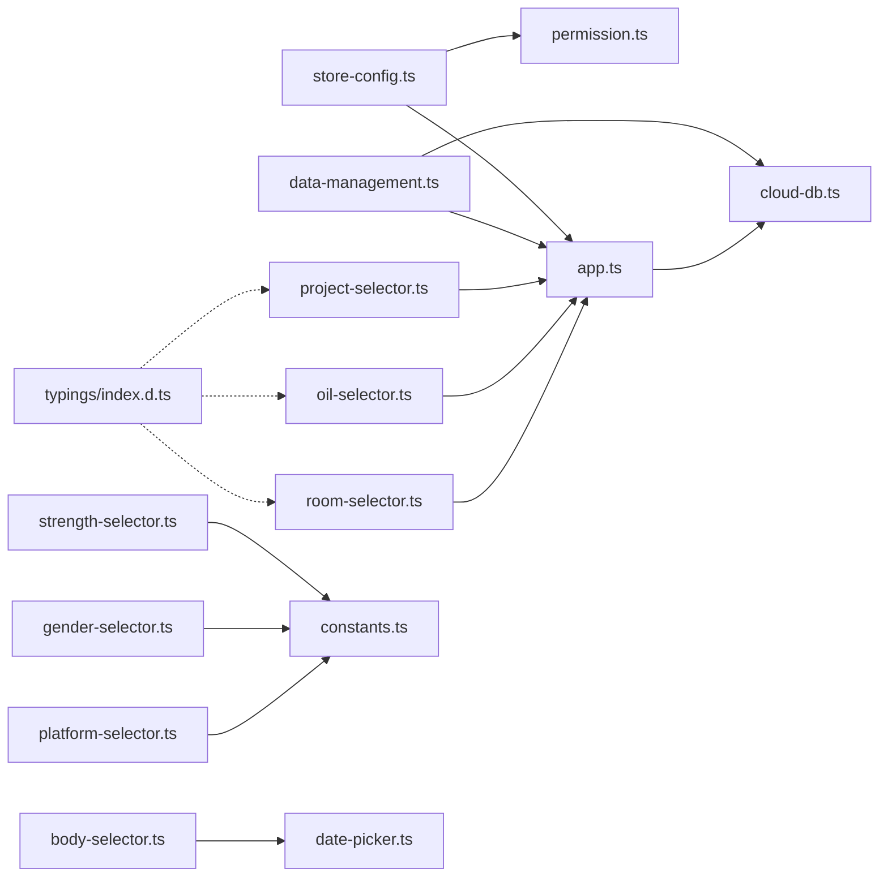

# 项目管理系统

<cite>
**本文档引用的文件**
- [miniprogram/pages/store-config/store-config.ts](file://miniprogram/pages/store-config/store-config.ts)
- [miniprogram/components/project-selector/project-selector.ts](file://miniprogram/components/project-selector/project-selector.ts)
- [miniprogram/components/oil-selector/oil-selector.ts](file://miniprogram/components/oil-selector/oil-selector.ts)
- [miniprogram/components/room-selector/room-selector.ts](file://miniprogram/components/room-selector/room-selector.ts)
- [miniprogram/components/strength-selector/strength-selector.ts](file://miniprogram/components/strength-selector/strength-selector.ts)
- [miniprogram/utils/constants.ts](file://miniprogram/utils/constants.ts)
- [miniprogram/app.ts](file://miniprogram/app.ts)
- [miniprogram/pages/data-management/data-management.ts](file://miniprogram/pages/data-management/data-management.ts)
- [miniprogram/utils/cloud-db.ts](file://miniprogram/utils/cloud-db.ts)
- [miniprogram/utils/permission.ts](file://miniprogram/utils/permission.ts)
- [miniprogram/components/body-selector/body-selector.ts](file://miniprogram/components/body-selector/body-selector.ts)
- [miniprogram/components/gender-selector/gender-selector.ts](file://miniprogram/components/gender-selector/gender-selector.ts)
- [miniprogram/components/platform-selector/platform-selector.ts](file://miniprogram/components/platform-selector/platform-selector.ts)
- [miniprogram/components/date-picker/date-picker.ts](file://miniprogram/components/date-picker/date-picker.ts)
- [typings/index.d.ts](file://typings/index.d.ts)
</cite>

## 目录
1. [简介](#简介)
2. [项目结构](#项目结构)
3. [核心组件](#核心组件)
4. [架构总览](#架构总览)
5. [详细组件分析](#详细组件分析)
6. [依赖关系分析](#依赖关系分析)
7. [性能考虑](#性能考虑)
8. [故障排查指南](#故障排查指南)
9. [结论](#结论)
10. [附录](#附录)

## 简介
本项目是一个基于微信小程序的按摩服务管理系统，围绕“项目配置、精油管理、房间分配与价格设置”构建。系统通过全局应用实例统一加载与缓存项目、房间、精油等基础数据，并提供可复用的选择器组件以支撑下单、结算、排班等业务流程。StoreConfig 页面作为入口页，负责模块导航与权限控制；DataManagement 页面提供项目、房间、精油的增删改查与状态切换；各选择器组件封装了数据加载、交互与事件分发，确保界面与业务逻辑解耦。

## 项目结构
系统采用按页面与组件分离的目录组织方式，核心模块如下：
- 页面层：store-config、data-management、cashier、analytics、staff、customers、membership-cards、history、calculator 等
- 组件层：project-selector、oil-selector、room-selector、strength-selector、body-selector、gender-selector、platform-selector、date-picker 等
- 工具层：permission（权限）、constants（常量）、cloud-db（云数据库）、auth（鉴权）、util（通用工具）



图表来源
- [miniprogram/pages/store-config/store-config.ts](file://miniprogram/pages/store-config/store-config.ts#L1-L64)
- [miniprogram/pages/data-management/data-management.ts](file://miniprogram/pages/data-management/data-management.ts#L1-L298)
- [miniprogram/app.ts](file://miniprogram/app.ts#L1-L191)
- [miniprogram/utils/cloud-db.ts](file://miniprogram/utils/cloud-db.ts#L1-L321)
- [miniprogram/utils/constants.ts](file://miniprogram/utils/constants.ts#L1-L49)
- [miniprogram/utils/permission.ts](file://miniprogram/utils/permission.ts#L1-L194)

章节来源
- [miniprogram/pages/store-config/store-config.ts](file://miniprogram/pages/store-config/store-config.ts#L1-L64)
- [miniprogram/pages/data-management/data-management.ts](file://miniprogram/pages/data-management/data-management.ts#L1-L298)
- [miniprogram/app.ts](file://miniprogram/app.ts#L1-L191)
- [miniprogram/utils/cloud-db.ts](file://miniprogram/utils/cloud-db.ts#L1-L321)
- [miniprogram/utils/constants.ts](file://miniprogram/utils/constants.ts#L1-L49)
- [miniprogram/utils/permission.ts](file://miniprogram/utils/permission.ts#L1-L194)

## 核心组件
- StoreConfig 页面：负责模块导航与权限校验，根据用户角色显示可访问模块并跳转至对应页面。
- DataManagement 页面：提供项目、房间、精油三类数据的增删改查、状态切换与批量操作入口。
- 选择器组件：封装项目、精油、房间、强度、身体部位、性别、平台、日期等常用选择逻辑，统一触发 change 事件供父组件消费。
- 全局应用实例：集中加载与缓存项目、房间、精油、员工等基础数据，提供异步获取接口与并发加载能力。
- 权限控制：基于角色映射页面与按钮级权限，提供访问校验与提示。

章节来源
- [miniprogram/pages/store-config/store-config.ts](file://miniprogram/pages/store-config/store-config.ts#L1-L64)
- [miniprogram/pages/data-management/data-management.ts](file://miniprogram/pages/data-management/data-management.ts#L1-L298)
- [miniprogram/app.ts](file://miniprogram/app.ts#L40-L108)
- [miniprogram/utils/permission.ts](file://miniprogram/utils/permission.ts#L1-L194)

## 架构总览
系统采用“页面-组件-应用实例-云数据库”的分层架构：
- 页面负责业务编排与状态管理；
- 组件负责交互与数据选择；
- 应用实例负责全局数据加载与共享；
- 云数据库封装对集合进行统一 CRUD 操作；
- 权限模块贯穿页面与按钮级访问控制。



图表来源
- [miniprogram/pages/store-config/store-config.ts](file://miniprogram/pages/store-config/store-config.ts#L16-L62)
- [miniprogram/utils/permission.ts](file://miniprogram/utils/permission.ts#L149-L173)
- [miniprogram/app.ts](file://miniprogram/app.ts#L40-L66)
- [miniprogram/utils/cloud-db.ts](file://miniprogram/utils/cloud-db.ts#L69-L88)

## 详细组件分析

### StoreConfig 页面（入口与权限）
- 功能要点
  - 在页面加载时，逐项检查用户对 staff、cashier、customers、membership-cards、history、analytics、data-management、calculator 等模块的访问权限，并将结果写入页面数据。
  - 处理模块点击事件，根据模块键值跳转到对应页面；默认情况下提示“功能开发中”，便于后续扩展。
- 权限机制
  - 基于角色映射页面权限，调用 hasPagePermission 进行校验；若无权限则提示并回退。
- 交互流程



图表来源
- [miniprogram/pages/store-config/store-config.ts](file://miniprogram/pages/store-config/store-config.ts#L16-L62)
- [miniprogram/utils/permission.ts](file://miniprogram/utils/permission.ts#L149-L173)

章节来源
- [miniprogram/pages/store-config/store-config.ts](file://miniprogram/pages/store-config/store-config.ts#L1-L64)
- [miniprogram/utils/permission.ts](file://miniprogram/utils/permission.ts#L1-L194)

### 项目选择器（project-selector）
- 数据来源
  - 通过全局应用实例获取全部项目，过滤状态为 normal 或未设置的项目，提取名称列表。
- 交互行为
  - 子组件点击某项目后，向上触发 change 事件，携带所选项目名称。
- 性能与健壮性
  - 异步加载失败时回退为空数组，避免页面崩溃。



图表来源
- [miniprogram/components/project-selector/project-selector.ts](file://miniprogram/components/project-selector/project-selector.ts#L14-L29)
- [miniprogram/app.ts](file://miniprogram/app.ts#L68-L73)

章节来源
- [miniprogram/components/project-selector/project-selector.ts](file://miniprogram/components/project-selector/project-selector.ts#L1-L38)
- [miniprogram/app.ts](file://miniprogram/app.ts#L68-L73)

### 精油选择器（oil-selector）
- 数据来源
  - 通过全局应用实例获取全部精油，过滤状态为 normal 或未设置的精油，直接使用对象列表。
- 交互行为
  - 子组件点击某精油后，向上触发 change 事件，携带所选精油对象。
- 错误处理
  - 异常时回退为空数组。



图表来源
- [miniprogram/components/oil-selector/oil-selector.ts](file://miniprogram/components/oil-selector/oil-selector.ts#L14-L28)
- [miniprogram/app.ts](file://miniprogram/app.ts#L82-L87)

章节来源
- [miniprogram/components/oil-selector/oil-selector.ts](file://miniprogram/components/oil-selector/oil-selector.ts#L1-L37)
- [miniprogram/app.ts](file://miniprogram/app.ts#L82-L87)

### 房间选择器（room-selector）
- 数据来源
  - 通过全局应用实例获取全部房间，过滤状态为 normal 或未设置的房间，提取名称列表。
- 交互行为
  - 子组件点击某房间后，向上触发 change 事件，携带所选房间名称。
- 可禁用特性
  - 支持 disabled 属性，禁用状态下不响应点击。



图表来源
- [miniprogram/components/room-selector/room-selector.ts](file://miniprogram/components/room-selector/room-selector.ts#L19-L35)
- [miniprogram/app.ts](file://miniprogram/app.ts#L75-L80)

章节来源
- [miniprogram/components/room-selector/room-selector.ts](file://miniprogram/components/room-selector/room-selector.ts#L1-L44)
- [miniprogram/app.ts](file://miniprogram/app.ts#L75-L80)

### 强度选择器（strength-selector）
- 数据来源
  - 使用常量 MASSAGE_STRENGTHS 定义强度选项。
- 交互行为
  - 子组件点击某强度后，向上触发 change 事件，携带所选强度标识。



图表来源
- [miniprogram/components/strength-selector/strength-selector.ts](file://miniprogram/components/strength-selector/strength-selector.ts#L1-L19)
- [miniprogram/utils/constants.ts](file://miniprogram/utils/constants.ts#L1-L5)

章节来源
- [miniprogram/components/strength-selector/strength-selector.ts](file://miniprogram/components/strength-selector/strength-selector.ts#L1-L19)
- [miniprogram/utils/constants.ts](file://miniprogram/utils/constants.ts#L1-L5)

### 身体部位选择器（body-selector）
- 数据来源
  - 内置部位列表，包含头部、颈部、肩部、后背、手臂、腹部、腰部、大腿、小腿。
- 交互行为
  - 触发 change 事件，携带所选部位对象。

章节来源
- [miniprogram/components/body-selector/body-selector.ts](file://miniprogram/components/body-selector/body-selector.ts#L1-L27)

### 性别选择器（gender-selector）
- 数据来源
  - 使用常量 GENDERS 定义性别选项。
- 交互行为
  - 触发 change 事件，携带所选性别标识。

章节来源
- [miniprogram/components/gender-selector/gender-selector.ts](file://miniprogram/components/gender-selector/gender-selector.ts#L1-L22)
- [miniprogram/utils/constants.ts](file://miniprogram/utils/constants.ts#L7-L10)

### 平台选择器（platform-selector）
- 数据来源
  - 使用常量 COUPON_PLATFORMS 定义平台选项（如美团、大众点评、抖音、微信、支付宝、现金、高德、免费、会员卡等）。
- 交互行为
  - 触发 change 事件，携带所选平台标识。

章节来源
- [miniprogram/components/platform-selector/platform-selector.ts](file://miniprogram/components/platform-selector/platform-selector.ts#L1-L22)
- [miniprogram/utils/constants.ts](file://miniprogram/utils/constants.ts#L12-L22)

### 日期选择器（date-picker）
- 功能要点
  - 支持上一日、今日、下一日导航与自选日期，内部维护 selectedDate、isToday、displayDate。
  - 触发 change 事件，传递新的日期字符串。
- 适配场景
  - 适用于排班、统计、预约等需要日期选择的业务。

章节来源
- [miniprogram/components/date-picker/date-picker.ts](file://miniprogram/components/date-picker/date-picker.ts#L1-L101)

### 数据模型与价格体系
- 项目（Project）
  - 关键字段：名称、时长、价格、手工提成、是否仅精油、是否需要精油、状态等。
- 房间（Room）
  - 关键字段：名称、状态。
- 精油（EssentialOil）
  - 关键字段：名称、功效、状态。
- 状态枚举（ItemStatus）
  - normal、disabled。
- 价格与资源
  - 结算时会读取项目的价格字段作为原价参考；项目配置支持是否仅精油、是否需要精油等资源约束。

```mermaid
classDiagram
class Project {
+string name
+number duration
+number price
+number commission
+boolean isEssentialOilOnly
+boolean needEssentialOil
+ItemStatus status
}
class Room {
+string name
+ItemStatus status
}
class EssentialOil {
+string name
+string effect
+ItemStatus status
}
class ItemStatus {
<<enum>>
"normal"
"disabled"
}
```

图表来源
- [typings/index.d.ts](file://typings/index.d.ts#L185-L206)

章节来源
- [typings/index.d.ts](file://typings/index.d.ts#L185-L206)

### StoreConfig 页面实现逻辑（项目列表管理、配置项编辑与状态同步）
- 项目列表管理
  - StoreConfig 页面本身不直接管理项目列表，但通过权限控制与模块导航引导至 DataManagement 页面进行项目、房间、精油的增删改查与状态切换。
- 配置项编辑
  - DataManagement 页面提供三个标签页：projects、rooms、oils。每个标签页展示对应集合的数据列表，支持新增、编辑、删除、状态切换。
  - 表单字段覆盖名称、时长、价格、提成、状态、是否仅精油、是否需要精油、功效等。
- 状态同步机制
  - 切换状态时，调用云数据库更新接口，成功后局部更新页面数据，保证 UI 与后端一致。
- 与全局数据的关系
  - 选择器组件通过全局应用实例获取最新数据，确保编辑与选择使用的是实时数据。



图表来源
- [miniprogram/pages/data-management/data-management.ts](file://miniprogram/pages/data-management/data-management.ts#L30-L52)
- [miniprogram/utils/cloud-db.ts](file://miniprogram/utils/cloud-db.ts#L69-L88)
- [miniprogram/app.ts](file://miniprogram/app.ts#L40-L66)

章节来源
- [miniprogram/pages/data-management/data-management.ts](file://miniprogram/pages/data-management/data-management.ts#L1-L298)
- [miniprogram/utils/cloud-db.ts](file://miniprogram/utils/cloud-db.ts#L1-L321)
- [miniprogram/app.ts](file://miniprogram/app.ts#L40-L66)

### 各选择器组件工作原理
- 项目选择器：拉取全局项目 -> 过滤 -> 渲染 -> 触发 change
- 精油选择器：拉取全局精油 -> 过滤 -> 渲染 -> 触发 change
- 房间选择器：拉取全局房间 -> 过滤 -> 渲染 -> 触发 change
- 强度选择器：读取常量 -> 渲染 -> 触发 change
- 身体部位/性别/平台/日期选择器：内置数据或常量 -> 渲染 -> 触发 change

章节来源
- [miniprogram/components/project-selector/project-selector.ts](file://miniprogram/components/project-selector/project-selector.ts#L1-L38)
- [miniprogram/components/oil-selector/oil-selector.ts](file://miniprogram/components/oil-selector/oil-selector.ts#L1-L37)
- [miniprogram/components/room-selector/room-selector.ts](file://miniprogram/components/room-selector/room-selector.ts#L1-L44)
- [miniprogram/components/strength-selector/strength-selector.ts](file://miniprogram/components/strength-selector/strength-selector.ts#L1-L19)
- [miniprogram/components/body-selector/body-selector.ts](file://miniprogram/components/body-selector/body-selector.ts#L1-L27)
- [miniprogram/components/gender-selector/gender-selector.ts](file://miniprogram/components/gender-selector/gender-selector.ts#L1-L22)
- [miniprogram/components/platform-selector/platform-selector.ts](file://miniprogram/components/platform-selector/platform-selector.ts#L1-L22)
- [miniprogram/components/date-picker/date-picker.ts](file://miniprogram/components/date-picker/date-picker.ts#L1-L101)
- [miniprogram/utils/constants.ts](file://miniprogram/utils/constants.ts#L1-L49)

## 依赖关系分析
- 页面依赖权限模块进行访问控制，依赖全局应用实例获取数据，依赖云数据库进行持久化。
- 组件依赖全局应用实例或常量文件，向上游触发事件。
- 全局应用实例依赖云数据库进行并发加载与缓存。
- 类型定义文件为项目提供强类型支持。



图表来源
- [miniprogram/pages/store-config/store-config.ts](file://miniprogram/pages/store-config/store-config.ts#L1-L64)
- [miniprogram/utils/permission.ts](file://miniprogram/utils/permission.ts#L1-L194)
- [miniprogram/app.ts](file://miniprogram/app.ts#L1-L191)
- [miniprogram/pages/data-management/data-management.ts](file://miniprogram/pages/data-management/data-management.ts#L1-L298)
- [miniprogram/utils/cloud-db.ts](file://miniprogram/utils/cloud-db.ts#L1-L321)
- [miniprogram/components/project-selector/project-selector.ts](file://miniprogram/components/project-selector/project-selector.ts#L1-L38)
- [miniprogram/components/oil-selector/oil-selector.ts](file://miniprogram/components/oil-selector/oil-selector.ts#L1-L37)
- [miniprogram/components/room-selector/room-selector.ts](file://miniprogram/components/room-selector/room-selector.ts#L1-L44)
- [miniprogram/components/strength-selector/strength-selector.ts](file://miniprogram/components/strength-selector/strength-selector.ts#L1-L19)
- [miniprogram/utils/constants.ts](file://miniprogram/utils/constants.ts#L1-L49)
- [miniprogram/components/body-selector/body-selector.ts](file://miniprogram/components/body-selector/body-selector.ts#L1-L27)
- [miniprogram/components/date-picker/date-picker.ts](file://miniprogram/components/date-picker/date-picker.ts#L1-L101)
- [typings/index.d.ts](file://typings/index.d.ts#L185-L206)

章节来源
- [miniprogram/pages/store-config/store-config.ts](file://miniprogram/pages/store-config/store-config.ts#L1-L64)
- [miniprogram/pages/data-management/data-management.ts](file://miniprogram/pages/data-management/data-management.ts#L1-L298)
- [miniprogram/app.ts](file://miniprogram/app.ts#L1-L191)
- [miniprogram/utils/cloud-db.ts](file://miniprogram/utils/cloud-db.ts#L1-L321)
- [miniprogram/utils/permission.ts](file://miniprogram/utils/permission.ts#L1-L194)
- [miniprogram/utils/constants.ts](file://miniprogram/utils/constants.ts#L1-L49)
- [miniprogram/components/project-selector/project-selector.ts](file://miniprogram/components/project-selector/project-selector.ts#L1-L38)
- [miniprogram/components/oil-selector/oil-selector.ts](file://miniprogram/components/oil-selector/oil-selector.ts#L1-L37)
- [miniprogram/components/room-selector/room-selector.ts](file://miniprogram/components/room-selector/room-selector.ts#L1-L44)
- [miniprogram/components/strength-selector/strength-selector.ts](file://miniprogram/components/strength-selector/strength-selector.ts#L1-L19)
- [miniprogram/components/body-selector/body-selector.ts](file://miniprogram/components/body-selector/body-selector.ts#L1-L27)
- [miniprogram/components/date-picker/date-picker.ts](file://miniprogram/components/date-picker/date-picker.ts#L1-L101)
- [typings/index.d.ts](file://typings/index.d.ts#L185-L206)

## 性能考虑
- 并发加载：全局应用实例在启动时并发拉取项目、房间、精油、员工数据，减少首屏等待时间。
- 缓存策略：全局数据加载完成后缓存于 globalData，后续组件直接从全局实例获取，避免重复请求。
- 选择器懒加载：组件在 attached 生命周期内才发起数据请求，降低页面初始化压力。
- 云数据库封装：统一的 CRUD 封装与错误兜底，提升稳定性与可维护性。
- 表单校验前置：在保存前进行必填与数值范围校验，减少无效请求。

章节来源
- [miniprogram/app.ts](file://miniprogram/app.ts#L40-L66)
- [miniprogram/components/project-selector/project-selector.ts](file://miniprogram/components/project-selector/project-selector.ts#L32-L36)
- [miniprogram/pages/data-management/data-management.ts](file://miniprogram/pages/data-management/data-management.ts#L140-L157)
- [miniprogram/utils/cloud-db.ts](file://miniprogram/utils/cloud-db.ts#L136-L203)

## 故障排查指南
- 页面无法访问
  - 检查权限映射与角色配置，确认 hasPagePermission 返回值。
  - 若无权限，页面会提示并回退。
- 数据加载失败
  - 全局应用实例与 DataManagement 页面均对异常进行了兜底，页面会提示“加载失败”或回退空数组。
- 保存失败
  - DataManagement 页面在保存前进行字段校验，若校验不通过会提示相应错误；保存过程中捕获异常并提示“保存失败”。

章节来源
- [miniprogram/utils/permission.ts](file://miniprogram/utils/permission.ts#L163-L173)
- [miniprogram/app.ts](file://miniprogram/app.ts#L40-L66)
- [miniprogram/pages/data-management/data-management.ts](file://miniprogram/pages/data-management/data-management.ts#L45-L51)
- [miniprogram/pages/data-management/data-management.ts](file://miniprogram/pages/data-management/data-management.ts#L144-L157)
- [miniprogram/pages/data-management/data-management.ts](file://miniprogram/pages/data-management/data-management.ts#L209-L211)

## 结论
本系统通过清晰的页面-组件-应用实例-云数据库分层，结合统一的权限控制与常量定义，实现了项目配置、精油管理、房间分配与价格设置的完整闭环。StoreConfig 页面承担入口与导航职责，DataManagement 页面提供完善的增删改查与状态管理能力，各类选择器组件保证交互一致性与可复用性。建议在后续迭代中完善 StoreConfig 的模块跳转逻辑与权限提示，同时探索批量操作与数据导入导出能力以进一步提升运营效率。

## 附录
- 最佳实践
  - 使用全局应用实例统一管理基础数据，避免多处重复请求。
  - 选择器组件尽量保持无状态与纯展示，通过事件向父组件传递数据。
  - 表单保存前进行前端校验，减少无效请求与错误提示。
- 扩展开发指导
  - 新增选择器：遵循现有组件结构，注入数据源与触发事件，确保命名规范与事件语义清晰。
  - 新增页面：优先引入权限校验，合理拆分页面与组件职责，利用云数据库封装进行数据持久化。
  - 数据模型扩展：在 typings 中补充类型定义，确保类型安全与 IDE 支持。