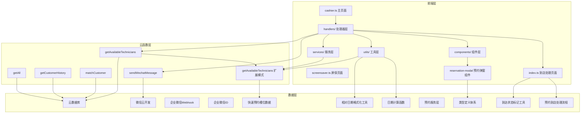
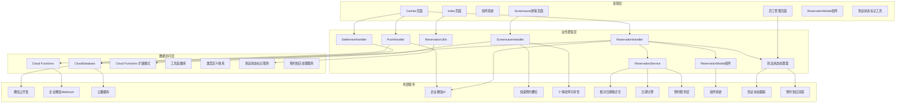
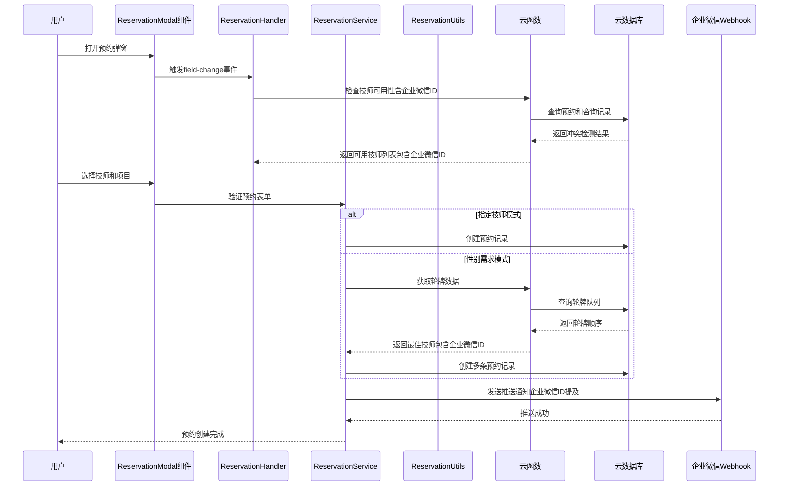
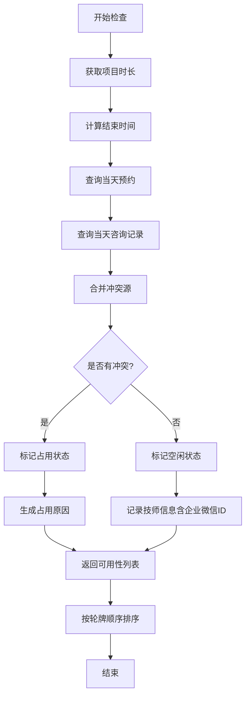
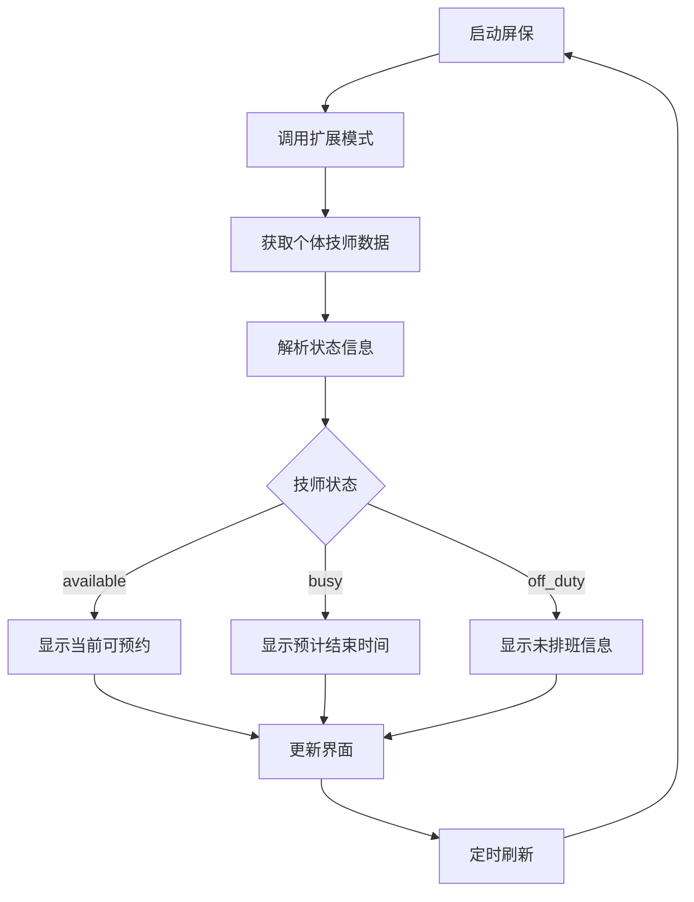
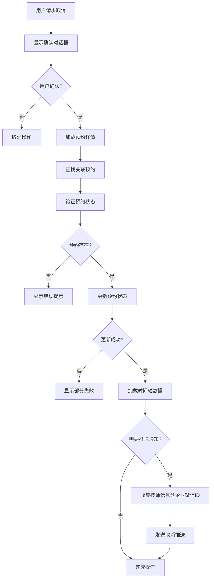
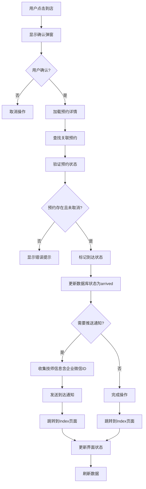
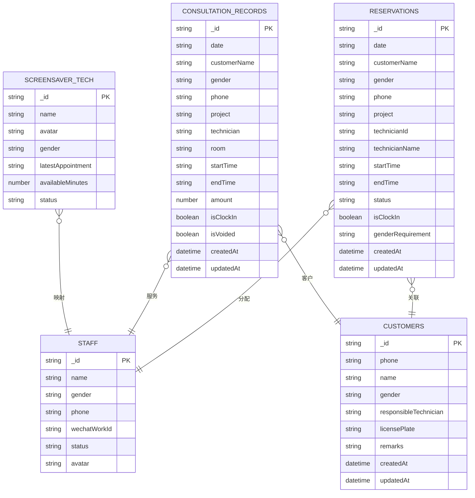

# 预约处理器

<cite>
**本文档引用的文件**
- [reservation.handler.ts](file://miniprogram/pages/cashier/handlers/reservation.handler.ts)
- [reservation.service.ts](file://miniprogram/services/reservation.service.ts)
- [reservation.types.ts](file://miniprogram/types/reservation.types.ts)
- [reservation-modal.ts](file://miniprogram/components/reservation-modal/reservation-modal.ts)
- [reservation-modal.wxml](file://miniprogram/components/reservation-modal/reservation-modal.wxml)
- [reservation-modal.less](file://miniprogram/components/reservation-modal/reservation-modal.less)
- [reservation-modal.json](file://miniprogram/components/reservation-modal/reservation-modal.json)
- [reservation-utils.ts](file://miniprogram/pages/index/utils/reservation-utils.ts)
- [cashier.types.ts](file://miniprogram/pages/cashier/cashier.types.ts)
- [push.handler.ts](file://miniprogram/pages/cashier/handlers/push.handler.ts)
- [cashier.ts](file://miniprogram/pages/cashier/cashier.ts)
- [index.ts](file://miniprogram/pages/index/index.ts)
- [cloud-db.ts](file://miniprogram/utils/cloud-db.ts)
- [util.ts](file://miniprogram/utils/util.ts)
- [app.ts](file://miniprogram/app.ts)
- [getAvailableTechnicians/index.js](file://cloudfunctions/getAvailableTechnicians/index.js)
- [sendWechatMessage/index.js](file://cloudfunctions/sendWechatMessage/index.js)
- [matchCustomer/index.js](file://cloudfunctions/matchCustomer/index.js)
- [getCustomerHistory/index.js](file://cloudfunctions/getCustomerHistory/index.js)
- [getAll/index.js](file://cloudfunctions/getAll/index.js)
- [wechat-work.ts](file://miniprogram/utils/wechat-work.ts)
- [staff.ts](file://miniprogram/pages/staff/staff.ts)
- [screensaver.ts](file://miniprogram/pages/screensaver/screensaver.ts)
- [screensaver.wxml](file://miniprogram/pages/screensaver/screensaver.wxml)
</cite>

## 更新摘要
**变更内容**
- 将 `deleteReservations()` 方法重命名为 `markReservationAsArrived()`，反映业务逻辑从删除到标记到达状态的变化
- 更新预约到店处理流程，从直接删除改为状态更新
- 增强预约系统功能，支持到达状态跟踪和通知推送
- 完善预约到店确认流程，提供更准确的业务逻辑

## 目录
1. [简介](#简介)
2. [项目结构](#项目结构)
3. [核心组件](#核心组件)
4. [架构概览](#架构概览)
5. [详细组件分析](#详细组件分析)
6. [依赖关系分析](#依赖关系分析)
7. [性能考虑](#性能考虑)
8. [故障排除指南](#故障排除指南)
9. [结论](#结论)

## 简介

预约处理器是ConsultationPrinter小程序中的核心业务组件，负责管理美容院的预约系统。该系统基于微信小程序平台构建，采用前后端分离的架构设计，通过云开发服务实现数据存储和业务逻辑处理。

**更新** 系统现已新增完整的预约系统功能模块，包括独立的预约弹窗组件、专门的预约服务层、完整的类型定义体系等。系统现已增强技师数据结构，支持企业微信ID信息，提供完整的通知系统支持，并优化了checkStaffAvailability()方法以正确处理云函数返回的扩展数据结构。同时新增了formatDaysFromNow()函数，增强了预约系统的日期显示功能，在预约取消、修改和创建通知中集成了相对日期显示，显著改善了用户体验。

系统主要功能包括：
- 预约创建和管理（支持指定技师和性别需求两种模式）
- 技师可用性检查和冲突检测
- 预约到店通知和变更推送
- 客户匹配和历史记录查询
- 轮牌管理和技师调度
- 企业微信ID集成和通知推送
- **更新** 个体技师可用性状态监控和快速预约槽位展示
- **更新** 相对日期显示功能，提供更直观的时间信息
- **新增** 独立的预约弹窗组件，提供统一的预约表单界面
- **新增** 专门的预约服务层，封装核心业务逻辑
- **新增** 完整的类型定义体系，确保类型安全性和可维护性
- **更新** 到达状态标记功能，替代原有的删除操作
- **更新** 增强的预约到店处理流程，支持状态跟踪和通知推送

## 项目结构

该项目采用模块化的前端架构，主要分为以下几个层次：



**图表来源**
- [cashier.ts:1-543](file://miniprogram/pages/cashier/cashier.ts#L1-L543)
- [reservation.handler.ts:1-1065](file://miniprogram/pages/cashier/handlers/reservation.handler.ts#L1-L1065)
- [reservation.service.ts:1-568](file://miniprogram/services/reservation.service.ts#L1-L568)
- [reservation-modal.ts:1-136](file://miniprogram/components/reservation-modal/reservation-modal.ts#L1-L136)
- [reservation-utils.ts:1-169](file://miniprogram/pages/index/utils/reservation-utils.ts#L1-L169)
- [index.ts:373-380](file://miniprogram/pages/index/index.ts#L373-L380)
- [screensaver.ts:1-101](file://miniprogram/pages/screensaver/screensaver.ts#L1-L101)
- [util.ts:154-164](file://miniprogram/utils/util.ts#L154-L164)

**章节来源**
- [cashier.ts:1-543](file://miniprogram/pages/cashier/cashier.ts#L1-L543)
- [app.ts:1-191](file://miniprogram/app.ts#L1-L191)

## 核心组件

### 预约处理器（ReservationHandler）

预约处理器是系统的核心控制器，负责处理所有与预约相关的业务逻辑。它采用面向对象的设计模式，将复杂的预约流程封装在单一职责的类中。

**更新** 现已支持企业微信ID集成，在技师选择和推送通知中使用企业微信ID进行精确提及。同时增强了checkStaffAvailability()方法，能够正确处理云函数返回的扩展数据结构，包括个体技师可用性和快速预约槽位信息。新增了formatDaysFromNow()函数的集成，为所有预约通知提供相对日期显示功能。

主要职责包括：
- 预约表单管理
- 技师可用性检查（包含企业微信ID验证和扩展数据结构处理）
- 预约创建和更新
- 预约取消和变更
- 到店通知和推送（支持企业微信Webhook）
- **更新** 到达状态标记和处理流程
- **更新** 增强的预约到店确认机制

### 预约服务层（ReservationService）

**新增** 预约服务层是专门封装预约相关核心业务逻辑的服务类，提供独立于页面的业务处理能力。该服务层封装了预约的创建、更新、删除、验证等核心功能，为多个页面提供统一的预约处理接口。

主要功能包括：
- 预约表单验证和数据转换
- 预约记录的创建、更新、删除
- 技师可用性检查和冲突检测
- 推送消息的构建和格式化
- 预约分配和轮牌算法
- **更新** 相对日期格式化和显示功能
- **更新** 到达状态标记工具集成

### 预约弹窗组件（ReservationModal）

**新增** 独立的预约弹窗组件，封装了完整的预约表单UI和交互逻辑，可以在多个页面中复用。该组件提供了统一的预约界面，支持两种预约模式：指定技师模式和性别需求模式。

主要特性包括：
- 统一的预约表单界面
- 支持指定技师和性别需求两种模式
- 实时的技师可用性检查
- 顾客匹配和应用功能
- 响应式的布局设计
- **更新** 企业微信ID提及功能

### 屏保处理器（ScreensaverHandler）

屏保处理器专门负责显示实时的技师可用性状态，提供直观的视觉反馈。它使用扩展的getAvailableTechnicians云函数模式来获取个体技师的详细可用性信息。

**更新** 新增屏保功能，实时显示技师的最新可用状态，包括当前状态、预计结束时间和剩余可用时间。

### 推送处理器（PushHandler）

推送处理器专门负责处理各种通知推送功能，包括新预约提醒、预约取消通知、到店通知等。它使用企业微信Webhook实现消息推送功能。

**更新** 完善了企业微信ID提及功能，支持通过企业微信ID直接@技师。

### 工具函数库

系统提供了完整的TypeScript工具函数库，确保代码的类型安全性和可维护性。主要包括：
- **更新** formatDaysFromNow() - 格式化相对日期显示，支持"明天"、"X天后"等人性化显示
- **更新** getDaysFromNow() - 计算目标日期距离今天的天数差
- **新增** ReserveForm - 预约表单数据结构定义
- **新增** PushModalState - 推送弹窗状态定义
- **新增** ReservationModalProps - 预约弹窗组件属性定义
- **新增** ReservationComponentData - 预约组件数据结构定义
- **新增** ReservationUtils - 预约工具类，包含到达状态标记功能
- 预约记录类型定义
- 技师信息类型定义（新增wechatWorkId字段）
- 项目类型定义
- 页面数据类型定义
- **更新** 屏保页面技术员卡片类型定义

**章节来源**
- [reservation.handler.ts:10-195](file://miniprogram/pages/cashier/handlers/reservation.handler.ts#L10-L195)
- [reservation.service.ts:1-568](file://miniprogram/services/reservation.service.ts#L1-L568)
- [reservation-modal.ts:1-136](file://miniprogram/components/reservation-modal/reservation-modal.ts#L1-L136)
- [reservation.types.ts:1-109](file://miniprogram/types/reservation.types.ts#L1-L109)
- [reservation-utils.ts:6-24](file://miniprogram/pages/index/utils/reservation-utils.ts#L6-L24)
- [push.handler.ts:1-313](file://miniprogram/pages/cashier/handlers/push.handler.ts#L1-L313)
- [cashier.types.ts:1-122](file://miniprogram/pages/cashier/cashier.types.ts#L1-L122)
- [util.ts:154-164](file://miniprogram/utils/util.ts#L154-L164)

## 架构概览

系统采用分层架构设计，清晰分离了关注点：



**图表来源**
- [cashier.ts:136-141](file://miniprogram/pages/cashier/cashier.ts#L136-L141)
- [reservation.handler.ts:1-1065](file://miniprogram/pages/cashier/handlers/reservation.handler.ts#L1-L1065)
- [reservation.service.ts:1-568](file://miniprogram/services/reservation.service.ts#L1-L568)
- [reservation-modal.ts:1-136](file://miniprogram/components/reservation-modal/reservation-modal.ts#L1-L136)
- [reservation-utils.ts:1-169](file://miniprogram/pages/index/utils/reservation-utils.ts#L1-L169)
- [cloud-db.ts:1-321](file://miniprogram/utils/cloud-db.ts#L1-L321)
- [screensaver.ts:52-81](file://miniprogram/pages/screensaver/screensaver.ts#L52-L81)
- [util.ts:154-164](file://miniprogram/utils/util.ts#L154-L164)

## 详细组件分析

### 预约创建流程

预约创建是系统最复杂的业务流程之一，涉及多个步骤和验证机制：



**图表来源**
- [reservation.handler.ts:539-745](file://miniprogram/pages/cashier/handlers/reservation.handler.ts#L539-L745)
- [reservation.service.ts:321-384](file://miniprogram/services/reservation.service.ts#L321-L384)
- [getAvailableTechnicians/index.js:9-124](file://cloudfunctions/getAvailableTechnicians/index.js#L9-L124)

### 技师可用性检查算法

系统实现了智能的技师可用性检查算法，能够处理复杂的冲突检测：



**更新** checkStaffAvailability()方法现在正确处理云函数返回的扩展数据结构，包括个体技师可用性和快速预约槽位信息。

**图表来源**
- [getAvailableTechnicians/index.js:22-124](file://cloudfunctions/getAvailableTechnicians/index.js#L22-L124)
- [util.ts:14-17](file://miniprogram/utils/util.ts#L14-L17)
- [reservation.handler.ts:132-197](file://miniprogram/pages/cashier/handlers/reservation.handler.ts#L132-L197)

### 屏保可用性监控

屏保功能提供了实时的技师可用性监控，显示每个技师的当前状态：



**更新** 新增屏保功能，使用扩展的getAvailableTechnicians模式获取个体技师的详细可用性状态。

**图表来源**
- [screensaver.ts:52-81](file://miniprogram/pages/screensaver/screensaver.ts#L52-L81)
- [getAvailableTechnicians/index.js:621-697](file://cloudfunctions/getAvailableTechnicians/index.js#L621-L697)

### 预约取消流程

预约取消功能支持批量取消和单个取消，具有完善的错误处理机制：



**图表来源**
- [reservation.handler.ts:443-534](file://miniprogram/pages/cashier/handlers/reservation.handler.ts#L443-L534)

### 到达状态标记流程

**更新** 新增的到达状态标记功能，替代原有的删除操作：



**更新** 到达状态标记功能现在使用 `markReservationAsArrived()` 方法替代原有的 `deleteReservations()` 方法，提供更准确的业务逻辑。

**图表来源**
- [reservation.handler.ts:348-420](file://miniprogram/pages/cashier/handlers/reservation.handler.ts#L348-L420)
- [reservation-utils.ts:7-24](file://miniprogram/pages/index/utils/reservation-utils.ts#L7-L24)
- [index.ts:373-380](file://miniprogram/pages/index/index.ts#L373-L380)

### 相对日期显示功能

**新增** 系统新增了formatDaysFromNow()函数，提供直观的相对日期显示功能：

```mermaid
flowchart TD
A[输入目标日期] --> B[计算天数差]
B --> C{天数差计算}
C --> |0天| D[返回空字符串]
C --> |1天| E[返回"明天"]
C --> |>1天| F[返回"X天后"格式]
D --> G[输出格式化日期]
E --> G
F --> G
G --> H[集成到推送消息]
H --> I[增强用户体验]
```

**更新** formatDaysFromNow()函数已集成到所有预约通知中，包括取消、修改和创建通知，提供更直观的时间信息显示。

**图表来源**
- [util.ts:154-164](file://miniprogram/utils/util.ts#L154-L164)
- [reservation.handler.ts:552-559](file://miniprogram/pages/cashier/handlers/reservation.handler.ts#L552-L559)
- [reservation.handler.ts:737-740](file://miniprogram/pages/cashier/handlers/reservation.handler.ts#L737-L740)
- [reservation.handler.ts:859-860](file://miniprogram/pages/cashier/handlers/reservation.handler.ts#L859-L860)
- [reservation.handler.ts:1028-1029](file://miniprogram/pages/cashier/handlers/reservation.handler.ts#L1028-L1029)
- [reservation.service.ts:104-105](file://miniprogram/services/reservation.service.ts#L104-L105)
- [reservation.service.ts:127-128](file://miniprogram/services/reservation.service.ts#L127-L128)
- [reservation.service.ts:157-158](file://miniprogram/services/reservation.service.ts#L157-L158)
- [reservation.service.ts:181-182](file://miniprogram/services/reservation.service.ts#L181-L182)

### 数据模型设计

系统采用标准化的数据模型设计，确保数据的一致性和完整性：



**更新** 新增屏保页面的技术员卡片数据模型，支持实时状态显示。

**图表来源**
- [cashier.types.ts:18-31](file://miniprogram/pages/cashier/cashier.types.ts#L18-L31)
- [cloud-db.ts:303-321](file://miniprogram/utils/cloud-db.ts#L303-L321)
- [screensaver.ts:3-11](file://miniprogram/pages/screensaver/screensaver.ts#L3-L11)

**章节来源**
- [reservation.handler.ts:1-1065](file://miniprogram/pages/cashier/handlers/reservation.handler.ts#L1-L1065)
- [reservation.service.ts:1-568](file://miniprogram/services/reservation.service.ts#L1-L568)
- [reservation-modal.ts:1-136](file://miniprogram/components/reservation-modal/reservation-modal.ts#L1-L136)
- [reservation.types.ts:1-109](file://miniprogram/types/reservation.types.ts#L1-L109)
- [reservation-utils.ts:1-169](file://miniprogram/pages/index/utils/reservation-utils.ts#L1-L169)
- [cashier.types.ts:1-122](file://miniprogram/pages/cashier/cashier.types.ts#L1-L122)
- [cloud-db.ts:1-321](file://miniprogram/utils/cloud-db.ts#L1-L321)

## 依赖关系分析

系统采用了清晰的依赖注入和模块化设计：

```mermaid
graph LR
subgraph "核心依赖"
A[ReservationHandler] --> B[PushHandler]
A --> C[CloudDatabase]
A --> D[App全局对象]
B --> C
B --> E[微信云开发]
B --> F[企业微信工具]
G[ScreensaverHandler] --> H[扩展云函数模式]
H --> I[快速预约槽位数据]
H --> J[个体技师可用性数据]
K[ReservationService] --> L[工具函数库]
L --> M[formatDaysFromNow函数]
L --> N[getDaysFromNow函数]
O[ReservationModal组件] --> P[类型定义体系]
O --> Q[组件系统]
R[ReservationUtils] --> S[到达状态标记工具]
S --> T[云数据库操作]
U[Index页面] --> V[到达状态标记方法]
V --> W[ReservationUtils集成]
end
subgraph "工具依赖"
X[Util工具] --> Y[时间处理]
X --> Z[项目解析]
AA[Permission权限] --> AB[按钮权限]
AC[Auth认证] --> AD[登录状态]
AE[WechatWork工具] --> AF[企业微信ID处理]
end
subgraph "云函数依赖"
AG[getAvailableTechnicians] --> AH[数据库查询]
AG --> AI[轮牌队列]
AJ[sendWechatMessage] --> AK[企业微信API]
AL[matchCustomer] --> AM[客户匹配算法]
H --> I
H --> J
R --> S
S --> T
U --> V
V --> W
W --> S
```

**更新** 新增ReservationService对工具函数库的依赖，支持相对日期格式化功能。新增ReservationModal组件对类型定义体系的依赖。新增ReservationUtils对到达状态标记功能的集成。

**图表来源**
- [reservation.handler.ts:1-8](file://miniprogram/pages/cashier/handlers/reservation.handler.ts#L1-L8)
- [reservation.service.ts:1-568](file://miniprogram/services/reservation.service.ts#L1-L568)
- [reservation-modal.ts:1-136](file://miniprogram/components/reservation-modal/reservation-modal.ts#L1-L136)
- [reservation-utils.ts:1-169](file://miniprogram/pages/index/utils/reservation-utils.ts#L1-L169)
- [push.handler.ts:1-6](file://miniprogram/pages/cashier/handlers/push.handler.ts#L1-L6)
- [util.ts:1-140](file://miniprogram/utils/util.ts#L1-L140)
- [screensaver.ts:59-65](file://miniprogram/pages/screensaver/screensaver.ts#L59-L65)
- [reservation.types.ts:1-109](file://miniprogram/types/reservation.types.ts#L1-L109)

**章节来源**
- [reservation.handler.ts:1-8](file://miniprogram/pages/cashier/handlers/reservation.handler.ts#L1-L8)
- [reservation.service.ts:1-568](file://miniprogram/services/reservation.service.ts#L1-L568)
- [reservation-modal.ts:1-136](file://miniprogram/components/reservation-modal/reservation-modal.ts#L1-L136)
- [reservation-utils.ts:1-169](file://miniprogram/pages/index/utils/reservation-utils.ts#L1-L169)
- [push.handler.ts:1-6](file://miniprogram/pages/cashier/handlers/push.handler.ts#L1-L6)
- [app.ts:1-191](file://miniprogram/app.ts#L1-L191)

## 性能考虑

系统在设计时充分考虑了性能优化：

### 数据查询优化
- 使用Promise.all并行加载多个数据源
- 实现分页查询避免大量数据传输
- 缓存常用配置数据减少重复查询
- **优化** 企业微信ID查询和缓存机制
- **更新** 扩展云函数模式的并行数据获取

### 云函数优化
- 批量操作减少网络往返
- 合理的索引设计提升查询性能
- 适当的错误处理避免重复调用
- **优化** 企业微信ID的高效处理
- **更新** 快速预约槽位计算的优化

### 前端性能
- 懒加载处理器组件
- 合理的状态管理减少不必要的渲染
- 优化的列表渲染策略
- **优化** 企业微信ID的本地缓存
- **更新** 屏保页面的定时刷新机制
- **更新** 相对日期格式化函数的复用和缓存
- **新增** 预约弹窗组件的性能优化
- **新增** 类型定义的编译时检查
- **更新** 到达状态标记操作的性能优化

## 故障排除指南

### 常见问题及解决方案

**预约冲突问题**
- 检查技师是否在相同时间段有其他预约
- 验证项目时长和准备时间的计算
- 确认轮牌队列数据的完整性

**推送通知失败**
- 检查企业微信Webhook配置
- 验证消息格式和内容
- 确认网络连接状态
- **新增** 检查企业微信ID的有效性

**数据同步问题**
- 检查云数据库连接状态
- 验证权限配置
- 确认数据格式一致性
- **新增** 验证扩展数据结构的完整性

**checkStaffAvailability()方法异常**
- 检查云函数返回的数据结构是否符合预期
- 验证扩展数据字段的正确性
- 确认企业微信ID字段的处理逻辑
- **新增** 检查快速预约槽位数据的解析

**屏保功能异常**
- 检查扩展云函数模式的调用
- 验证个体技师可用性数据的获取
- 确认屏保页面的数据绑定
- **新增** 检查定时刷新机制的工作状态

**相对日期显示问题**
- **新增** 检查formatDaysFromNow()函数的输入参数格式
- 验证日期字符串的正确性
- 确认getDaysFromNow()函数的计算逻辑
- 检查国际化和本地化设置

**企业微信ID相关问题**
- 确保技师的企业微信ID已正确录入
- 验证企业微信ID的格式和有效性
- 检查企业微信Webhook的配置
- 确认企业微信应用的权限设置

**预约弹窗组件问题**
- **新增** 检查组件的属性传递是否正确
- 验证事件绑定和回调函数
- 确认组件的样式和布局
- 检查组件的生命周期管理

**预约服务层问题**
- **新增** 验证服务层方法的调用参数
- 检查异步操作的错误处理
- 确认数据验证和转换逻辑
- 检查服务层与数据库的交互

**到达状态标记问题**
- **更新** 检查markReservationAsArrived()方法的调用
- 验证状态更新操作的正确性
- 确认数据库状态字段的更新
- 检查到达通知的发送机制

**类型定义问题**
- **新增** 检查类型定义的兼容性
- 验证接口和实现的一致性
- 确认泛型参数的正确使用
- 检查类型推导和约束

**章节来源**
- [reservation.handler.ts:187-194](file://miniprogram/pages/cashier/handlers/reservation.handler.ts#L187-L194)
- [reservation.service.ts:1-568](file://miniprogram/services/reservation.service.ts#L1-L568)
- [reservation-modal.ts:1-136](file://miniprogram/components/reservation-modal/reservation-modal.ts#L1-L136)
- [reservation-utils.ts:1-169](file://miniprogram/pages/index/utils/reservation-utils.ts#L1-L169)
- [push.handler.ts:115-120](file://miniprogram/pages/cashier/handlers/push.handler.ts#L115-L120)

## 结论

预约处理器是一个设计精良、功能完整的业务系统。它通过模块化的架构设计、完善的错误处理机制和优化的性能策略，为美容院管理提供了可靠的预约解决方案。

**更新** 系统现已新增完整的预约系统功能模块，包括独立的预约弹窗组件、专门的预约服务层、完整的类型定义体系等。系统现已增强技师数据结构，支持企业微信ID信息，提供完整的通知系统支持，并优化了checkStaffAvailability()方法以正确处理云函数返回的扩展数据结构。新增的formatDaysFromNow()函数进一步提升了用户体验，通过相对日期显示让预约信息更加直观易懂。**新增的到达状态标记功能**完全替代了原有的删除操作，提供了更准确的业务逻辑和更好的用户体验。

系统的亮点包括：
- 清晰的职责分离和模块化设计
- 智能的冲突检测和调度算法
- 完善的通知推送机制（支持企业微信ID提及）
- 良好的扩展性和维护性
- **新增** 独立的预约弹窗组件，提供统一的预约界面
- **新增** 专门的预约服务层，封装核心业务逻辑
- **新增** 完整的类型定义体系，确保类型安全
- **新增** 企业微信ID集成，提升通知精准度
- **新增** 屏保功能，提供实时技师状态监控
- **新增** 快速预约槽位展示，提升用户体验
- **新增** 相对日期显示功能，提供更直观的时间信息
- **更新** 到达状态标记功能，替代原有的删除操作
- **更新** 增强的预约到店处理流程，支持状态跟踪和通知推送

未来可以考虑的功能增强：
- 更灵活的预约规则配置
- 高级报表和分析功能
- 移动端推送优化
- 更丰富的客户管理功能
- **新增** 企业微信ID的批量导入和管理功能
- **新增** 屏保页面的自定义配置选项
- **新增** 快速预约槽位的智能推荐算法
- **新增** 相对日期显示的多语言支持
- **新增** 自定义日期格式化选项
- **新增** 预约弹窗组件的主题定制功能
- **新增** 预约服务层的缓存机制优化
- **新增** 到达状态跟踪的统计分析功能
- **新增** 预约到店流程的自动化处理选项