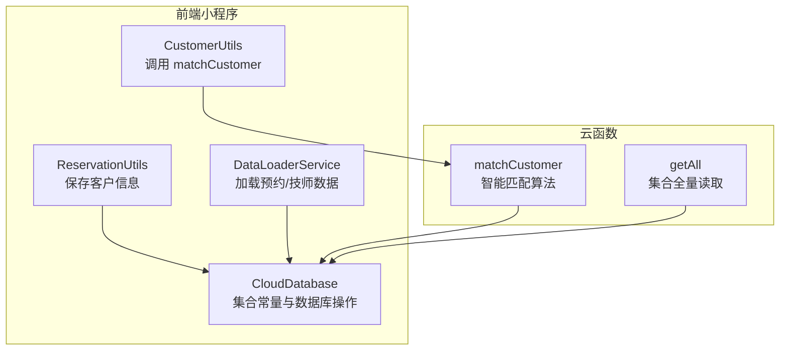
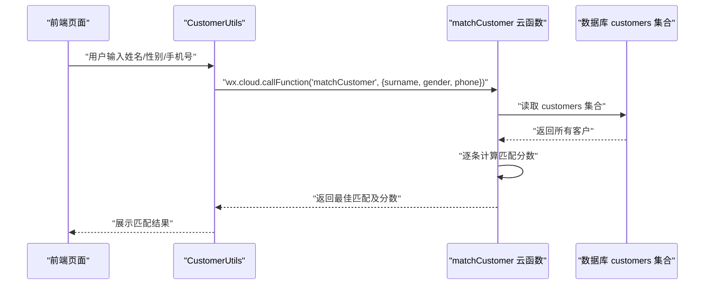
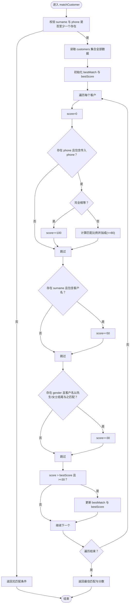
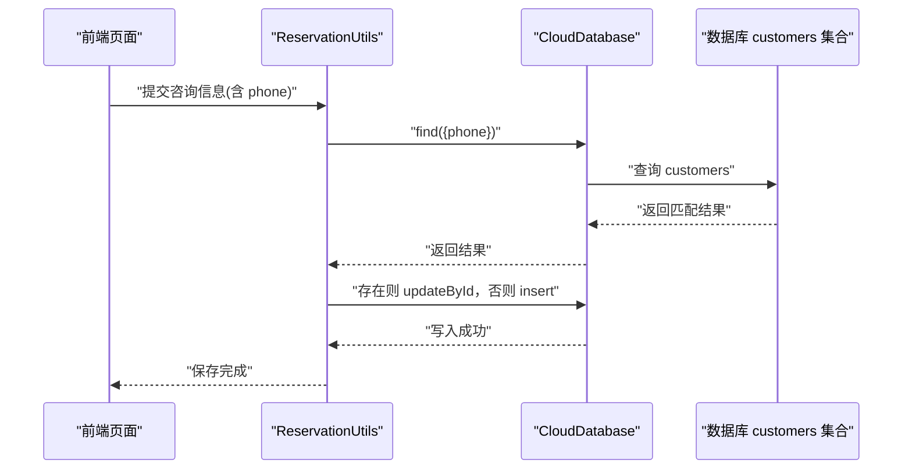
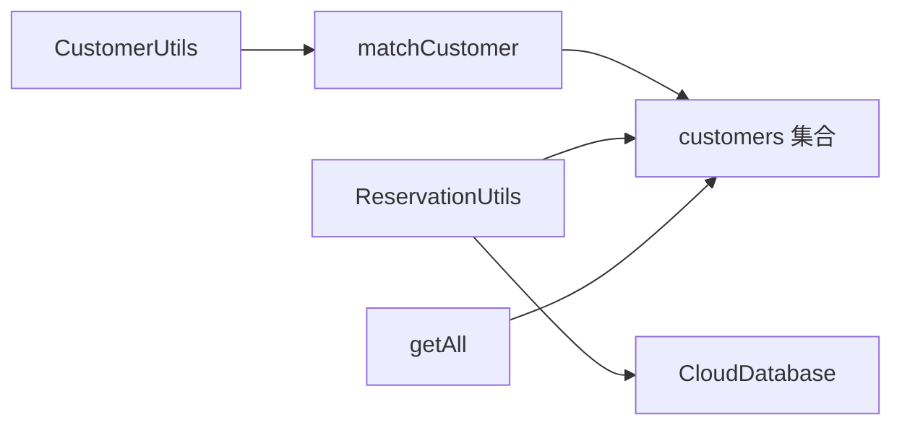

# 客户匹配系统

<cite>
**本文引用的文件列表**
- [cloudfunctions/matchCustomer/index.js](file://cloudfunctions/matchCustomer/index.js)
- [cloudfunctions/matchCustomer/package.json](file://cloudfunctions/matchCustomer/package.json)
- [miniprogram/pages/index/utils/customer-utils.ts](file://miniprogram/pages/index/utils/customer-utils.ts)
- [miniprogram/pages/index/utils/reservation-utils.ts](file://miniprogram/pages/index/utils/reservation-utils.ts)
- [miniprogram/pages/index/services/data-loader.service.ts](file://miniprogram/pages/index/services/data-loader.service.ts)
- [miniprogram/utils/cloud-db.ts](file://miniprogram/utils/cloud-db.ts)
- [typings/index.d.ts](file://typings/index.d.ts)
- [cloudfunctions/getAll/index.js](file://cloudfunctions/getAll/index.js)
</cite>

## 目录
1. [简介](#简介)
2. [项目结构](#项目结构)
3. [核心组件](#核心组件)
4. [架构总览](#架构总览)
5. [详细组件分析](#详细组件分析)
6. [依赖关系分析](#依赖关系分析)
7. [性能考量](#性能考量)
8. [故障排查指南](#故障排查指南)
9. [结论](#结论)
10. [附录](#附录)

## 简介
本技术文档围绕“客户匹配系统”展开，重点解析 matchCustomer 云函数的智能匹配算法（精确匹配与模糊匹配）、客户信息比对逻辑（手机号匹配、姓名匹配、性别后缀匹配与多字段组合评分）、参数处理、查询优化与结果排序机制，并阐述其与 ReservationUtils.saveCustomerInfo 的协同工作流程（新客户注册与老客户更新）。同时提供匹配精度评估、性能优化与错误处理的最佳实践，以及实际匹配场景与扩展开发指导。

## 项目结构
该系统由前端小程序页面与云函数两部分组成：
- 前端：通过 CustomerUtils 调用 matchCustomer 云函数进行客户匹配；通过 ReservationUtils.saveCustomerInfo 进行客户信息的保存或更新。
- 云函数：matchCustomer 对 customers 集合中的客户进行评分匹配；getAll 提供分页读取集合数据的能力（用于调试与迁移）。

图表来源
- [cloudfunctions/matchCustomer/index.js](file://cloudfunctions/matchCustomer/index.js#L1-L71)
- [miniprogram/pages/index/utils/customer-utils.ts](file://miniprogram/pages/index/utils/customer-utils.ts#L1-L121)
- [miniprogram/pages/index/utils/reservation-utils.ts](file://miniprogram/pages/index/utils/reservation-utils.ts#L147-L171)
- [miniprogram/pages/index/services/data-loader.service.ts](file://miniprogram/pages/index/services/data-loader.service.ts#L1-L206)
- [miniprogram/utils/cloud-db.ts](file://miniprogram/utils/cloud-db.ts#L303-L320)
- [cloudfunctions/getAll/index.js](file://cloudfunctions/getAll/index.js#L1-L59)

章节来源
- [cloudfunctions/matchCustomer/index.js](file://cloudfunctions/matchCustomer/index.js#L1-L71)
- [miniprogram/pages/index/utils/customer-utils.ts](file://miniprogram/pages/index/utils/customer-utils.ts#L1-L121)
- [miniprogram/pages/index/utils/reservation-utils.ts](file://miniprogram/pages/index/utils/reservation-utils.ts#L147-L171)
- [miniprogram/pages/index/services/data-loader.service.ts](file://miniprogram/pages/index/services/data-loader.service.ts#L1-L206)
- [miniprogram/utils/cloud-db.ts](file://miniprogram/utils/cloud-db.ts#L303-L320)
- [cloudfunctions/getAll/index.js](file://cloudfunctions/getAll/index.js#L1-L59)

## 核心组件
- matchCustomer 云函数：接收 surname、gender、phone 参数，遍历 customers 集合，按规则打分并返回最高分客户。
- CustomerUtils.searchCustomer：封装前端调用 matchCustomer 的逻辑，负责参数提取与结果处理。
- ReservationUtils.saveCustomerInfo：根据手机号查找现有客户，存在则更新，不存在则新增，实现客户信息的持久化。
- CloudDatabase.Collections：统一管理集合名称，便于跨模块引用。
- getAll 云函数：提供集合全量读取能力，便于调试与迁移。

章节来源
- [cloudfunctions/matchCustomer/index.js](file://cloudfunctions/matchCustomer/index.js#L9-L70)
- [miniprogram/pages/index/utils/customer-utils.ts](file://miniprogram/pages/index/utils/customer-utils.ts#L2-L49)
- [miniprogram/pages/index/utils/reservation-utils.ts](file://miniprogram/pages/index/utils/reservation-utils.ts#L147-L171)
- [miniprogram/utils/cloud-db.ts](file://miniprogram/utils/cloud-db.ts#L303-L320)
- [cloudfunctions/getAll/index.js](file://cloudfunctions/getAll/index.js#L9-L58)

## 架构总览
前端通过 wx.cloud.callFunction 调用 matchCustomer，传入当前输入的姓名、性别、手机号；云函数在 customers 集合中遍历所有客户，计算匹配分数，返回最佳匹配。同时，前端在保存咨询信息时调用 ReservationUtils.saveCustomerInfo，基于手机号进行去重与更新。

图表来源
- [miniprogram/pages/index/utils/customer-utils.ts](file://miniprogram/pages/index/utils/customer-utils.ts#L27-L49)
- [cloudfunctions/matchCustomer/index.js](file://cloudfunctions/matchCustomer/index.js#L20-L63)

章节来源
- [miniprogram/pages/index/utils/customer-utils.ts](file://miniprogram/pages/index/utils/customer-utils.ts#L2-L49)
- [cloudfunctions/matchCustomer/index.js](file://cloudfunctions/matchCustomer/index.js#L9-L70)

## 详细组件分析

### matchCustomer 云函数
- 输入参数处理：从 event 中解构 surname、gender、phone，若两者皆为空则直接返回提示。
- 数据查询：一次性读取 customers 集合全部数据，后续在内存中进行评分。
- 匹配评分规则：
  - 手机号精确匹配：100 分；前缀/包含匹配：按匹配长度占比乘以 80 再取整。
  - 姓名包含匹配：+50 分。
  - 性别后缀匹配：若客户名以“先生/女士”结尾且与 gender 匹配，则 +30 分。
- 结果筛选：仅当分数大于最佳分数且不低于阈值（30）时才更新最佳匹配。
- 返回结构：包含 code、message、data（最佳匹配客户）、score（最佳分数），异常时返回 -1 与错误信息。

图表来源
- [cloudfunctions/matchCustomer/index.js](file://cloudfunctions/matchCustomer/index.js#L12-L63)

章节来源
- [cloudfunctions/matchCustomer/index.js](file://cloudfunctions/matchCustomer/index.js#L9-L70)

### 客户信息比对逻辑
- 手机号匹配：支持完全相等与包含匹配，包含匹配按长度比例加权，避免误判短号被长号覆盖。
- 姓名匹配：基于包含关系，适用于拼音首字母或部分字的模糊匹配。
- 性别匹配：通过客户名是否以“先生/女士”结尾判断性别，与传入 gender 比较，提升性别一致性。
- 多字段组合：三者叠加计分，最终选择分数最高的客户；设置最低阈值（30）过滤低质量匹配。

章节来源
- [cloudfunctions/matchCustomer/index.js](file://cloudfunctions/matchCustomer/index.js#L27-L56)

### 参数处理与查询优化
- 参数处理：前端在调用前会根据是否双人模式选择对应 guest 的姓名/性别，确保传入的 surname 与 gender 合理。
- 查询优化：当前实现为一次性读取 customers 全量数据，适合中小规模数据；对于大规模数据建议：
  - 在数据库侧增加索引（如 phone、name）。
  - 采用分页或条件过滤减少扫描范围。
  - 将匹配逻辑迁移至数据库聚合管道，减少内存遍历成本。
- 结果排序：云函数内部按分数降序选择最佳匹配，无需额外排序。

章节来源
- [miniprogram/pages/index/utils/customer-utils.ts](file://miniprogram/pages/index/utils/customer-utils.ts#L9-L25)
- [cloudfunctions/matchCustomer/index.js](file://cloudfunctions/matchCustomer/index.js#L20-L63)

### 与 ReservationUtils.saveCustomerInfo 的协同
- 调用时机：在完成咨询登记或预约转化后，调用 saveCustomerInfo 以确保客户信息入库或更新。
- 逻辑流程：
  - 前端收集 consultation 信息（含 surname、gender、phone、licensePlate、remarks 等）。
  - 通过 cloudDb.find 按 phone 查询是否存在客户。
  - 若存在则更新对应字段；否则插入新客户记录。
- 与匹配系统的衔接：匹配到的客户可直接用于填充咨询表单，避免重复录入；保存时以 phone 作为唯一标识，保证去重。

图表来源
- [miniprogram/pages/index/utils/reservation-utils.ts](file://miniprogram/pages/index/utils/reservation-utils.ts#L147-L171)
- [miniprogram/utils/cloud-db.ts](file://miniprogram/utils/cloud-db.ts#L303-L320)

章节来源
- [miniprogram/pages/index/utils/reservation-utils.ts](file://miniprogram/pages/index/utils/reservation-utils.ts#L147-L171)
- [miniprogram/utils/cloud-db.ts](file://miniprogram/utils/cloud-db.ts#L303-L320)

### 类型与数据模型
- CustomerRecord：定义了 customers 集合的字段结构（phone、name、gender、responsibleTechnician、licensePlate、remarks）。
- Collections：集中管理集合名称，便于跨模块引用，降低硬编码风险。

章节来源
- [typings/index.d.ts](file://typings/index.d.ts#L136-L144)
- [miniprogram/utils/cloud-db.ts](file://miniprogram/utils/cloud-db.ts#L303-L320)

## 依赖关系分析
- 前端依赖：
  - CustomerUtils 依赖 wx.cloud.callFunction 调用 matchCustomer。
  - ReservationUtils 依赖 CloudDatabase 进行数据库操作。
- 云函数依赖：
  - matchCustomer 依赖 wx-server-sdk 与数据库 SDK，读取 customers 集合。
  - getAll 依赖数据库 SDK，提供集合全量读取能力。
- 数据库依赖：
  - customers 集合为匹配与保存的核心数据源。

图表来源
- [miniprogram/pages/index/utils/customer-utils.ts](file://miniprogram/pages/index/utils/customer-utils.ts#L27-L49)
- [cloudfunctions/matchCustomer/index.js](file://cloudfunctions/matchCustomer/index.js#L6-L7)
- [miniprogram/pages/index/utils/reservation-utils.ts](file://miniprogram/pages/index/utils/reservation-utils.ts#L147-L171)
- [cloudfunctions/getAll/index.js](file://cloudfunctions/getAll/index.js#L6-L7)

章节来源
- [miniprogram/pages/index/utils/customer-utils.ts](file://miniprogram/pages/index/utils/customer-utils.ts#L27-L49)
- [cloudfunctions/matchCustomer/index.js](file://cloudfunctions/matchCustomer/index.js#L6-L7)
- [miniprogram/pages/index/utils/reservation-utils.ts](file://miniprogram/pages/index/utils/reservation-utils.ts#L147-L171)
- [cloudfunctions/getAll/index.js](file://cloudfunctions/getAll/index.js#L6-L7)

## 性能考量
- 当前实现为全量扫描 customers 集合，时间复杂度 O(n)，n 为客户总数。建议：
  - 在数据库层面建立 phone 与 name 字段索引，加速查询。
  - 限制匹配范围：先按 phone 精确或前缀过滤，再在候选集上进行姓名与性别评分。
  - 使用聚合管道：在云函数内通过聚合阶段完成评分与排序，减少内存遍历。
  - 分页读取：getAll 已提供分页思路，可借鉴到匹配逻辑中，避免一次性加载过多数据。
- 前端调用：
  - 在输入框失焦或达到一定字符数后再触发匹配，减少频繁调用。
  - 对于双人模式，仅在切换到对应客人时触发匹配，避免重复请求。

章节来源
- [cloudfunctions/getAll/index.js](file://cloudfunctions/getAll/index.js#L25-L44)
- [cloudfunctions/matchCustomer/index.js](file://cloudfunctions/matchCustomer/index.js#L20-L63)

## 故障排查指南
- 无匹配条件：
  - 现象：返回“无匹配条件”，通常由于 surname 与 phone 均为空。
  - 排查：确认前端参数提取逻辑与输入合法性。
- 匹配失败：
  - 现象：返回 code=-1 与错误信息。
  - 排查：检查云函数日志、数据库连接权限、集合名称是否正确。
- 匹配结果为空：
  - 现象：返回“未找到匹配”，最佳分数低于阈值或没有满足条件的客户。
  - 排查：调整阈值、放宽匹配条件（如允许只凭 phone 或 surname 匹配）。
- 保存客户信息异常：
  - 现象：保存失败或未生效。
  - 排查：确认 phone 非空、集合存在、字段映射正确；查看 ReservationUtils 的 try/catch 包裹是否吞掉异常。

章节来源
- [cloudfunctions/matchCustomer/index.js](file://cloudfunctions/matchCustomer/index.js#L12-L18)
- [cloudfunctions/matchCustomer/index.js](file://cloudfunctions/matchCustomer/index.js#L64-L69)
- [miniprogram/pages/index/utils/reservation-utils.ts](file://miniprogram/pages/index/utils/reservation-utils.ts#L147-L171)

## 结论
matchCustomer 云函数通过多字段评分实现了灵活的客户匹配，结合前端的参数处理与 ReservationUtils 的客户保存逻辑，形成了完整的“匹配—填充—保存”闭环。当前实现简洁高效，适合中小规模数据；随着业务增长，建议引入数据库索引、聚合管道与分页策略，进一步提升性能与稳定性。

## 附录

### 实际匹配场景示例
- 场景一：仅输入手机号
  - 规则：完全相等得 100 分；包含匹配按比例加分；若存在姓名包含或性别匹配则叠加加分。
- 场景二：输入姓名与性别
  - 规则：姓名包含 +50 分；性别后缀匹配 +30 分；若同时有手机号包含则叠加。
- 场景三：双人模式
  - 规则：根据当前活跃客人提取 surname、gender；若为空则不触发匹配；匹配成功后自动填充到对应 guest 字段。

章节来源
- [cloudfunctions/matchCustomer/index.js](file://cloudfunctions/matchCustomer/index.js#L27-L56)
- [miniprogram/pages/index/utils/customer-utils.ts](file://miniprogram/pages/index/utils/customer-utils.ts#L13-L25)

### 扩展开发指导
- 新增匹配维度：
  - 可扩展生日、车牌号、备注等字段参与评分，提高匹配准确性。
- 评分权重调优：
  - 通过配置文件或环境变量控制各维度权重，便于灰度调整。
- 前端交互优化：
  - 增加“历史匹配”列表，允许用户手动选择；对低分结果给出改进建议（如补全姓名/性别）。
- 数据库优化：
  - 引入复合索引（phone+name、phone+gender），并定期清理无效数据。
- 日志与监控：
  - 记录匹配耗时、命中率、失败原因，便于持续优化算法与前端体验。