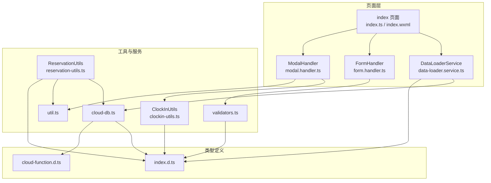
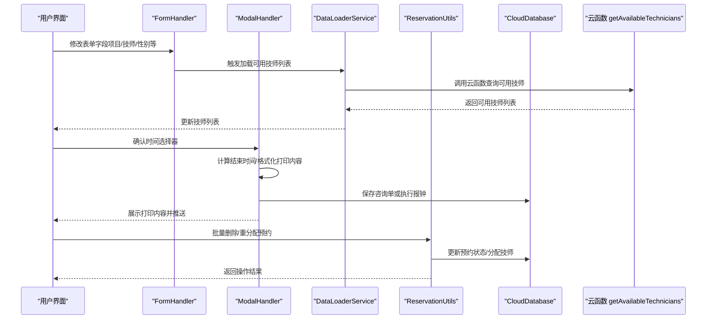
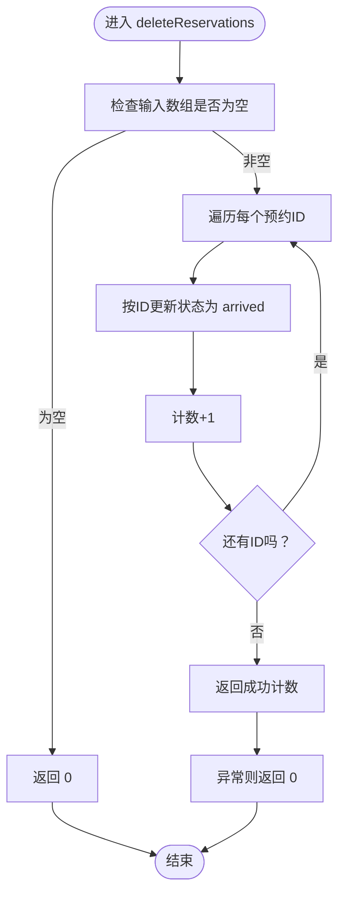
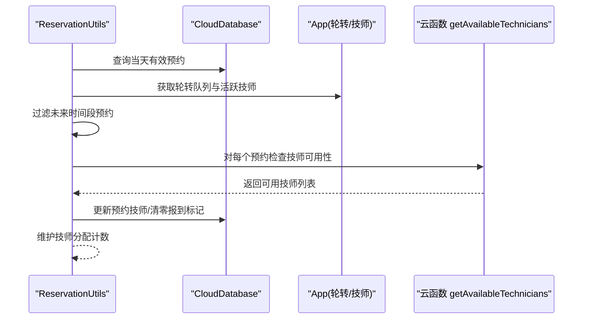
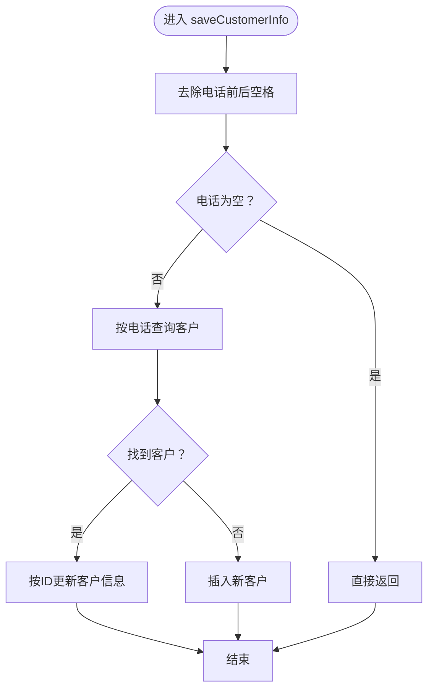
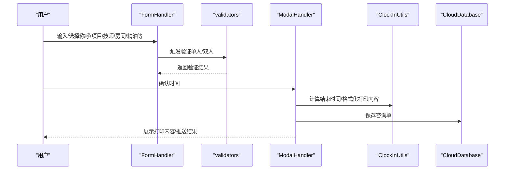
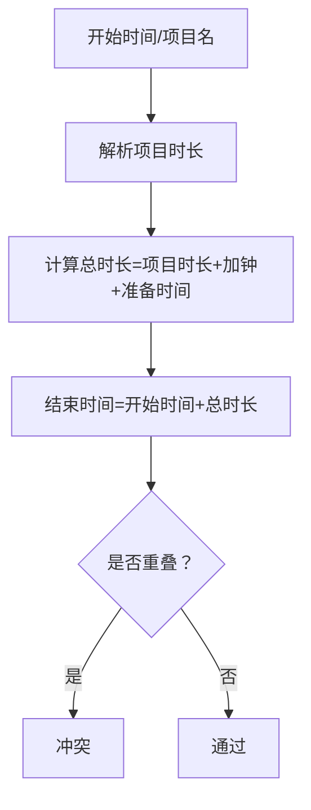
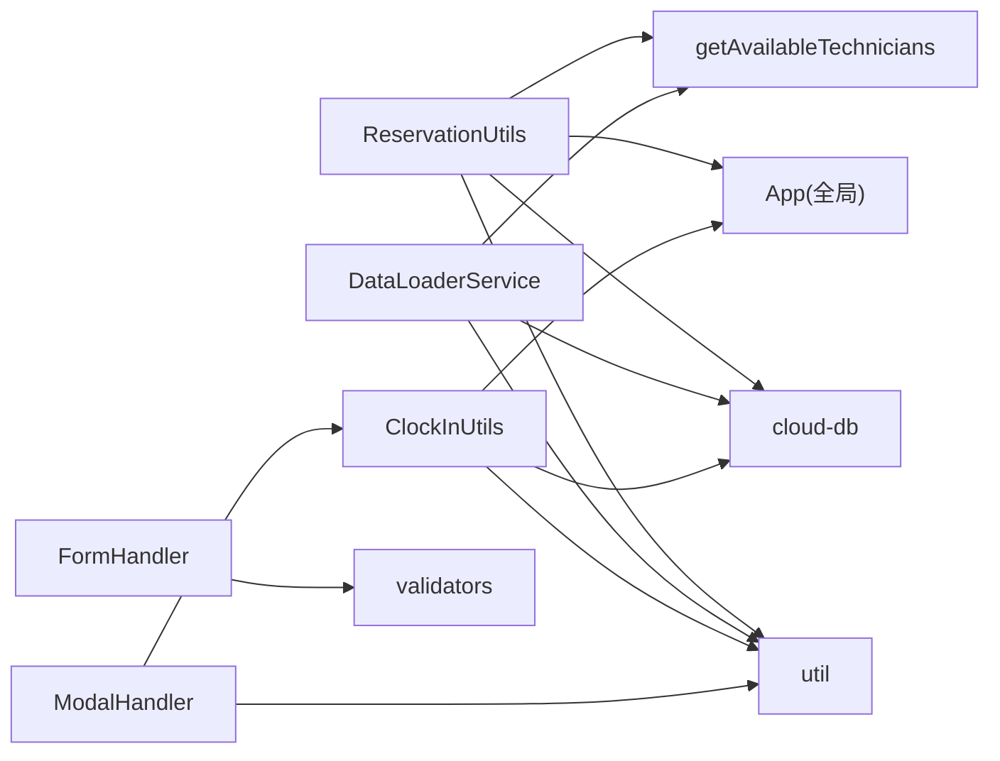

# 预约创建与管理

<cite>
**本文引用的文件**
- [reservation-utils.ts](file://miniprogram/pages/index/utils/reservation-utils.ts)
- [data-loader.service.ts](file://miniprogram/pages/index/services/data-loader.service.ts)
- [form.handler.ts](file://miniprogram/pages/index/handlers/form.handler.ts)
- [modal.handler.ts](file://miniprogram/pages/index/handlers/modal.handler.ts)
- [validators.ts](file://miniprogram/utils/validators.ts)
- [util.ts](file://miniprogram/utils/util.ts)
- [cloud-db.ts](file://miniprogram/utils/cloud-db.ts)
- [clockin-utils.ts](file://miniprogram/pages/index/utils/clockin-utils.ts)
- [index.d.ts](file://typings/index.d.ts)
- [cloud-function.d.ts](file://typings/cloud-function.d.ts)
</cite>

## 目录
1. [简介](#简介)
2. [项目结构](#项目结构)
3. [核心组件](#核心组件)
4. [架构总览](#架构总览)
5. [详细组件分析](#详细组件分析)
6. [依赖关系分析](#依赖关系分析)
7. [性能考量](#性能考量)
8. [故障排查指南](#故障排查指南)
9. [结论](#结论)
10. [附录](#附录)

## 简介
本技术文档聚焦于“预约创建与管理”功能，围绕 ReservationUtils 类中的预约创建与管理逻辑展开，涵盖以下主题：
- 预约数据验证、时间窗口检查与冲突检测机制
- 批量删除实现（deleteReservations）的状态更新与事务处理
- 客户信息保存（saveCustomerInfo）的去重与更新策略
- 预约表单的数据绑定、验证规则与提交流程
- 预约状态管理、时间计算与项目时长解析
- 实际代码示例路径与最佳实践建议

## 项目结构
本功能涉及的前端页面与工具模块主要位于 miniprogram/pages/index 目录下，配合通用工具与类型定义文件共同完成预约创建与管理。

图表来源
- [data-loader.service.ts](file://miniprogram/pages/index/services/data-loader.service.ts#L1-L206)
- [form.handler.ts](file://miniprogram/pages/index/handlers/form.handler.ts#L1-L175)
- [modal.handler.ts](file://miniprogram/pages/index/handlers/modal.handler.ts#L1-L167)
- [reservation-utils.ts](file://miniprogram/pages/index/utils/reservation-utils.ts#L1-L173)
- [clockin-utils.ts](file://miniprogram/pages/index/utils/clockin-utils.ts#L1-L184)
- [validators.ts](file://miniprogram/utils/validators.ts#L1-L81)
- [util.ts](file://miniprogram/utils/util.ts#L1-L150)
- [cloud-db.ts](file://miniprogram/utils/cloud-db.ts#L1-L321)
- [index.d.ts](file://typings/index.d.ts#L1-L435)
- [cloud-function.d.ts](file://typings/cloud-function.d.ts#L1-L57)

章节来源
- [data-loader.service.ts](file://miniprogram/pages/index/services/data-loader.service.ts#L1-L206)
- [reservation-utils.ts](file://miniprogram/pages/index/utils/reservation-utils.ts#L1-L173)
- [index.d.ts](file://typings/index.d.ts#L108-L122)

## 核心组件
- ReservationUtils：提供预约相关操作，包括批量删除、未来预约重分配、客户信息保存等。
- DataLoaderService：负责加载技师列表、项目列表、编辑数据与预约数据映射。
- FormHandler：处理表单字段变更与联动，如项目选择、技师选择、性别/称呼等。
- ModalHandler：处理时间选择器确认、双人模式报钟、打印内容格式化与微信推送。
- ClockInUtils：计算加班单位、生成打印内容、双人模式信息构建。
- validators：统一的表单验证规则与错误提示。
- util：时间格式化、项目时长解析、时间重叠判断、加班单位计算等工具。
- cloud-db：封装云数据库读写、分页查询、保存咨询单等。

章节来源
- [reservation-utils.ts](file://miniprogram/pages/index/utils/reservation-utils.ts#L6-L173)
- [data-loader.service.ts](file://miniprogram/pages/index/services/data-loader.service.ts#L6-L206)
- [form.handler.ts](file://miniprogram/pages/index/handlers/form.handler.ts#L3-L175)
- [modal.handler.ts](file://miniprogram/pages/index/handlers/modal.handler.ts#L7-L167)
- [clockin-utils.ts](file://miniprogram/pages/index/utils/clockin-utils.ts#L7-L184)
- [validators.ts](file://miniprogram/utils/validators.ts#L6-L81)
- [util.ts](file://miniprogram/utils/util.ts#L13-L105)
- [cloud-db.ts](file://miniprogram/utils/cloud-db.ts#L12-L321)

## 架构总览
预约创建与管理的端到端流程如下：

图表来源
- [form.handler.ts](file://miniprogram/pages/index/handlers/form.handler.ts#L33-L70)
- [data-loader.service.ts](file://miniprogram/pages/index/services/data-loader.service.ts#L33-L65)
- [modal.handler.ts](file://miniprogram/pages/index/handlers/modal.handler.ts#L38-L68)
- [reservation-utils.ts](file://miniprogram/pages/index/utils/reservation-utils.ts#L7-L24)
- [cloud-db.ts](file://miniprogram/utils/cloud-db.ts#L169-L188)
- [cloud-function.d.ts](file://typings/cloud-function.d.ts#L22-L23)

## 详细组件分析

### ReservationUtils 组件分析
ReservationUtils 提供了预约相关的三大核心能力：批量删除、未来预约重分配、客户信息保存。

#### 批量删除（deleteReservations）
- 输入：预约 ID 数组
- 行为：遍历 ID，将每个预约状态更新为“到达”（arrived），并统计成功数量；异常时返回 0
- 事务特性：逐条更新，无显式事务包裹；若需强一致性，建议在云函数中实现原子更新或引入事务

图表来源
- [reservation-utils.ts](file://miniprogram/pages/index/utils/reservation-utils.ts#L7-L24)

章节来源
- [reservation-utils.ts](file://miniprogram/pages/index/utils/reservation-utils.ts#L7-L24)

#### 未来预约重分配（reassignFutureReservations）
- 目标：对指定日期内未报到且未来时间段的预约进行自动分配
- 步骤概览：
  - 查询当天“有效”预约并筛选未来时间段
  - 获取轮转队列与活跃技师列表
  - 按性别要求与可用性匹配最优技师
  - 更新预约的技师信息并维护分配计数

图表来源
- [reservation-utils.ts](file://miniprogram/pages/index/utils/reservation-utils.ts#L26-L145)
- [cloud-db.ts](file://miniprogram/utils/cloud-db.ts#L108-L123)
- [cloud-function.d.ts](file://typings/cloud-function.d.ts#L22-L23)

章节来源
- [reservation-utils.ts](file://miniprogram/pages/index/utils/reservation-utils.ts#L26-L145)

#### 客户信息保存（saveCustomerInfo）
- 输入：咨询信息（含电话、姓名、性别、技师、车牌、备注等）
- 行为：
  - 去除电话前后空格并校验
  - 按电话查询现有客户
  - 若存在则更新，否则新增
- 注意：未设置事务，若并发写入可能产生竞态；建议在云函数中加锁或使用原子更新

图表来源
- [reservation-utils.ts](file://miniprogram/pages/index/utils/reservation-utils.ts#L147-L171)
- [cloud-db.ts](file://miniprogram/utils/cloud-db.ts#L136-L165)

章节来源
- [reservation-utils.ts](file://miniprogram/pages/index/utils/reservation-utils.ts#L147-L171)

### 表单数据绑定、验证与提交流程
- 表单字段绑定：FormHandler 将用户输入写入页面 data 的 consultationInfo/guest1Info/guest2Info，并触发客户搜索
- 验证规则：validators 提供单人/双人模式的必填项与业务约束（如精油必选、房间必选等）
- 提交流程：ModalHandler 在时间确认后，计算结束时间、格式化打印内容并保存咨询单；随后可推送至微信 Webhook

图表来源
- [form.handler.ts](file://miniprogram/pages/index/handlers/form.handler.ts#L10-L98)
- [validators.ts](file://miniprogram/utils/validators.ts#L6-L72)
- [modal.handler.ts](file://miniprogram/pages/index/handlers/modal.handler.ts#L38-L68)
- [clockin-utils.ts](file://miniprogram/pages/index/utils/clockin-utils.ts#L49-L109)
- [cloud-db.ts](file://miniprogram/utils/cloud-db.ts#L260-L278)

章节来源
- [form.handler.ts](file://miniprogram/pages/index/handlers/form.handler.ts#L1-L175)
- [validators.ts](file://miniprogram/utils/validators.ts#L1-L81)
- [modal.handler.ts](file://miniprogram/pages/index/handlers/modal.handler.ts#L1-L167)

### 预约状态管理、时间计算与项目时长解析
- 状态管理：ReservationRecord.status 支持 active、cancelled、arrived；ReservationUtils 将删除操作映射为状态更新
- 时间计算：
  - 项目时长解析：parseProjectDuration 从项目名中提取分钟数
  - 结束时间：calculateProjectEndTime 基于开始时间、项目时长、加钟与准备时间（10分钟）计算
  - 加班单位：calculateOvertimeUnits 以30分钟为单位计算超时
- 冲突检测：isTimeOverlapping 判断两个时间段是否存在重叠

图表来源
- [util.ts](file://miniprogram/utils/util.ts#L13-L105)
- [index.d.ts](file://typings/index.d.ts#L108-L122)

章节来源
- [util.ts](file://miniprogram/utils/util.ts#L13-L105)
- [index.d.ts](file://typings/index.d.ts#L108-L122)

## 依赖关系分析
- ReservationUtils 依赖：
  - cloud-db：更新/插入/查询
  - util：项目时长解析、时间格式化
  - App 全局：轮转队列与技师列表
  - 云函数：getAvailableTechnicians
- DataLoaderService 依赖：
  - 云函数：getAvailableTechnicians
  - util：parseProjectDuration/formatTime
  - cloud-db：findById/find
- ClockInUtils 依赖：
  - util：parseProjectDuration/formatTime
  - cloud-db：getConsultationsByDate
  - App：排班与轮转数据
- validators 依赖：
  - 类型定义：ConsultationInfo/GuestInfo/Project 等

图表来源
- [reservation-utils.ts](file://miniprogram/pages/index/utils/reservation-utils.ts#L1-L4)
- [data-loader.service.ts](file://miniprogram/pages/index/services/data-loader.service.ts#L1-L4)
- [clockin-utils.ts](file://miniprogram/pages/index/utils/clockin-utils.ts#L1-L5)
- [validators.ts](file://miniprogram/utils/validators.ts#L1-L4)
- [cloud-db.ts](file://miniprogram/utils/cloud-db.ts#L1-L7)

章节来源
- [reservation-utils.ts](file://miniprogram/pages/index/utils/reservation-utils.ts#L1-L173)
- [data-loader.service.ts](file://miniprogram/pages/index/services/data-loader.service.ts#L1-L206)
- [clockin-utils.ts](file://miniprogram/pages/index/utils/clockin-utils.ts#L1-L184)
- [validators.ts](file://miniprogram/utils/validators.ts#L1-L81)
- [cloud-db.ts](file://miniprogram/utils/cloud-db.ts#L1-L321)

## 性能考量
- 云函数调用：DataLoaderService 与 ReservationUtils 均会调用 getAvailableTechnicians，建议合并请求或缓存结果以减少网络开销
- 批量更新：deleteReservations 逐条更新，大量数据时建议迁移至云函数并使用批量更新或事务
- 查询优化：cloud-db.find 支持条件查询，避免全量扫描；对高频查询建立索引
- 时间计算：util 中的时间解析与比较均为常量/线性复杂度，影响较小

## 故障排查指南
- 删除失败：deleteReservations 在异常时返回 0，检查网络与权限；必要时在云函数中增加幂等与回滚
- 技师不可用：ModalHandler 在加载可用技师失败时会提示错误，检查云函数返回结构与 code/message
- 客户信息未更新：saveCustomerInfo 仅按电话去重，若电话不同但实为同一人会导致重复；建议增加多字段唯一性校验
- 时间冲突：使用 isTimeOverlapping 进行冲突检测，确保 UI 提示与后端一致

章节来源
- [reservation-utils.ts](file://miniprogram/pages/index/utils/reservation-utils.ts#L7-L24)
- [data-loader.service.ts](file://miniprogram/pages/index/services/data-loader.service.ts#L44-L64)
- [validators.ts](file://miniprogram/utils/validators.ts#L74-L80)

## 结论
ReservationUtils 将预约删除、未来预约重分配与客户信息保存整合为统一入口，结合 DataLoaderService、FormHandler、ModalHandler 与 ClockInUtils，形成完整的预约创建与管理闭环。建议在高并发场景下增强事务与幂等控制，并完善客户唯一性校验与冲突检测提示，以提升系统稳定性与用户体验。

## 附录
- 代码示例路径（不含具体代码内容）：
  - 批量删除实现：[reservation-utils.ts](file://miniprogram/pages/index/utils/reservation-utils.ts#L7-L24)
  - 未来预约重分配：[reservation-utils.ts](file://miniprogram/pages/index/utils/reservation-utils.ts#L26-L145)
  - 客户信息保存：[reservation-utils.ts](file://miniprogram/pages/index/utils/reservation-utils.ts#L147-L171)
  - 表单字段处理：[form.handler.ts](file://miniprogram/pages/index/handlers/form.handler.ts#L10-L98)
  - 时间确认与打印内容：[modal.handler.ts](file://miniprogram/pages/index/handlers/modal.handler.ts#L38-L68)
  - 验证规则：[validators.ts](file://miniprogram/utils/validators.ts#L6-L72)
  - 工具函数（时长解析/时间计算）：[util.ts](file://miniprogram/utils/util.ts#L13-L105)
  - 云数据库封装：[cloud-db.ts](file://miniprogram/utils/cloud-db.ts#L12-L321)
  - 类型定义（预约/咨询单/技师等）：[index.d.ts](file://typings/index.d.ts#L108-L122)
  - 云函数返回类型：[cloud-function.d.ts](file://typings/cloud-function.d.ts#L22-L23)