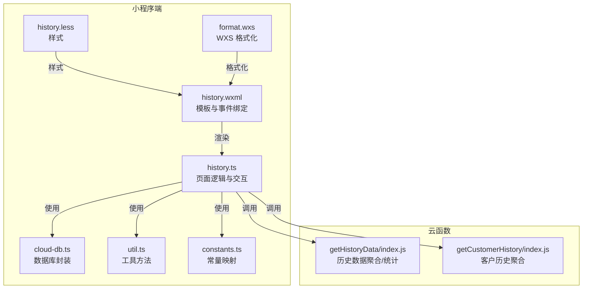
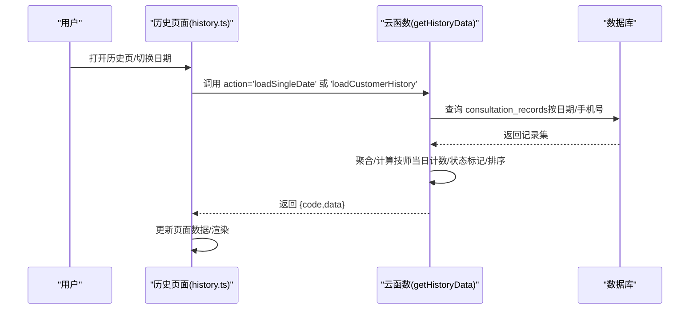
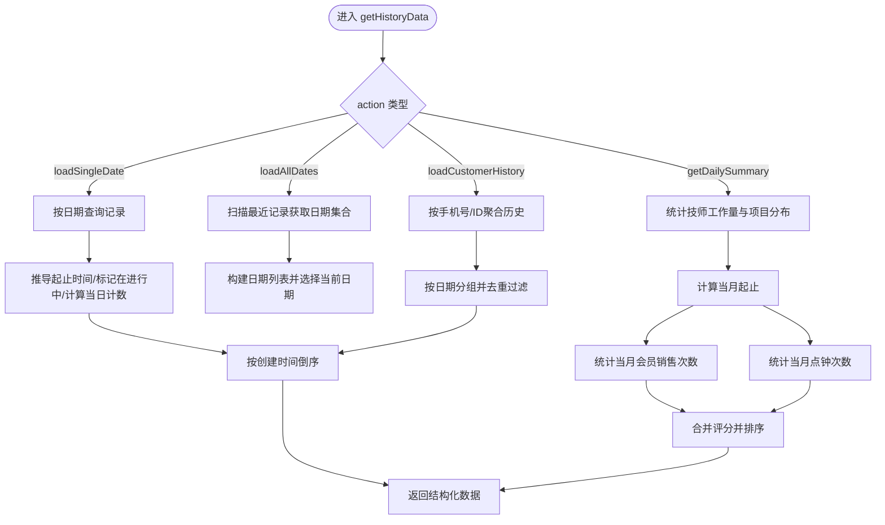
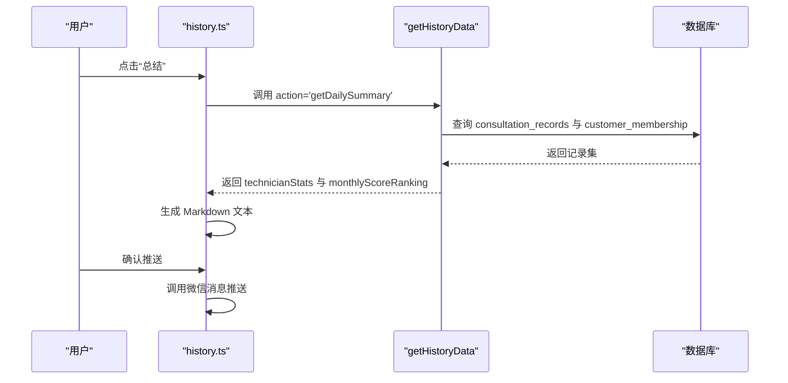
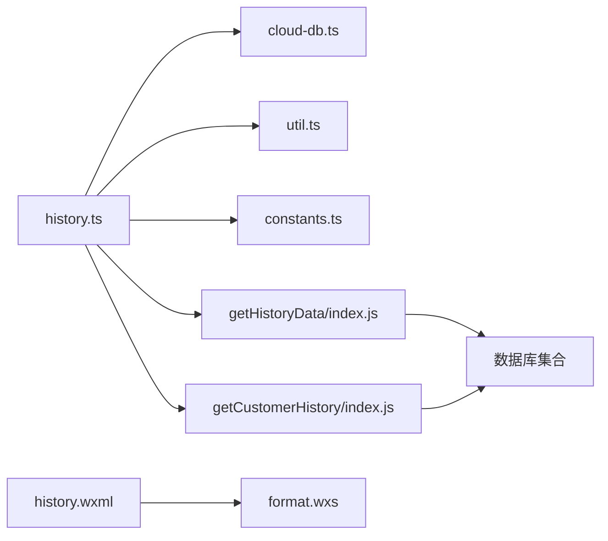

# 预约历史查询

<cite>
**本文引用的文件**
- [getHistoryData/index.js](file://cloudfunctions/getHistoryData/index.js)
- [getCustomerHistory/index.js](file://cloudfunctions/getCustomerHistory/index.js)
- [history.ts](file://miniprogram/pages/history/history.ts)
- [history.wxml](file://miniprogram/pages/history/history.wxml)
- [history.less](file://miniprogram/pages/history/history.less)
- [format.wxs](file://miniprogram/pages/history/format.wxs)
- [cloud-db.ts](file://miniprogram/utils/cloud-db.ts)
- [util.ts](file://miniprogram/utils/util.ts)
- [constants.ts](file://miniprogram/utils/constants.ts)
- [index.d.ts](file://typings/index.d.ts)
</cite>

## 目录
1. [简介](#简介)
2. [项目结构](#项目结构)
3. [核心组件](#核心组件)
4. [架构总览](#架构总览)
5. [详细组件分析](#详细组件分析)
6. [依赖关系分析](#依赖关系分析)
7. [性能考量](#性能考量)
8. [故障排查指南](#故障排查指南)
9. [结论](#结论)
10. [附录](#附录)

## 简介
本技术文档围绕“预约历史查询”功能展开，系统性解析云函数 getHistoryData 的数据聚合与格式化逻辑、前端历史页面的数据展示与交互、以及统计分析能力。重点覆盖：
- 时间范围筛选、状态过滤与分页处理
- 查询优化策略（索引、缓存、并发与批量读取）
- 历史页面的时间线展示、状态标识与交互
- 统计分析（预约量、技师工作量、客户行为）
- 数据导出、搜索过滤与批量操作的实现方案
- 实际查询场景与扩展开发建议

## 项目结构
该功能由三部分组成：
- 云函数层：负责从数据库聚合与计算历史数据、生成日度汇总与统计
- 小程序页面层：负责渲染历史列表、时间线、状态标识与交互操作
- 工具与常量层：提供数据库封装、通用工具与常量映射

图表来源
- [history.ts](file://miniprogram/pages/history/history.ts#L1-L739)
- [history.wxml](file://miniprogram/pages/history/history.wxml#L1-L176)
- [history.less](file://miniprogram/pages/history/history.less#L1-L631)
- [format.wxs](file://miniprogram/pages/history/format.wxs#L1-L23)
- [cloud-db.ts](file://miniprogram/utils/cloud-db.ts#L1-L321)
- [util.ts](file://miniprogram/utils/util.ts#L1-L150)
- [constants.ts](file://miniprogram/utils/constants.ts#L1-L49)
- [getHistoryData/index.js](file://cloudfunctions/getHistoryData/index.js#L1-L411)
- [getCustomerHistory/index.js](file://cloudfunctions/getCustomerHistory/index.js#L1-L100)

章节来源
- [history.ts](file://miniprogram/pages/history/history.ts#L1-L739)
- [history.wxml](file://miniprogram/pages/history/history.wxml#L1-L176)
- [history.less](file://miniprogram/pages/history/history.less#L1-L631)
- [format.wxs](file://miniprogram/pages/history/format.wxs#L1-L23)
- [cloud-db.ts](file://miniprogram/utils/cloud-db.ts#L1-L321)
- [util.ts](file://miniprogram/utils/util.ts#L1-L150)
- [constants.ts](file://miniprogram/utils/constants.ts#L1-L49)
- [getHistoryData/index.js](file://cloudfunctions/getHistoryData/index.js#L1-L411)
- [getCustomerHistory/index.js](file://cloudfunctions/getCustomerHistory/index.js#L1-L100)

## 核心组件
- 云函数 getHistoryData：支持按单日加载、全日期加载、客户历史加载、日度汇总统计等动作；对记录进行时间计算、状态标记、技师当日计数与排序。
- 云函数 getCustomerHistory：按客户手机号聚合其咨询单、会员卡与使用记录，并计算总到店次数与实收金额。
- 历史页面 history.ts：负责日期选择、加载历史、折叠/展开、作废、提前下钟、加钟、删除、生成日度总结与推送等交互。
- 数据库封装 cloud-db.ts：提供 CRUD、分页查询、按日期查询等能力。
- 工具与常量 util.ts、constants.ts：提供时间格式化、加班计算、项目时长解析、性别/平台/强度等映射。
- WXS format.wxs：结算时间格式化辅助。

章节来源
- [getHistoryData/index.js](file://cloudfunctions/getHistoryData/index.js#L88-L410)
- [getCustomerHistory/index.js](file://cloudfunctions/getCustomerHistory/index.js#L9-L99)
- [history.ts](file://miniprogram/pages/history/history.ts#L146-L186)
- [cloud-db.ts](file://miniprogram/utils/cloud-db.ts#L93-L298)
- [util.ts](file://miniprogram/utils/util.ts#L3-L150)
- [constants.ts](file://miniprogram/utils/constants.ts#L1-L49)
- [format.wxs](file://miniprogram/pages/history/format.wxs#L1-L23)

## 架构总览
历史查询采用“小程序端请求云函数 -> 云函数聚合/统计 -> 返回结构化数据 -> 小程序渲染”的模式。核心流程如下：

图表来源
- [history.ts](file://miniprogram/pages/history/history.ts#L146-L186)
- [getHistoryData/index.js](file://cloudfunctions/getHistoryData/index.js#L88-L250)

## 详细组件分析

### 云函数 getHistoryData：数据聚合与格式化
- 支持的动作
  - loadSingleDate：按目标日期加载当日记录，计算技师当日计数、是否在进行中、起止时间推导等。
  - loadAllDates：扫描最近若干条记录以获取所有日期，返回可选日期列表与当前选中日期的数据。
  - loadCustomerHistory：按客户手机号与ID聚合其历史，按日期分组并去重过滤。
  - getDailySummary：按日期统计技师工作量、加班与项目分布，并生成月度评分排行。
- 关键逻辑
  - 时间与状态
    - 若记录缺失起止时间，则根据创建时间与项目时长推导起止时间。
    - 标记“在进行中”：当天且当前时间处于开始/结束之间。
  - 技师当日计数
    - 在同一天内按技师累计未作废记录数，作为“当日第N单”展示。
  - 排序与分组
    - 按创建时间倒序；按日期分组。
  - 日度汇总
    - 统计技师总数、点钟次数、加钟次数与总时长、加班单位数、项目分布。
    - 月度评分：结合当月会员销售次数与点钟次数综合排名。
- 返回结构
  - code/message/data：data 包含历史数据或统计结果。

图表来源
- [getHistoryData/index.js](file://cloudfunctions/getHistoryData/index.js#L33-L86)
- [getHistoryData/index.js](file://cloudfunctions/getHistoryData/index.js#L114-L148)
- [getHistoryData/index.js](file://cloudfunctions/getHistoryData/index.js#L150-L250)
- [getHistoryData/index.js](file://cloudfunctions/getHistoryData/index.js#L252-L394)

章节来源
- [getHistoryData/index.js](file://cloudfunctions/getHistoryData/index.js#L88-L410)

### 历史页面 history.ts：数据展示与交互
- 页面数据结构
  - historyData：按日期分组的记录数组，每条记录包含 collapsed、dailyCount、isInProgress 等字段。
  - dateSelector：当前选中日期、最大日期、前后日期、是否今天。
  - numberInputModal/earlyFinishModal/summaryModal：三种交互弹窗。
- 主要交互
  - 加载历史：调用云函数 action='loadSingleDate'，更新日期选择器与历史数据。
  - 客户模式：通过只读模式加载指定客户的咨询历史。
  - 折叠/展开：点击头部切换 collapsed 状态。
  - 作废：将 isVoided 设为 true 并刷新。
  - 提前下钟：弹窗确认后更新 endTime 为当前时间并刷新。
  - 加钟：弹出数字输入框，输入单位（半小时），更新 extraTime 并计算新结束时间，刷新。
  - 删除：管理员权限下删除记录。
  - 生成日度总结：调用 action='getDailySummary'，生成 Markdown 文本并通过微信消息推送。
- 渲染要点
  - 模板按日期分组，日期头右侧显示“总结”按钮（非客户模式）。
  - 头部显示客户名、房间、结束时间、作废标签；详情区显示技师、项目、时间段、支付平台与券码等。
  - 结算信息区域展示已结算标签、结算时间、实收总额与各支付方式明细。

图表来源
- [history.ts](file://miniprogram/pages/history/history.ts#L394-L498)
- [getHistoryData/index.js](file://cloudfunctions/getHistoryData/index.js#L252-L394)

章节来源
- [history.ts](file://miniprogram/pages/history/history.ts#L146-L186)
- [history.ts](file://miniprogram/pages/history/history.ts#L188-L269)
- [history.ts](file://miniprogram/pages/history/history.ts#L271-L331)
- [history.ts](file://miniprogram/pages/history/history.ts#L333-L374)
- [history.ts](file://miniprogram/pages/history/history.ts#L394-L498)
- [history.wxml](file://miniprogram/pages/history/history.wxml#L11-L105)

### 数据模型与类型
- 咨询单记录（ConsultationRecord）
  - 字段：surname/gender/project/technician/room/massageStrength/essentialOil/selectedParts/isClockIn/remarks/phone/extraTime/overtime/couponCode/couponPlatform/date/startTime/endTime/settlement/amount/date/isVoided 等。
- 客户记录（CustomerRecord）
  - 字段：phone/name/gender/responsibleTechnician/licensePlate/remarks。
- 会员卡与使用记录（CustomerMembership/MembershipUsageRecord）
  - 字段：customerId/customerName/customerPhone/cardId/cardName/originalPrice/paidAmount/remainingTimes/project/salesStaff/remarks/status。
- 页面显示增强
  - 历史记录扩展字段：collapsed/dailyCount/isInProgress。

章节来源
- [index.d.ts](file://typings/index.d.ts#L37-L183)
- [history.ts](file://miniprogram/pages/history/history.ts#L6-L14)

### 统计分析功能
- 预约量统计
  - 按技师统计当日总单数、点钟次数、加钟次数与加班单位数。
- 技师工作量分析
  - 项目分布统计（不同项目的次数）。
- 客户行为追踪
  - 客户历史页聚合客户咨询单、会员卡购买与使用记录，计算总到店次数与实收金额。
- 月度评分
  - 以“当月会员销售次数 + 点钟次数”作为综合评分进行排行。

章节来源
- [getHistoryData/index.js](file://cloudfunctions/getHistoryData/index.js#L252-L394)
- [getCustomerHistory/index.js](file://cloudfunctions/getCustomerHistory/index.js#L49-L91)

### 数据导出、搜索过滤与批量操作
- 导出
  - 历史页面支持生成日度总结并推送至企业微信（通过云函数 sendWechatMessage）。
- 搜索过滤
  - 前端提供日期选择器；云函数按日期或手机号过滤。
- 批量操作
  - 历史页面支持批量作废、提前下钟、加钟与删除（管理员权限）。

章节来源
- [history.ts](file://miniprogram/pages/history/history.ts#L394-L498)
- [history.ts](file://miniprogram/pages/history/history.ts#L271-L331)
- [history.ts](file://miniprogram/pages/history/history.ts#L333-L374)
- [getHistoryData/index.js](file://cloudfunctions/getHistoryData/index.js#L150-L250)

## 依赖关系分析
- 前端依赖
  - history.ts 依赖 cloud-db.ts 进行数据库操作；依赖 util.ts 进行时间与加班计算；依赖 constants.ts 进行性别/平台/强度等映射。
  - history.wxml 依赖 format.wxs 进行结算时间格式化。
- 后端依赖
  - getHistoryData 依赖数据库集合 consultation_records、customer_membership、membership_usage 等进行聚合与统计。
  - getCustomerHistory 依赖 consultation_records、customers、customer_membership、membership_usage 进行客户历史聚合。

图表来源
- [history.ts](file://miniprogram/pages/history/history.ts#L1-L739)
- [cloud-db.ts](file://miniprogram/utils/cloud-db.ts#L1-L321)
- [util.ts](file://miniprogram/utils/util.ts#L1-L150)
- [constants.ts](file://miniprogram/utils/constants.ts#L1-L49)
- [format.wxs](file://miniprogram/pages/history/format.wxs#L1-L23)
- [getHistoryData/index.js](file://cloudfunctions/getHistoryData/index.js#L1-L411)
- [getCustomerHistory/index.js](file://cloudfunctions/getCustomerHistory/index.js#L1-L100)

## 性能考量
- 查询优化
  - 索引建议
    - consultation_records：date、phone、isVoided、createdAt 上建立复合索引，以支持按日期/手机号/状态/时间的高效查询。
    - customer_membership：createdAt、salesStaff 上建立索引，提升月度统计效率。
  - 分页与批量
    - 前端分页查询封装（findWithPage）可减少一次性拉取大量数据带来的压力。
    - 云函数在全日期扫描时限制 limit，避免全表扫描。
- 缓存机制
  - 前端可在短时间内缓存当前日期的历史数据，减少重复请求。
  - 对于高频统计（如技师当日计数），可在内存中做局部缓存（注意过期与一致性）。
- 并发与异步
  - 云函数内部多处查询采用串行，可考虑使用 Promise.all 并行获取不同集合的数据，缩短总耗时。
- 时间计算与本地化
  - 云函数中涉及 UTC 与本地时间转换，需确保时区一致，避免跨日边界错误。
- 代码复杂度
  - getHistoryData 中存在较多条件分支与嵌套循环，建议拆分为独立函数以提升可维护性。

章节来源
- [getHistoryData/index.js](file://cloudfunctions/getHistoryData/index.js#L114-L148)
- [getHistoryData/index.js](file://cloudfunctions/getHistoryData/index.js#L150-L250)
- [getHistoryData/index.js](file://cloudfunctions/getHistoryData/index.js#L252-L394)
- [cloud-db.ts](file://miniprogram/utils/cloud-db.ts#L209-L255)

## 故障排查指南
- 常见问题
  - 参数缺失：action、targetDate、customerPhone、customerId 等必填参数缺失会导致返回错误信息。
  - 记录不存在：更新/删除/作废时若记录不存在会返回失败提示。
  - 时间格式异常：起止时间解析失败或格式不正确会导致推导失败。
- 建议排查步骤
  - 检查云函数返回的 code/message，定位具体错误原因。
  - 在小程序端打印调用参数与返回值，核对日期与手机号格式。
  - 核对数据库索引是否存在，必要时补充复合索引。
  - 对于统计异常，检查 isVoided 过滤与项目时长解析逻辑。

章节来源
- [getHistoryData/index.js](file://cloudfunctions/getHistoryData/index.js#L88-L410)
- [history.ts](file://miniprogram/pages/history/history.ts#L146-L186)

## 结论
预约历史查询功能通过云函数与小程序端的协同，实现了灵活的时间范围筛选、状态过滤与统计分析。前端以时间线形式直观展示历史记录，支持多种交互操作；后端提供高效的聚合与统计能力。为进一步提升性能与可维护性，建议完善索引、引入缓存、优化并发与拆分复杂逻辑。

## 附录
- 实际查询场景示例
  - 单日查询：传入 targetDate，返回当日记录并标注“在进行中”与技师当日计数。
  - 客户历史：传入 customerPhone 与 customerId，返回按日期分组的历史记录。
  - 日度汇总：传入 targetDate，返回技师工作量、项目分布与月度评分。
- 扩展开发建议
  - 引入分页查询封装（findWithPage）以支持大数据量场景。
  - 增加缓存层（内存/云托管缓存）以降低重复查询成本。
  - 将统计逻辑模块化，便于单元测试与维护。
  - 增强错误处理与重试机制，提升稳定性。