# 预约管理系统

<cite>
**本文档引用的文件**
- [matchCustomer/index.js](file://cloudfunctions/matchCustomer/index.js)
- [getHistoryData/index.js](file://cloudfunctions/getHistoryData/index.js)
- [reservation-utils.ts](file://miniprogram/pages/index/utils/reservation-utils.ts)
- [customer-utils.ts](file://miniprogram/pages/index/utils/customer-utils.ts)
- [clockin-utils.ts](file://miniprogram/pages/index/utils/clockin-utils.ts)
- [history.ts](file://miniprogram/pages/history/history.ts)
- [index.ts](file://miniprogram/pages/index/index.ts)
- [util.ts](file://miniprogram/utils/util.ts)
- [cloud-db.ts](file://miniprogram/utils/cloud-db.ts)
- [index.d.ts](file://typings/index.d.ts)
- [getAvailableTechnicians/index.js](file://cloudfunctions/getAvailableTechnicians/index.js)
- [manageRotation/index.js](file://cloudfunctions/manageRotation/index.js)
- [manageRotation/shared-utils.js](file://cloudfunctions/manageRotation/shared-utils.js)
- [getCustomerHistory/index.js](file://cloudfunctions/getCustomerHistory/index.js)
- [getAnalytics/index.js](file://cloudfunctions/getAnalytics/index.js)
- [sendWechatMessage/index.js](file://cloudfunctions/sendWechatMessage/index.js)
- [app.ts](file://miniprogram/app.ts)
- [reservation.service.ts](file://miniprogram/services/reservation.service.ts)
- [reservation.handler.ts](file://miniprogram/pages/cashier/handlers/reservation.handler.ts)
</cite>

## 目录
1. [简介](#简介)
2. [项目结构](#项目结构)
3. [核心组件](#核心组件)
4. [架构概览](#架构概览)
5. [详细组件分析](#详细组件分析)
6. [依赖关系分析](#依赖关系分析)
7. [性能考虑](#性能考虑)
8. [故障排查指南](#故障排查指南)
9. [结论](#结论)
10. [附录](#附录)

## 简介
本系统是一个基于微信小程序与云开发的预约管理系统，覆盖从预约创建、冲突检测、到店报钟、历史查询与统计分析的完整业务闭环。系统通过前端页面与云函数协同工作，实现预约与咨询单的全生命周期管理，并提供客户匹配、技师可用性查询、轮牌调度、通知推送等能力。

## 项目结构
系统采用前后端分离架构：
- 小程序前端：负责用户交互、表单提交、历史查看、报钟与加钟操作、通知推送等。
- 云函数后端：负责数据聚合、历史查询、客户匹配、技师可用性与轮牌调度、统计分析、企业微信通知等。
- 类型定义：统一的数据模型与接口约束，确保前后端一致性。

```mermaid
graph TB
subgraph "小程序前端"
UI_Index["首页表单<br/>index.ts"]
UI_History["历史页面<br/>history.ts"]
Utils_Customer["客户匹配工具<br/>customer-utils.ts"]
Utils_Reservation["预约工具<br/>reservation-utils.ts"]
Utils_ClockIn["报钟工具<br/>clockin-utils.ts"]
Utils_DB["云数据库封装<br/>cloud-db.ts"]
Utils_Util["通用工具<br/>util.ts"]
Types["类型定义<br/>index.d.ts"]
App["应用层<br/>app.ts"]
Service["服务层<br/>reservation.service.ts"]
Handler["处理器<br/>reservation.handler.ts"]
end
subgraph "云函数"
CF_Match["客户匹配<br/>matchCustomer/index.js"]
CF_Avail["技师可用性<br/>getAvailableTechnicians/index.js"]
CF_Rotation["轮牌管理<br/>manageRotation/index.js"]
CF_RotationShared["轮牌共享工具<br/>manageRotation/shared-utils.js"]
CF_History["历史查询<br/>getHistoryData/index.js"]
CF_CustHist["客户历史<br/>getCustomerHistory/index.js"]
CF_Analytics["统计分析<br/>getAnalytics/index.js"]
CF_Msg["企业微信消息<br/>sendWechatMessage/index.js"]
end
UI_Index --> Utils_DB
UI_Index --> Utils_Customer
UI_Index --> Utils_Reservation
UI_Index --> Utils_ClockIn
UI_Index --> Utils_Util
UI_Index --> Types
UI_Index --> CF_Match
UI_Index --> CF_Avail
UI_Index --> CF_Rotation
UI_Index --> CF_History
UI_Index --> CF_CustHist
UI_Index --> CF_Analytics
UI_Index --> CF_Msg
UI_Index --> App
UI_Index --> Service
UI_Index --> Handler
UI_History --> CF_History
UI_History --> CF_Msg
App --> CF_Rotation
Service --> CF_Rotation
Service --> CF_Avail
Handler --> CF_Rotation
Handler --> CF_Avail
```

**图表来源**
- [index.ts:1-735](file://miniprogram/pages/index/index.ts#L1-L735)
- [history.ts:1-762](file://miniprogram/pages/history/history.ts#L1-L762)
- [customer-utils.ts:1-121](file://miniprogram/pages/index/utils/customer-utils.ts#L1-L121)
- [reservation-utils.ts:1-173](file://miniprogram/pages/index/utils/reservation-utils.ts#L1-L173)
- [clockin-utils.ts:1-184](file://miniprogram/pages/index/utils/clockin-utils.ts#L1-L184)
- [cloud-db.ts:1-321](file://miniprogram/utils/cloud-db.ts#L1-L321)
- [util.ts:1-150](file://miniprogram/utils/util.ts#L1-L150)
- [index.d.ts:1-435](file://typings/index.d.ts#L1-L435)
- [matchCustomer/index.js:1-71](file://cloudfunctions/matchCustomer/index.js#L1-L71)
- [getAvailableTechnicians/index.js:1-285](file://cloudfunctions/getAvailableTechnicians/index.js#L1-L285)
- [manageRotation/index.js:1-356](file://cloudfunctions/manageRotation/index.js#L1-L356)
- [manageRotation/shared-utils.js:1-164](file://cloudfunctions/manageRotation/shared-utils.js#L1-L164)
- [getHistoryData/index.js:1-411](file://cloudfunctions/getHistoryData/index.js#L1-L411)
- [getCustomerHistory/index.js:1-100](file://cloudfunctions/getCustomerHistory/index.js#L1-L100)
- [getAnalytics/index.js:1-172](file://cloudfunctions/getAnalytics/index.js#L1-L172)
- [sendWechatMessage/index.js:1-65](file://cloudfunctions/sendWechatMessage/index.js#L1-L65)
- [app.ts:1-237](file://miniprogram/app.ts#L1-L237)
- [reservation.service.ts:513-548](file://miniprogram/services/reservation.service.ts#L513-L548)
- [reservation.handler.ts:915-951](file://miniprogram/pages/cashier/handlers/reservation.handler.ts#L915-L951)

**章节来源**
- [index.ts:1-735](file://miniprogram/pages/index/index.ts#L1-L735)
- [history.ts:1-762](file://miniprogram/pages/history/history.ts#L1-L762)
- [cloud-db.ts:1-321](file://miniprogram/utils/cloud-db.ts#L1-L321)

## 核心组件
- 预约工具类（ReservationUtils）：负责预约删除、未来预约重新分配、客户信息持久化。
- 客户匹配工具（CustomerUtils）：封装调用 matchCustomer 云函数，实现精确与模糊匹配。
- 报钟工具类（ClockInUtils）：计算加班单位、格式化报钟信息、双人报钟构建。
- 历史查询云函数（getHistoryData）：按日、按客户、按月度汇总查询，支持数据聚合与格式化。
- 客户匹配云函数（matchCustomer）：基于姓名、性别、电话的评分匹配算法。
- 技师可用性云函数（getAvailableTechnicians）：冲突检测与占用原因生成。
- 轮牌管理云函数（manageRotation）：初始化、取号、服务完成、位置调整，采用基于轮班顺序的简化算法。
- 通知云函数（sendWechatMessage）：向企业微信机器人推送 Markdown 消息。
- 通用工具（util.ts）：时间解析、项目时长解析、加班计算、日期工具。
- 云数据库封装（cloud-db.ts）：统一的 CRUD 与分页查询接口。
- 类型定义（index.d.ts）：ConsultationRecord、ReservationRecord、CustomerRecord 等核心模型。

**章节来源**
- [reservation-utils.ts:1-173](file://miniprogram/pages/index/utils/reservation-utils.ts#L1-L173)
- [customer-utils.ts:1-121](file://miniprogram/pages/index/utils/customer-utils.ts#L1-L121)
- [clockin-utils.ts:1-184](file://miniprogram/pages/index/utils/clockin-utils.ts#L1-L184)
- [getHistoryData/index.js:1-411](file://cloudfunctions/getHistoryData/index.js#L1-L411)
- [matchCustomer/index.js:1-71](file://cloudfunctions/matchCustomer/index.js#L1-L71)
- [getAvailableTechnicians/index.js:1-285](file://cloudfunctions/getAvailableTechnicians/index.js#L1-L285)
- [manageRotation/index.js:1-356](file://cloudfunctions/manageRotation/index.js#L1-L356)
- [sendWechatMessage/index.js:1-65](file://cloudfunctions/sendWechatMessage/index.js#L1-L65)
- [util.ts:1-150](file://miniprogram/utils/util.ts#L1-L150)
- [cloud-db.ts:1-321](file://miniprogram/utils/cloud-db.ts#L1-L321)
- [index.d.ts:1-435](file://typings/index.d.ts#L1-L435)

## 架构概览
系统采用"前端页面 + 云函数 + 数据库"的三层架构：
- 前端页面通过 wx.cloud.callFunction 调用云函数，使用 cloud-db.ts 统一封装数据库操作。
- 云函数直接访问云数据库，执行复杂查询、聚合与业务逻辑。
- 类型定义确保前后端数据结构一致，减少错误。

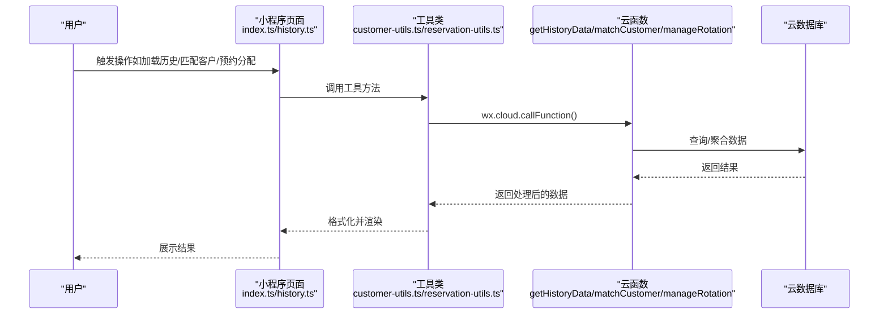

**图表来源**
- [index.ts:1-735](file://miniprogram/pages/index/index.ts#L1-L735)
- [history.ts:1-762](file://miniprogram/pages/history/history.ts#L1-L762)
- [customer-utils.ts:1-121](file://miniprogram/pages/index/utils/customer-utils.ts#L1-L121)
- [reservation-utils.ts:1-173](file://miniprogram/pages/index/utils/reservation-utils.ts#L1-L173)
- [getHistoryData/index.js:1-411](file://cloudfunctions/getHistoryData/index.js#L1-L411)
- [matchCustomer/index.js:1-71](file://cloudfunctions/matchCustomer/index.js#L1-L71)
- [manageRotation/index.js:1-356](file://cloudfunctions/manageRotation/index.js#L1-L356)

## 详细组件分析

### 预约工具类 ReservationUtils
职责与流程：
- 删除预约：将已到店的预约状态更新为"已到达"，并返回删除数量。
- 未来预约重新分配：筛选当天未点钟的未来预约，结合轮牌与可用性检查，为满足性别要求的预约分配合适技师。
- 保存客户信息：根据咨询单信息创建或更新 customers 集合记录。

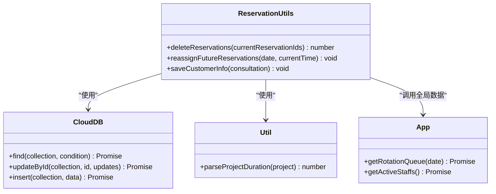

**图表来源**
- [reservation-utils.ts:1-173](file://miniprogram/pages/index/utils/reservation-utils.ts#L1-L173)
- [cloud-db.ts:1-321](file://miniprogram/utils/cloud-db.ts#L1-L321)
- [util.ts:1-150](file://miniprogram/utils/util.ts#L1-L150)

**章节来源**
- [reservation-utils.ts:1-173](file://miniprogram/pages/index/utils/reservation-utils.ts#L1-L173)
- [cloud-db.ts:1-321](file://miniprogram/utils/cloud-db.ts#L1-L321)
- [util.ts:1-150](file://miniprogram/utils/util.ts#L1-L150)

### 员工选择算法（轮牌管理）- 已更新
**更新** 简化了员工选择算法，从复杂的预约数量比较改为基于轮班顺序的简单选择方法

职责与流程：
- 轮牌初始化：根据排班与昨日轮牌优先级生成初始队列，采用简化的优先级计算。
- 取号：返回当前轮牌员工及队列。
- 服务完成：根据是否点钟更新订单计数与最后服务时间，维护队列顺序。
- 调整位置：支持拖拽调整员工位置并重算序号。

**简化后的优先级算法**：
- 早班员工获得基础优先级（+1000）
- 昨天未在班的员工扣减优先级（-500）
- 昨天在班的员工按昨日服务次数加权（+orderCount * 10）
- 最终按优先级降序排列，生成固定顺序队列

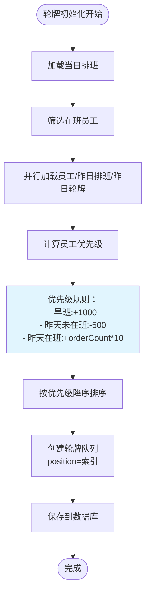

**图表来源**
- [manageRotation/index.js:76-119](file://cloudfunctions/manageRotation/index.js#L76-L119)

**章节来源**
- [manageRotation/index.js:1-356](file://cloudfunctions/manageRotation/index.js#L1-L356)
- [manageRotation/shared-utils.js:1-164](file://cloudfunctions/manageRotation/shared-utils.js#L1-L164)

### 客户匹配算法 matchCustomer
匹配策略：
- 条件校验：若既无姓氏也无线索电话，直接返回无匹配。
- 遍历匹配：遍历 customers 集合，按以下规则打分：
  - 电话完全匹配：+100
  - 电话部分匹配：按匹配比例加 80 分左右
  - 姓氏包含匹配：+50
  - 性别与称谓匹配（先生/女士）：+30
- 选取阈值：当分数超过 30 且高于当前最高分时，更新最佳匹配。

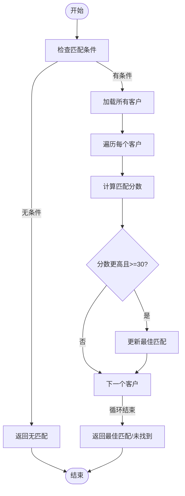

**图表来源**
- [matchCustomer/index.js:1-71](file://cloudfunctions/matchCustomer/index.js#L1-L71)

**章节来源**
- [matchCustomer/index.js:1-71](file://cloudfunctions/matchCustomer/index.js#L1-L71)

### 历史数据查询 getHistoryData
功能与流程：
- 单日加载：按目标日期查询 consultation_records，计算技师当日计数、进行中状态、补全起止时间。
- 全日期加载：统计所有日期并返回最近日期的单日数据。
- 客户历史加载：按客户手机号查询咨询记录，按日期分组并过滤有效记录。
- 日度汇总：按日期统计技师的项目数、点钟数、加钟、加班、月度积分排行。

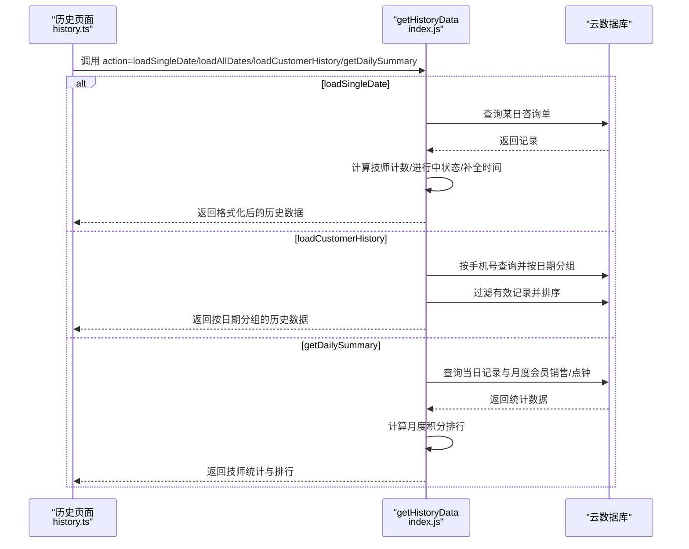

**图表来源**
- [getHistoryData/index.js:1-411](file://cloudfunctions/getHistoryData/index.js#L1-L411)
- [history.ts:1-762](file://miniprogram/pages/history/history.ts#L1-L762)

**章节来源**
- [getHistoryData/index.js:1-411](file://cloudfunctions/getHistoryData/index.js#L1-L411)
- [history.ts:1-762](file://miniprogram/pages/history/history.ts#L1-L762)

### 技师可用性与冲突检测 getAvailableTechnicians
- 参数校验与必要字段提取。
- 计算提议结束时间（开始时间 + 项目时长 + 10 分钟准备）。
- 过滤当天 active 预约与有效咨询单，生成冲突区间。
- 生成占用原因（冲突时间段、客户称谓、是否预约）。
- 按轮牌位置排序返回技师列表。

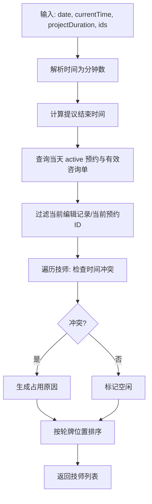

**图表来源**
- [getAvailableTechnicians/index.js:1-285](file://cloudfunctions/getAvailableTechnicians/index.js#L1-L285)

**章节来源**
- [getAvailableTechnicians/index.js:1-285](file://cloudfunctions/getAvailableTechnicians/index.js#L1-L285)

### 轮牌调度 manageRotation
- 初始化轮牌：根据排班与昨日轮牌优先级生成初始队列。
- 取号：返回当前轮牌员工及队列。
- 服务完成：根据是否点钟更新订单计数与最后服务时间，维护队列顺序。
- 调整位置：支持拖拽调整员工位置并重算序号。

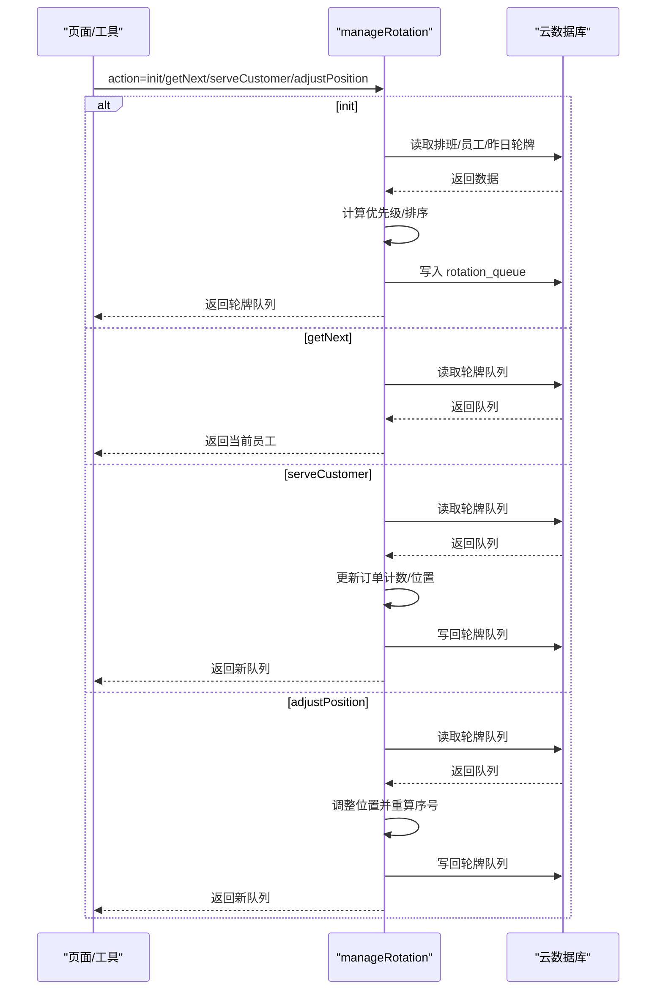

**图表来源**
- [manageRotation/index.js:1-356](file://cloudfunctions/manageRotation/index.js#L1-L356)

**章节来源**
- [manageRotation/index.js:1-356](file://cloudfunctions/manageRotation/index.js#L1-L356)

### 报钟与加班计算 clockin-utils
- 计算加班单位：根据排班时段与报钟时间计算超时单位（每 30 分钟一单位）。
- 格式化报钟信息：生成 Markdown 格式的报钟文本，包含技师当日计数、项目、时间等。
- 双人报钟：同时生成两位客人的报钟信息并统一结束时间。

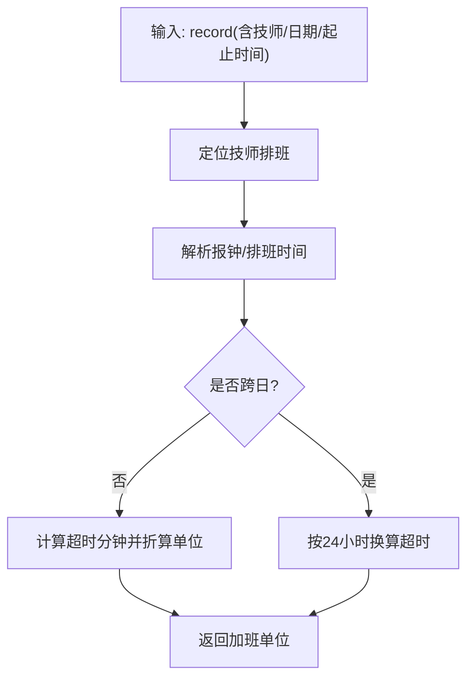

**图表来源**
- [clockin-utils.ts:1-184](file://miniprogram/pages/index/utils/clockin-utils.ts#L1-L184)
- [util.ts:1-150](file://miniprogram/utils/util.ts#L1-L150)

**章节来源**
- [clockin-utils.ts:1-184](file://miniprogram/pages/index/utils/clockin-utils.ts#L1-L184)
- [util.ts:1-150](file://miniprogram/utils/util.ts#L1-L150)

### 通知机制 sendWechatMessage
- 通过企业微信 Webhook 推送 Markdown 消息。
- 支持加钟提醒、每日总结推送等场景。

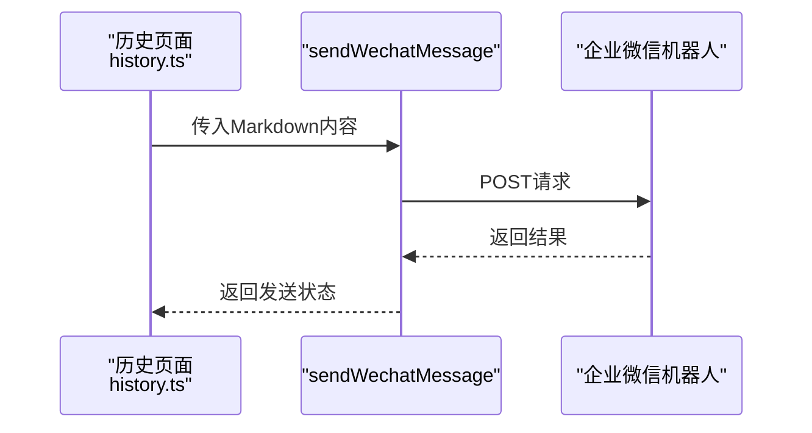

**图表来源**
- [sendWechatMessage/index.js:1-65](file://cloudfunctions/sendWechatMessage/index.js#L1-L65)
- [history.ts:1-762](file://miniprogram/pages/history/history.ts#L1-L762)

**章节来源**
- [sendWechatMessage/index.js:1-65](file://cloudfunctions/sendWechatMessage/index.js#L1-L65)
- [history.ts:1-762](file://miniprogram/pages/history/history.ts#L1-L762)

### 数据模型设计
核心实体与字段：
- 咨询单（ConsultationRecord）：包含客户信息、技师、房间、项目、时间、结算信息、加钟、加班等。
- 预约（ReservationRecord）：包含预约日期、客户、性别、项目、技师、时间段、状态、性别要求等。
- 客户（CustomerRecord）：手机号、姓名、性别、负责技师、车牌、备注等。
- 员工（StaffInfo）、排班（ScheduleRecord）、轮牌（rotation_queue）等。

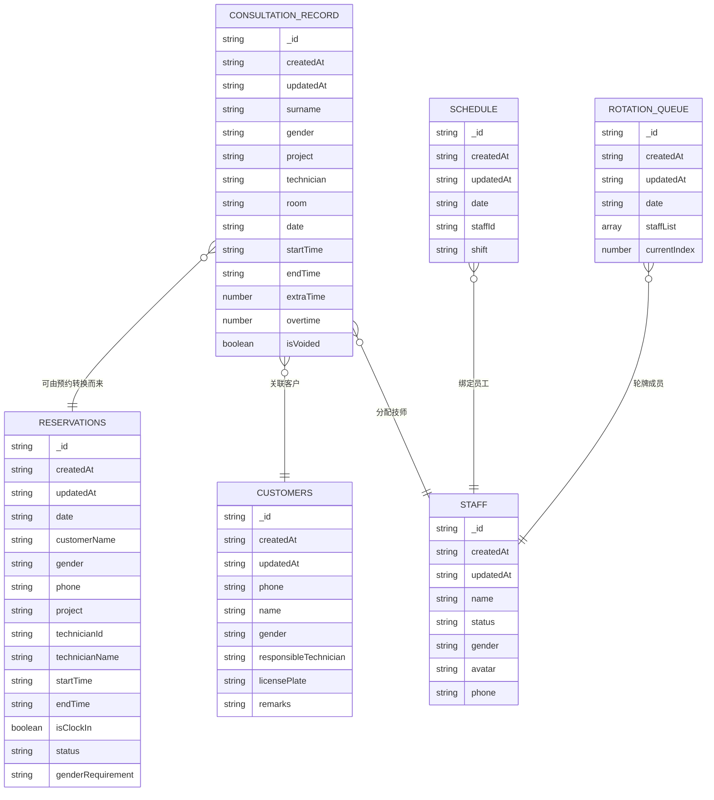

**图表来源**
- [index.d.ts:37-183](file://typings/index.d.ts#L37-L183)

**章节来源**
- [index.d.ts:37-183](file://typings/index.d.ts#L37-L183)

## 依赖关系分析
- 前端页面依赖工具类与云数据库封装；工具类再依赖云函数与全局应用数据。
- 云函数之间存在协作：getHistoryData 依赖 consultation_records、customer_membership、membership_usage；getAvailableTechnicians 依赖 reservations、consultation_records、schedule、rotation_queue；manageRotation 依赖 schedule、staff、rotation_queue。
- 类型定义贯穿前后端，保证数据结构一致性。

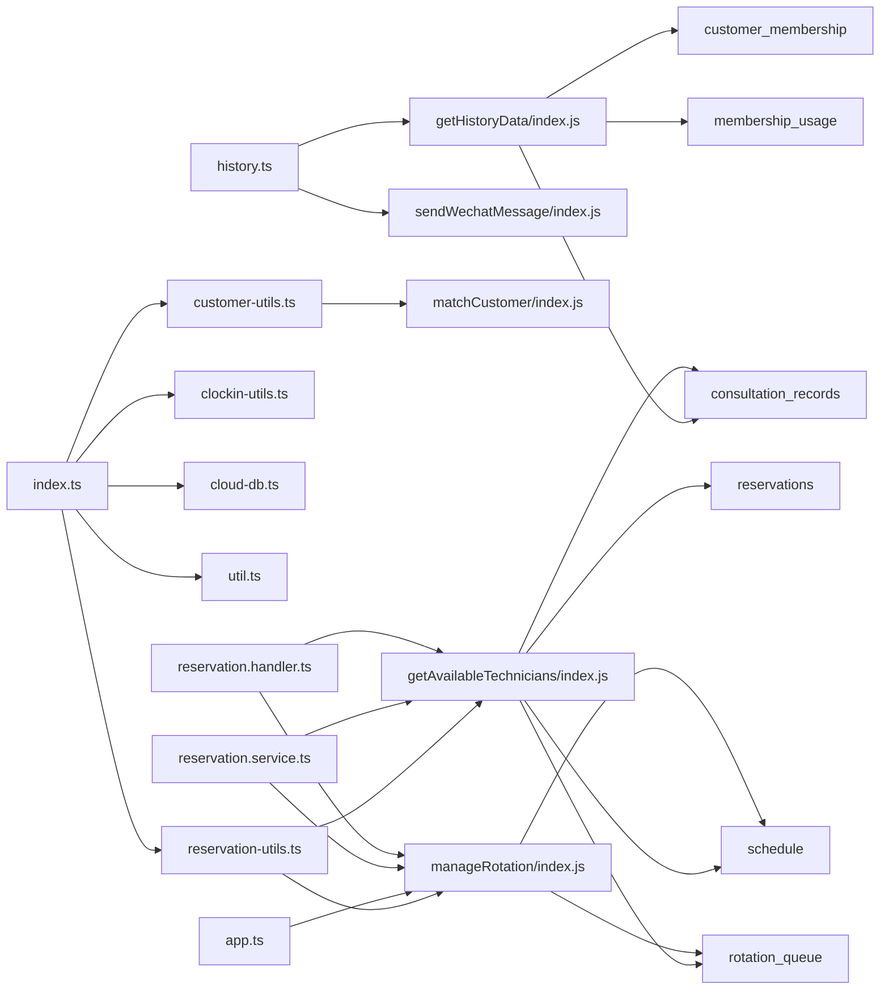

**图表来源**
- [index.ts:1-735](file://miniprogram/pages/index/index.ts#L1-L735)
- [history.ts:1-762](file://miniprogram/pages/history/history.ts#L1-L762)
- [customer-utils.ts:1-121](file://miniprogram/pages/index/utils/customer-utils.ts#L1-L121)
- [reservation-utils.ts:1-173](file://miniprogram/pages/index/utils/reservation-utils.ts#L1-L173)
- [clockin-utils.ts:1-184](file://miniprogram/pages/index/utils/clockin-utils.ts#L1-L184)
- [cloud-db.ts:1-321](file://miniprogram/utils/cloud-db.ts#L1-L321)
- [util.ts:1-150](file://miniprogram/utils/util.ts#L1-L150)
- [getHistoryData/index.js:1-411](file://cloudfunctions/getHistoryData/index.js#L1-L411)
- [matchCustomer/index.js:1-71](file://cloudfunctions/matchCustomer/index.js#L1-L71)
- [getAvailableTechnicians/index.js:1-285](file://cloudfunctions/getAvailableTechnicians/index.js#L1-L285)
- [manageRotation/index.js:1-356](file://cloudfunctions/manageRotation/index.js#L1-L356)
- [app.ts:1-237](file://miniprogram/app.ts#L1-L237)
- [reservation.service.ts:513-548](file://miniprogram/services/reservation.service.ts#L513-L548)
- [reservation.handler.ts:915-951](file://miniprogram/pages/cashier/handlers/reservation.handler.ts#L915-L951)

**章节来源**
- [index.ts:1-735](file://miniprogram/pages/index/index.ts#L1-L735)
- [history.ts:1-762](file://miniprogram/pages/history/history.ts#L1-L762)
- [getHistoryData/index.js:1-411](file://cloudfunctions/getHistoryData/index.js#L1-L411)
- [getAvailableTechnicians/index.js:1-285](file://cloudfunctions/getAvailableTechnicians/index.js#L1-L285)
- [manageRotation/index.js:1-356](file://cloudfunctions/manageRotation/index.js#L1-L356)

## 性能考虑
- 云函数内尽量使用数据库层面的过滤与排序，避免一次性拉取全量数据。
- 历史查询中对大集合使用分页与限制数量，避免超时。
- 客户匹配采用单次全量扫描，建议在数据量较大时增加索引或按需分页。
- 报钟与加钟计算在前端本地完成，减少云函数调用频率。
- 通知推送采用异步调用，避免阻塞主流程。
- **轮牌算法优化**：简化后的优先级计算减少了复杂的预约数量统计，提高了算法执行效率和代码可读性。

## 故障排查指南
- 云函数返回错误：检查必填参数、数据库连接与集合权限。
- 历史查询为空：确认日期格式、集合是否存在、是否有 isVoided 过滤。
- 客户匹配无结果：确认姓名/电话输入、匹配阈值设置。
- 技师不可用：检查排班、轮牌、冲突检测逻辑与时间格式。
- 通知推送失败：检查 Webhook 地址与网络连通性。
- **轮牌问题**：检查排班数据完整性、员工状态、轮牌队列数据结构。

**章节来源**
- [getHistoryData/index.js:1-411](file://cloudfunctions/getHistoryData/index.js#L1-L411)
- [matchCustomer/index.js:1-71](file://cloudfunctions/matchCustomer/index.js#L1-L71)
- [getAvailableTechnicians/index.js:1-285](file://cloudfunctions/getAvailableTechnicians/index.js#L1-L285)
- [sendWechatMessage/index.js:1-65](file://cloudfunctions/sendWechatMessage/index.js#L1-L65)
- [manageRotation/index.js:1-356](file://cloudfunctions/manageRotation/index.js#L1-L356)

## 结论
本系统通过清晰的模块划分与云函数协作，实现了预约、报钟、历史与统计的完整闭环。ReservationUtils、CustomerUtils、ClockInUtils 等工具类提升了前端逻辑的可复用性；matchCustomer、getAvailableTechnicians、manageRotation 等云函数承担了复杂的业务规则与数据聚合。配合类型定义与统一的数据库封装，系统具备良好的可维护性与扩展性。

**更新** 轮牌管理算法的简化显著提升了代码可读性和系统性能，通过简化的优先级计算替代了复杂的预约数量统计，使系统更加稳定可靠。

## 附录
- 实际使用场景建议：
  - 预约创建：先调用 getAvailableTechnicians 检查冲突，再创建咨询单并删除对应预约。
  - 到店报钟：计算加班单位，生成报钟信息，必要时推送通知。
  - 历史查询：按日/按客户/按月度汇总，结合分页与格式化展示。
  - **轮牌管理**：系统会自动根据排班和历史数据生成最优轮牌队列，管理员可手动调整员工位置。
- 扩展开发指导：
  - 新增字段：在 index.d.ts 中补充类型定义，并同步更新前后端逻辑。
  - 新增云函数：遵循现有错误处理与返回结构，确保幂等与事务一致性。
  - 性能优化：为高频查询建立索引，合理拆分大查询，缓存静态数据。
  - **算法优化**：轮牌算法已简化，后续开发应保持算法简洁性，避免过度复杂的计算逻辑。