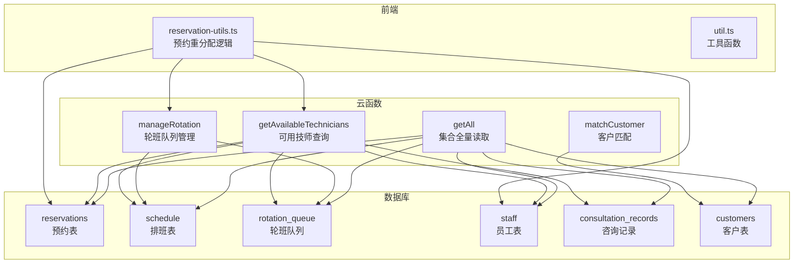
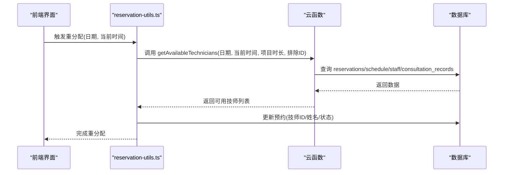
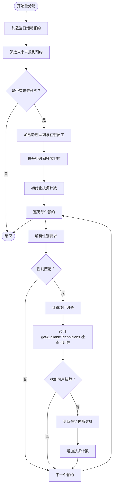
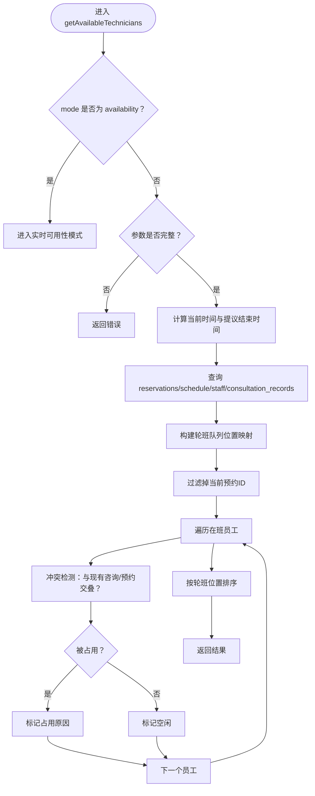
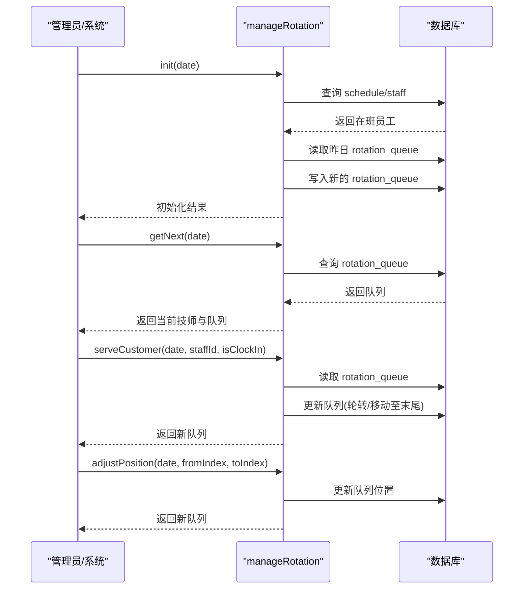
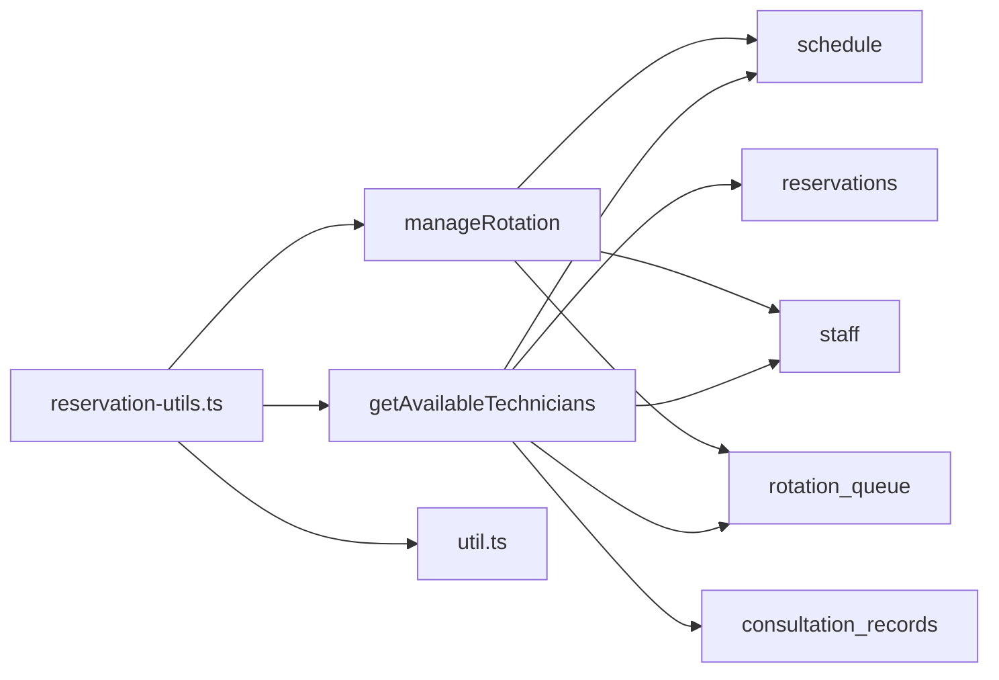

# 预约调度与分配

<cite>
**本文档引用的文件**
- [cloudfunctions/getAvailableTechnicians/index.js](file://cloudfunctions/getAvailableTechnicians/index.js)
- [cloudfunctions/manageRotation/index.js](file://cloudfunctions/manageRotation/index.js)
- [miniprogram/pages/index/utils/reservation-utils.ts](file://miniprogram/pages/index/utils/reservation-utils.ts)
- [cloudfunctions/matchCustomer/index.js](file://cloudfunctions/matchCustomer/index.js)
- [miniprogram/utils/util.ts](file://miniprogram/utils/util.ts)
- [cloudfunctions/getAll/index.js](file://cloudfunctions/getAll/index.js)
</cite>

## 目录
1. [简介](#简介)
2. [项目结构](#项目结构)
3. [核心组件](#核心组件)
4. [架构总览](#架构总览)
5. [详细组件分析](#详细组件分析)
6. [依赖关系分析](#依赖关系分析)
7. [性能考虑](#性能考虑)
8. [故障排除指南](#故障排除指南)
9. [结论](#结论)
10. [附录](#附录)

## 简介
本技术文档围绕预约调度与分配功能展开，重点解析以下关键能力：
- 智能重分配算法：reassignFutureReservations 方法如何基于技师轮班队列与工作量进行动态分配，并结合性别要求、可用性检查与项目时长计算实现高效匹配。
- 可用技师查询机制：getAvailableTechnicians 云函数的时间窗口过滤与冲突避免算法，支持“当前时刻+项目时长+准备时间”的可用性判断。
- 轮班队列管理：manageRotation 云函数负责轮班队列的初始化、取号、服务完成后的顺序调整与位置调整。
- 调度优先级与负载均衡：通过预约时间排序、性别匹配优先、最小化工作量策略以及动态调整实现负载均衡。
- 性能优化与异常恢复：并发处理建议、数据库访问优化、错误处理与回退策略。
- 实际调度场景与扩展指导：提供常见场景示例与可定制化扩展点。

## 项目结构
该系统采用前后端分离架构，前端为小程序应用，后端使用微信云开发的云函数与数据库。预约调度涉及以下模块：
- 前端工具与业务逻辑：reservation-utils.ts 提供预约重分配、客户信息保存等逻辑。
- 云函数层：
  - getAvailableTechnicians：查询可用技师并进行冲突检测。
  - manageRotation：维护轮班队列，支持初始化、取号、服务完成与位置调整。
  - matchCustomer：客户匹配评分。
  - getAll：通用分页读取集合数据。
- 工具函数：util.ts 提供时间解析、项目时长解析、加班计算等辅助能力。

图表来源
- [cloudfunctions/getAvailableTechnicians/index.js](file://cloudfunctions/getAvailableTechnicians/index.js#L1-L124)
- [cloudfunctions/manageRotation/index.js](file://cloudfunctions/manageRotation/index.js#L1-L146)
- [miniprogram/pages/index/utils/reservation-utils.ts](file://miniprogram/pages/index/utils/reservation-utils.ts#L1-L173)
- [cloudfunctions/matchCustomer/index.js](file://cloudfunctions/matchCustomer/index.js#L1-L71)
- [miniprogram/utils/util.ts](file://miniprogram/utils/util.ts#L1-L150)
- [cloudfunctions/getAll/index.js](file://cloudfunctions/getAll/index.js#L1-L59)

章节来源
- [cloudfunctions/getAvailableTechnicians/index.js](file://cloudfunctions/getAvailableTechnicians/index.js#L1-L124)
- [cloudfunctions/manageRotation/index.js](file://cloudfunctions/manageRotation/index.js#L1-L146)
- [miniprogram/pages/index/utils/reservation-utils.ts](file://miniprogram/pages/index/utils/reservation-utils.ts#L1-L173)
- [cloudfunctions/matchCustomer/index.js](file://cloudfunctions/matchCustomer/index.js#L1-L71)
- [miniprogram/utils/util.ts](file://miniprogram/utils/util.ts#L1-L150)
- [cloudfunctions/getAll/index.js](file://cloudfunctions/getAll/index.js#L1-L59)

## 核心组件
- reassignFutureReservations：对未来的预约进行智能重分配，按预约开始时间升序处理，优先满足性别要求，再通过云函数检查可用性，最后以工作量最少为原则分配给技师。
- getAvailableTechnicians：根据日期、当前时间、项目时长与现有预约/咨询冲突，返回可用技师列表；支持“实时可用性”模式。
- manageRotation：初始化轮班队列、获取下一个技师、服务完成后更新队列顺序与计数、手动调整队列位置。
- 工具函数：parseProjectDuration、calculateProjectEndTime、laterOrEqualTo、earlierThan 等用于时间与项目时长解析与计算。

章节来源
- [miniprogram/pages/index/utils/reservation-utils.ts](file://miniprogram/pages/index/utils/reservation-utils.ts#L26-L145)
- [cloudfunctions/getAvailableTechnicians/index.js](file://cloudfunctions/getAvailableTechnicians/index.js#L9-L124)
- [cloudfunctions/manageRotation/index.js](file://cloudfunctions/manageRotation/index.js#L9-L146)
- [miniprogram/utils/util.ts](file://miniprogram/utils/util.ts#L14-L105)

## 架构总览
调度流程从前端触发，调用云函数进行数据查询与状态更新，核心交互如下：

图表来源
- [miniprogram/pages/index/utils/reservation-utils.ts](file://miniprogram/pages/index/utils/reservation-utils.ts#L99-L118)
- [cloudfunctions/getAvailableTechnicians/index.js](file://cloudfunctions/getAvailableTechnicians/index.js#L26-L117)

## 详细组件分析

### reassignFutureReservations 智能重分配算法
该方法实现了面向未来的预约重分配，遵循以下步骤：
1. 获取当日所有活动预约，筛选出尚未开始且未报到的未来预约。
2. 获取轮班队列与在班员工映射，构建按轮班顺序的候选技师列表。
3. 将未来预约按开始时间升序排序，确保先处理更早的预约。
4. 维护每个技师的预约计数，作为负载均衡依据。
5. 对每个预约：
   - 解析性别要求：优先使用预约上的性别要求，若无则回退到指定技师的性别。
   - 过滤性别不匹配的技师。
   - 计算项目时长（默认60分钟），调用 getAvailableTechnicians 进行可用性检查。
   - 在可用技师中选择当前工作量最少者，若存在多个相同最小值，优先选择轮班顺序靠前的技师。
6. 成功匹配后更新预约的技师信息与计数。

图表来源
- [miniprogram/pages/index/utils/reservation-utils.ts](file://miniprogram/pages/index/utils/reservation-utils.ts#L26-L145)
- [cloudfunctions/getAvailableTechnicians/index.js](file://cloudfunctions/getAvailableTechnicians/index.js#L9-L124)

章节来源
- [miniprogram/pages/index/utils/reservation-utils.ts](file://miniprogram/pages/index/utils/reservation-utils.ts#L26-L145)

### getAvailableTechnicians 可用技师查询机制
该云函数负责在给定时间窗口内查询可用技师，核心逻辑如下：
- 参数校验：当 mode 为 availability 时进入“实时可用性”模式，否则需要日期、当前时间与项目时长。
- 时间窗口计算：将当前时间转换为分钟数，项目时长加10分钟准备时间得到提议结束时间，用于冲突检测。
- 数据查询：
  - reservations：筛选同日活动预约。
  - schedule：筛选当日排班在班员工ID。
  - staff：筛选在班且活跃员工。
  - consultation_records：筛选当日未作废的咨询记录。
  - rotation_queue：获取当日轮班队列，建立员工ID到队列位置的映射。
- 冲突检测：对每个在班员工，检查其在当前提议时间段内的咨询或预约是否与其姓名匹配，若存在交叠则标记为占用。
- 输出排序：按轮班队列位置排序返回结果，便于前端展示与后续重分配使用。

图表来源
- [cloudfunctions/getAvailableTechnicians/index.js](file://cloudfunctions/getAvailableTechnicians/index.js#L9-L124)
- [cloudfunctions/getAvailableTechnicians/index.js](file://cloudfunctions/getAvailableTechnicians/index.js#L131-L285)

章节来源
- [cloudfunctions/getAvailableTechnicians/index.js](file://cloudfunctions/getAvailableTechnicians/index.js#L9-L124)
- [cloudfunctions/getAvailableTechnicians/index.js](file://cloudfunctions/getAvailableTechnicians/index.js#L131-L285)

### manageRotation 轮班队列管理
该云函数负责轮班队列的生命周期管理：
- 初始化：根据当日排班在班员工生成队列，结合昨日轮班数据与班次类型设置优先级，按优先级排序后赋予初始位置。
- 取下一个：若队列不存在则先初始化，然后返回当前索引对应的技师及队列快照。
- 服务完成：根据 isClockIn 参数决定是“继续轮转”还是“将该技师移到末尾”，同时更新 orderCount 与 lastServedTime，并推进 currentIndex。
- 队列调整：支持手动调整队列中某员工的位置，更新所有位置索引。

图表来源
- [cloudfunctions/manageRotation/index.js](file://cloudfunctions/manageRotation/index.js#L38-L146)
- [cloudfunctions/manageRotation/index.js](file://cloudfunctions/manageRotation/index.js#L148-L246)
- [cloudfunctions/manageRotation/index.js](file://cloudfunctions/manageRotation/index.js#L248-L315)

章节来源
- [cloudfunctions/manageRotation/index.js](file://cloudfunctions/manageRotation/index.js#L38-L146)
- [cloudfunctions/manageRotation/index.js](file://cloudfunctions/manageRotation/index.js#L148-L246)
- [cloudfunctions/manageRotation/index.js](file://cloudfunctions/manageRotation/index.js#L248-L315)

### 客户匹配与通用查询
- matchCustomer：基于姓名、性别、电话的模糊匹配，计算综合评分，返回最佳匹配客户。
- getAll：通用分页读取集合数据，避免一次性拉取过多数据导致超时。

章节来源
- [cloudfunctions/matchCustomer/index.js](file://cloudfunctions/matchCustomer/index.js#L9-L71)
- [cloudfunctions/getAll/index.js](file://cloudfunctions/getAll/index.js#L9-L59)

## 依赖关系分析
- reassignFutureReservations 依赖：
  - 轮班队列数据（manageRotation）
  - 员工与预约数据（staff、reservations）
  - 可用性检查（getAvailableTechnicians）
  - 工具函数（parseProjectDuration、calculateProjectEndTime）
- getAvailableTechnicians 依赖：
  - reservations、schedule、staff、consultation_records、rotation_queue
  - 时间解析工具（parseTimeToMinutes）
- manageRotation 依赖：
  - schedule、rotation_queue、staff
  - 工具函数（getYesterday、parseTimeToMinutes）

图表来源
- [miniprogram/pages/index/utils/reservation-utils.ts](file://miniprogram/pages/index/utils/reservation-utils.ts#L1-L173)
- [cloudfunctions/getAvailableTechnicians/index.js](file://cloudfunctions/getAvailableTechnicians/index.js#L1-L124)
- [cloudfunctions/manageRotation/index.js](file://cloudfunctions/manageRotation/index.js#L1-L146)
- [miniprogram/utils/util.ts](file://miniprogram/utils/util.ts#L1-L150)

## 性能考虑
- 并发处理建议：
  - reassignFutureReservations 中对每个预约调用 getAvailableTechnicians，建议在前端侧批量请求或在云函数侧合并查询，减少网络往返。
  - 对于大量预约的重分配，可考虑分批处理并在 UI 层显示进度。
- 数据库访问优化：
  - getAvailableTechnicians 使用了多集合查询与过滤，建议在 reservations、consultation_records、schedule、rotation_queue 上建立合适的索引（如 date、status、technicianName、staffId）。
  - getAll 采用分页读取，避免一次性拉取过多数据。
- 时间计算与冲突检测：
  - 使用分钟制时间比较，避免字符串比较带来的潜在问题；util.ts 提供了 parseProjectDuration 与 calculateProjectEndTime，确保项目时长与准备时间一致。
- 异常恢复：
  - reassignFutureReservations 对单个预约的异常进行捕获并跳过，保证整体流程不中断；建议在 UI 层提示用户并允许重试。
  - getAvailableTechnicians 对内部错误统一返回错误码与消息，便于前端展示与日志追踪。

[本节为通用性能建议，无需特定文件引用]

## 故障排除指南
- reassignFutureReservations 无法分配：
  - 检查轮班队列是否存在且非空。
  - 确认预约的性别要求是否合理，是否存在性别匹配的技师。
  - 检查 getAvailableTechnicians 的返回结果，确认是否因冲突导致无可用技师。
- getAvailableTechnicians 返回为空：
  - 确认日期、当前时间、项目时长参数是否正确传递。
  - 检查当日排班与在班员工状态。
  - 查看冲突检测逻辑是否误判（例如当前预约ID是否被排除）。
- manageRotation 操作失败：
  - 确认队列是否存在，员工是否在队列中。
  - 检查索引范围与位置调整逻辑。
- 客户匹配不准确：
  - 调整 matchCustomer 的评分阈值与权重，确保姓名、性别、电话的匹配逻辑符合业务预期。

章节来源
- [miniprogram/pages/index/utils/reservation-utils.ts](file://miniprogram/pages/index/utils/reservation-utils.ts#L142-L145)
- [cloudfunctions/getAvailableTechnicians/index.js](file://cloudfunctions/getAvailableTechnicians/index.js#L16-L21)
- [cloudfunctions/manageRotation/index.js](file://cloudfunctions/manageRotation/index.js#L190-L206)

## 结论
本系统通过“轮班队列 + 可用性检查 + 负载均衡”的组合策略，实现了对未来预约的智能重分配。reassignFutureReservations 以预约开始时间与性别要求为优先，结合 getAvailableTechnicians 的冲突检测与 manageRotation 的队列管理，有效提升了技师资源利用率与客户满意度。建议在生产环境中进一步优化并发与数据库索引，并完善异常处理与监控告警机制。

[本节为总结性内容，无需特定文件引用]

## 附录

### 实际调度场景与扩展指导
- 场景一：早高峰时段大量预约集中
  - 扩展：在 reassignFutureReservations 中增加“高峰期权重”，对早高峰的预约给予更高的优先级或更短的等待时间窗口。
- 场景二：技师临时请假导致缺员
  - 扩展：在 manageRotation 中增加“缺勤标记”，在初始化时降低缺勤技师的优先级，或在 getAvailableTechnicians 中加入“缺勤技师过滤”。
- 场景三：客户性别偏好强烈
  - 扩展：在 matchCustomer 中引入性别偏好权重，或在 reassignFutureReservations 中对性别匹配设置更高权重。
- 场景四：项目时长波动较大
  - 扩展：在 getAvailableTechnicians 中引入“动态准备时间”，根据历史数据或用户输入调整准备时间，提升可用性检测的准确性。

[本节为概念性扩展建议，无需特定文件引用]